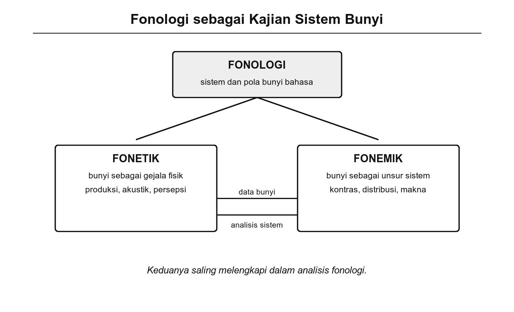
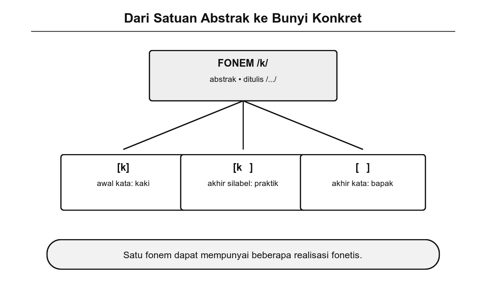
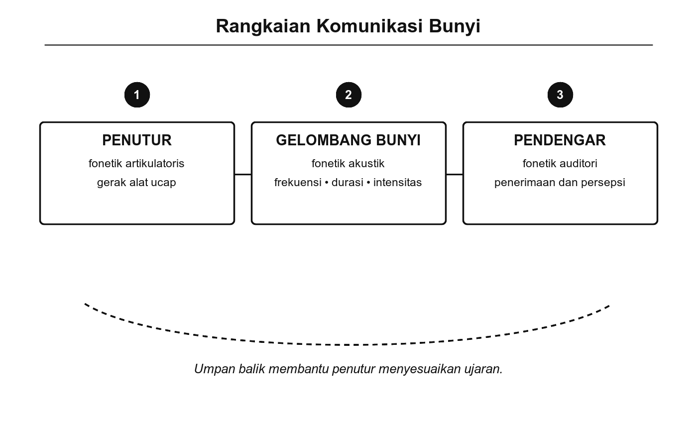

# Bab 1. Fonologi, Fonetik, dan Fonemik

## Tujuan Pembelajaran

Setelah mempelajari bab ini, pembaca diharapkan mampu:

1. Menjelaskan pengertian fonologi, fonetik, dan fonemik serta hubungan ketiganya dalam kajian bunyi bahasa.
2. Membedakan konsep fon dan fonem beserta perannya masing-masing dalam sistem bunyi bahasa.
3. Menjelaskan tiga subdisiplin fonetik (artikulatoris, akustik, dan auditori) serta cakupan kajiannya.
4. Mengidentifikasi pasangan minimal dalam bahasa Indonesia dan menjelaskan fungsinya dalam pembuktian fonem.
5. Menjelaskan konsep alofon dan memberikan contoh realisasi bunyi yang berbeda dari fonem yang sama.

## Pengantar Bab

Dalam kehidupan sehari-hari, kita sering tidak menyadari betapa besar pengaruh bunyi dan cara pengucapannya terhadap komunikasi. Dari cara kita menekankan suatu kata hingga perbedaan intonasi ketika bertanya atau menyatakan sesuatu, semuanya dikaji dalam fonologi dan fonetik.

Bahasa Indonesia memiliki sekitar 30 fonem yang digunakan untuk membangun ribuan kata (Chaer, 2009). Mengganti satu fonem saja, misalnya /p/ menjadi /b/ pada kata "paru," sudah cukup untuk mengubah makna sepenuhnya menjadi "baru." Sistem bunyi yang tampak sederhana ini, jika diamati secara sistematis, mengungkapkan aturan dan pola yang kaya dan kompleks.

Bab ini mengajak kita memahami dasar-dasar fonologi, fonetik, dan fonemik sebagai tiga bidang yang saling melengkapi dalam mengkaji bunyi bahasa Indonesia.

## 1.1 Pengenalan Fonologi

*Fonologi* adalah cabang linguistik yang mengkaji sistem bunyi bahasa (Crystal, 2008). Secara etimologis, istilah ini berasal dari dua kata dalam bahasa Yunani: *phonē* (φωνή) yang berarti 'bunyi' dan *logos* (λόγος) yang berarti 'ilmu.' Fonologi tidak mempelajari bunyi secara fisik (itu tugas fonetik), melainkan mempelajari bagaimana bunyi-bunyi bahasa diorganisasi menjadi sistem yang fungsional dalam suatu bahasa (Chaer, 2009).

Fonologi memusatkan perhatian pada dua hal utama. Pertama, **kontras bunyi**: bunyi-bunyi mana yang membedakan makna dalam suatu bahasa. Kedua, **distribusi bunyi**: di posisi mana saja suatu bunyi boleh dan tidak boleh muncul (Crystal, 2008). Kedua fokus ini akan dibahas sepanjang buku ini.

### Kontras Bunyi dan Pasangan Minimal

Dalam bahasa Indonesia, kontras antarfonem sangat menentukan makna kata. Perhatikan contoh berikut:

- **"paru"** (organ pernapasan) dan **"baru"** (belum lama ada). Perbedaan fonem /p/ dan /b/ mengubah makna sepenuhnya.
- **"kali"** (sungai; kali lipat) dan **"gali"** (menggali). Perbedaan fonem /k/ dan /g/ menghasilkan kata yang berbeda makna.
- **"tua"** (berumur lanjut) dan **"dua"** (angka 2). Perbedaan fonem /t/ dan /d/ membedakan makna.

Pasangan kata seperti di atas disebut **pasangan minimal** (*minimal pair*), yaitu dua kata yang hanya berbeda satu fonem pada posisi yang sama tetapi memiliki makna yang berlainan. Pasangan minimal merupakan alat utama dalam fonologi untuk membuktikan bahwa dua bunyi merupakan fonem yang berbeda (Chaer, 2009; Muslich, 2013). Jika mengganti satu bunyi menghasilkan kata bermakna lain, maka kedua bunyi itu berstatus fonem yang berbeda.

{width="5.8in"}

Gambar 1.1 Hubungan Fonologi, Fonetik, dan Fonemik

### Distribusi Bunyi

Selain kontras bunyi, fonologi juga mempelajari pola distribusi bunyi: kombinasi bunyi mana yang mungkin dan tidak mungkin dalam suatu bahasa. Dalam bahasa Indonesia, misalnya, tidak lazim ditemukan kata asli yang berakhir dengan konsonan bersuara /b/, /d/, atau /g/. Kata-kata yang berakhir konsonan bersuara seperti "adab" dan "jihad" umumnya merupakan kata serapan dari bahasa Arab (Chaer, 2009). Distribusi bunyi ini akan dibahas lebih mendalam pada Bab 9 (Fonotaktik).

### Coba Perhatikan

Ucapkan kata **"paru"** dan **"baru"** secara bergantian. Perhatikan posisi bibir saat mengucapkan bunyi pertama. Pada kedua kata ini, satu-satunya perbedaan bunyi terletak pada konsonan awal: /p/ diucapkan tanpa getaran pita suara (*tak bersuara*), sedangkan /b/ diucapkan dengan getaran pita suara (*bersuara*). Perbedaan kecil ini sudah cukup untuk mengubah makna kata secara keseluruhan. Jika kita letakkan jari di tenggorokan, getaran pada /b/ akan terasa, sedangkan pada /p/ tidak.

## 1.2 Bunyi Bahasa

*Bunyi bahasa* adalah bunyi yang dihasilkan oleh alat ucap manusia dan memiliki fungsi komunikatif, yaitu mampu membedakan makna dalam suatu bahasa (Marsono, 2019). Perlu dicatat bahwa tidak semua bunyi yang keluar dari alat ucap tergolong bunyi bahasa. Batuk, bersin, bersendawa, dan mendengkur dihasilkan oleh organ yang sama, tetapi tidak termasuk dalam sistem bahasa karena tidak berfungsi membedakan makna kata.

Dalam kajian linguistik, bunyi bahasa dibedakan menjadi dua konsep penting (Chaer, 2009):

**Fon** adalah bunyi bahasa terkecil yang bersifat konkret dan dapat diamati secara fisik. Fon adalah bunyi ujaran yang benar-benar diucapkan oleh penutur dalam konteks tertentu. Fon dituliskan di antara kurung siku, misalnya [p], [b], [a]. Ketika kita merekam seseorang berbicara dan menganalisis gelombang bunyinya, yang kita amati adalah fon.

**Fonem** adalah satuan bunyi terkecil yang bersifat abstrak dan berfungsi membedakan makna. Fonem merupakan representasi mental dari bunyi yang berperan dalam sistem bahasa. Fonem dituliskan di antara garis miring, misalnya /p/, /b/, /a/. Fonem tidak bisa "didengar" secara langsung; yang didengar adalah fon sebagai realisasi konkretnya.

Perbedaan antara fon dan fonem dapat dipahami melalui konsep *parole* dan *langue* yang diperkenalkan oleh Ferdinand de Saussure (1916/2011). Fon termasuk ranah *parole*, yaitu ujaran nyata yang terjadi dalam komunikasi lisan sehari-hari. Fonem termasuk ranah *langue*, yaitu sistem bahasa abstrak yang ada dalam pikiran penutur. Muslich (2013) mengibaratkan hubungan ini seperti hubungan antara "cetak biru bangunan" (fonem) dan "bangunan jadi" (fon): cetak biru selalu sama, tetapi bangunan jadinya bisa sedikit berbeda tergantung pelaksanaan.

{width="5.8in"}

Gambar 1.2 Hubungan Fon dan Fonem

Secara ringkas, bunyi bahasa memiliki beberapa ciri penting (Marsono, 2019):

- Dihasilkan oleh alat ucap manusia (pita suara, lidah, bibir, dan organ artikulasi lainnya).
- Merupakan unsur bahasa yang paling kecil.
- Berfungsi sebagai pembeda makna dalam sistem komunikasi lisan.
- Bersifat terstruktur dan diatur dalam sistem fonologis suatu bahasa.

## 1.3 Fonetik

*Fonetik* adalah cabang linguistik yang mempelajari bunyi bahasa dari sisi fisiknya: bagaimana bunyi diproduksi, dirambatkan, dan dipersepsikan (Ladefoged, 2006). Jika fonologi bertanya "bunyi mana yang membedakan makna?", fonetik bertanya "bagaimana bunyi itu dihasilkan dan didengar?" Fonetik dibagi menjadi tiga subdisiplin utama (Ladefoged & Johnson, 2011):

1. ***Fonetik artikulatoris*** (*articulatory phonetics*): mempelajari cara bunyi dihasilkan oleh alat ucap manusia, termasuk posisi dan gerakan lidah, bibir, pita suara, dan organ artikulasi lainnya. Subdisiplin ini akan dibahas secara mendalam pada Bab 2.

2. ***Fonetik akustik*** (*acoustic phonetics*): mempelajari sifat fisik gelombang bunyi yang dihasilkan, seperti frekuensi, amplitudo, dan durasi. Analisis akustik menggunakan perangkat seperti Praat (Bab 13) termasuk dalam ranah ini.

3. ***Fonetik auditori*** (*auditory phonetics*): mempelajari cara bunyi diterima dan diproses oleh telinga, sistem saraf, dan otak pendengar.

{width="5.8in"}

Gambar 1.3 Tiga Subdisiplin Fonetik

Untuk menuliskan bunyi bahasa secara akurat dan universal, fonetik menggunakan sistem transkripsi yang disebut **IPA** (*International Phonetic Alphabet*), yaitu alfabet fonetik internasional yang dikembangkan oleh International Phonetic Association sejak tahun 1888 (Ladefoged & Johnson, 2011). IPA menyediakan satu lambang untuk setiap bunyi bahasa, sehingga bunyi yang sama di bahasa mana pun ditulis dengan lambang yang sama.

Berikut beberapa contoh konsonan bahasa Indonesia beserta klasifikasi artikulasinya:

**Tabel 1.1** Contoh Konsonan Bahasa Indonesia dan Artikulasinya

| **Lambang IPA** | **Artikulasi** | **Contoh kata** | **Arti** |
|---|---|---|---|
| /p/ | Bilabial, plosif, tak bersuara | padi | tanaman penghasil beras |
| /b/ | Bilabial, plosif, bersuara | buku | kumpulan kertas berjilid |
| /t/ | Alveolar, plosif, tak bersuara | tari | gerakan badan berirama |
| /d/ | Alveolar, plosif, bersuara | dari | kata depan penanda asal |
| /k/ | Velar, plosif, tak bersuara | kaki | anggota badan untuk berjalan |
| /g/ | Velar, plosif, bersuara | gula | bahan pemanis |
| /s/ | Alveolar, frikatif, tak bersuara | satu | bilangan pertama |
| /m/ | Bilabial, nasal, bersuara | mama | panggilan untuk ibu |
| /n/ | Alveolar, nasal, bersuara | nasi | beras yang sudah dimasak |
| /ŋ/ | Velar, nasal, bersuara | nganga | membuka mulut lebar |

Istilah-istilah seperti "bilabial," "alveolar," "plosif," dan "frikatif" merujuk pada cara dan tempat bunyi dihasilkan oleh alat ucap. Pembahasan lengkap tentang klasifikasi ini disajikan pada Bab 2 (Produksi Bunyi dan Alat Ucap) dan Bab 3 (Klasifikasi Bunyi Bahasa).

Dalam bahasa Indonesia, penting untuk memahami kontras antarbunyi karena kontras ini menentukan makna. Misalnya, /p/ dan /b/ sama-sama merupakan *plosif bilabial* (bunyi letupan yang dihasilkan dengan menutup kedua bibir), tetapi /p/ bersifat *tak bersuara* (pita suara tidak bergetar) sementara /b/ bersifat *bersuara* (pita suara bergetar). Perbedaan ini, meskipun secara fisik sangat kecil, sudah cukup untuk membedakan kata seperti "paku" dan "baku" (Chaer, 2009).

## 1.4 Fonemik

*Fonemik* adalah cabang fonologi yang secara khusus mengkaji fonem: satuan bunyi terkecil yang membedakan makna dalam suatu bahasa. Jika fonetik mempelajari semua bunyi yang bisa dihasilkan manusia, fonemik memfokuskan diri pada bunyi-bunyi yang benar-benar berfungsi membedakan makna dalam bahasa tertentu (Harris, 1951; Chaer, 2009).

### Alofon

Salah satu konsep terpenting dalam fonemik adalah **alofon** (*allophone*), yaitu variasi pengucapan dari satu fonem yang sama. Alofon muncul karena perbedaan lingkungan fonetis (bunyi-bunyi lain yang mengapit) tetapi tidak mengubah makna kata (Muslich, 2013).

Contoh yang paling mudah diamati dalam bahasa Indonesia adalah alofon dari fonem /k/:

**Tabel 1.2** Alofon Fonem /k/ dalam Bahasa Indonesia

| **Alofon** | **Lingkungan** | **Contoh** | **Keterangan** |
|---|---|---|---|
| [k] | Awal dan tengah kata | "kopi" [kopi], "suka" [suka] | Plosif velar standar, udara dilepaskan |
| [k̚] | Akhir kata (ragam baku) | "bapak" [bapak̚] | Plosif velar tak terlepas |
| [ʔ] | Akhir kata (ragam informal) | "bapak" [bapaʔ] | Hambat glotal menggantikan /k/ |

Ketiga bunyi ini secara fonetis berbeda, tetapi penutur bahasa Indonesia memperlakukannya sebagai "bunyi yang sama" karena ketiganya tidak membedakan makna. Kata "bapak" tetap bermakna 'bapak' entah diucapkan dengan [k], [k̚], atau [ʔ] di akhir. Ketiga bunyi ini adalah alofon dari fonem /k/. Pembahasan mendalam tentang alofon dan realisasi fonem akan disajikan pada Bab 7 dan Bab 8.

Konvensi penulisan yang digunakan dalam fonologi (Chaer, 2009):

- **Fonem** ditulis di antara garis miring: /k/, /a/, /p/. Notasi ini menunjukkan satuan abstrak dalam sistem bahasa.
- **Fon/alofon** ditulis di antara kurung siku: [k], [k̚], [ʔ]. Notasi ini menunjukkan realisasi konkret dalam ujaran.

### Contoh Nyata

Coba ucapkan kata "bapak" tiga kali: pertama dengan pelafalan penuh [bapak], kedua dengan akhiran yang "ditahan" [bapak̚], ketiga dengan akhiran yang "terputus" [bapaʔ]. Ketiga pelafalan ini merujuk pada orang yang sama dan bermakna sama. Kita tidak akan salah paham meskipun pendengar mengucapkannya dengan cara yang berbeda. Inilah bukti bahwa [k], [k̚], dan [ʔ] adalah alofon dari satu fonem /k/, bukan fonem yang berbeda.

## 1.5 Penerapan Fonologi, Fonetik, dan Fonemik

Fonologi, fonetik, dan fonemik bukan sekadar ilmu teoretis. Ketiga bidang ini memiliki penerapan praktis dalam berbagai aspek kehidupan.

### Dalam Pembelajaran Bahasa

Fonemik menjadi unsur penting dalam pengajaran membaca dan menulis, khususnya bagi peserta didik tahap awal. Pemahaman tentang fonem membantu pengajar mengajarkan cara pengucapan kata yang benar serta cara mengeja dan membaca. Dalam bahasa Indonesia, misalnya, perbedaan fonemik antara kata "kata" dan "kita" perlu diperjelas agar tidak menimbulkan kebingungan saat membaca dan menulis. Ziegler dan Goswami (2005) menunjukkan bahwa bahasa dengan korespondensi huruf-bunyi yang teratur (seperti bahasa Indonesia) cenderung lebih mudah dipelajari dalam hal baca-tulis dibandingkan bahasa dengan korespondensi yang tidak teratur (seperti bahasa Inggris).

### Dalam Teknologi Pengenalan Suara

Teknologi pengenalan suara seperti Google Assistant atau Siri memanfaatkan prinsip fonetik akustik untuk mengubah bunyi ujaran menjadi teks. Sistem ini memerlukan model akustik yang dapat mengenali berbagai realisasi fonem, termasuk variasi antardaerah dan antarpenutur. Dalam konteks bahasa Indonesia, perbedaan pengucapan antardaerah bisa sangat mencolok: penutur dari Jakarta mungkin mengucapkan "apa" sebagai [apɛ], sedangkan penutur dari Jawa Timur mengucapkannya [ɔpɔ]. Sistem pengenalan suara yang baik harus mampu mengenali keduanya sebagai kata yang sama (Ladefoged & Johnson, 2011).

### Dalam Linguistik Forensik

Fonologi digunakan dalam *linguistik forensik*, yaitu penerapan ilmu bahasa untuk keperluan hukum (Olsson, 2008). Ahli fonologi dapat menganalisis rekaman suara untuk mengidentifikasi pembicara berdasarkan ciri-ciri fonologis khas, seperti pola intonasi, realisasi fonem tertentu, dan ciri dialektal. Dalam kasus rekaman suara yang tidak jelas, analisis fonologis dapat membantu mengidentifikasi asal daerah pembicara berdasarkan ciri fonologis yang khas dari dialek tertentu.

## Trivia

Salah satu fenomena menarik dalam fonologi bahasa Indonesia adalah kecenderungan penutur menggantikan fonem /k/ di akhir kata dengan hambat glotal [ʔ] dalam percakapan sehari-hari (Chaer, 2009). Perhatikan contoh berikut:

- "Tidak" sering diucapkan menjadi [tidaʔ].
- "Capek" sering diucapkan menjadi [tʃapeʔ] atau bahkan [tʃape].
- "Masak" dalam konteks percakapan bisa diucapkan menjadi [masaʔ] (terutama dalam bentuk tanya yang mengimplikasikan keraguan).

Fenomena ini merupakan bentuk **glotalisasi**, yaitu penggantian bunyi plosif dengan hambat glotal, yang sangat produktif dalam bahasa Indonesia lisan. Meskipun fonem /k/ tidak diucapkan secara penuh, pendengar tetap memahami makna kata berkat konteks ujaran. Fenomena ini akan dibahas lebih lanjut pada Bab 7 (Variasi Fonem) dan Bab 8 (Realisasi Fonem).

## Rangkuman

Bab ini memperkenalkan tiga bidang kajian bunyi bahasa yang saling berkaitan. **Fonologi** adalah bidang payung yang mengkaji sistem bunyi bahasa secara keseluruhan, termasuk kontras bunyi dan distribusi bunyi. Di bawahnya, **fonetik** mempelajari sisi fisik bunyi (bagaimana bunyi diproduksi, dirambatkan, dan dipersepsikan), sementara **fonemik** mempelajari sisi fungsional bunyi (bagaimana bunyi membedakan makna dalam bahasa tertentu).

Konsep penting yang diperkenalkan dalam bab ini meliputi *fon* (bunyi konkret yang diucapkan, ditulis [...]) dan *fonem* (satuan bunyi abstrak yang membedakan makna, ditulis /.../ ). Keduanya dibedakan melalui alat analisis berupa *pasangan minimal*, yaitu dua kata yang hanya berbeda satu bunyi pada posisi yang sama tetapi bermakna lain. Selain itu, diperkenalkan pula konsep *alofon*, yaitu variasi pengucapan dari fonem yang sama yang tidak mengubah makna, seperti [k], [k̚], dan [ʔ] yang merupakan alofon dari fonem /k/.

Fonetik sebagai subdisiplin dibagi menjadi tiga cabang: *fonetik artikulatoris* (produksi bunyi), *fonetik akustik* (gelombang bunyi), dan *fonetik auditori* (persepsi bunyi). Penerapan ketiga bidang ini ditemukan dalam pembelajaran bahasa, teknologi pengenalan suara, dan linguistik forensik.

## Latihan Akhir Bab

1. Jelaskan perbedaan antara fonetik dan fonemik. Mengapa kedua bidang ini sama-sama diperlukan untuk memahami sistem bunyi suatu bahasa?

2. Berikan tiga contoh pasangan minimal dalam bahasa Indonesia (selain yang sudah disebut di bab ini) dan jelaskan fonem mana yang membedakan makna pada masing-masing pasangan.

3. Jelaskan perbedaan antara fon dan fonem. Mengapa fonem disebut "abstrak" sedangkan fon disebut "konkret"? Gunakan analogi atau contoh untuk memperjelas.

4. Jelaskan apa yang dimaksud dengan alofon. Mengapa bunyi [k] dan [ʔ] pada akhir kata "bapak" dianggap sebagai fonem yang sama, padahal secara fonetis bunyi keduanya berbeda?

## 🧠 Istilah yang dipelajari pada bab ini

- **Fonologi**: cabang linguistik yang mengkaji sistem bunyi bahasa, termasuk aturan dan pola penggunaan bunyi untuk membedakan makna.
- **Fonetik**: cabang linguistik yang mempelajari sifat fisik bunyi bahasa, yaitu cara bunyi diproduksi, dirambatkan, dan dipersepsikan.
- **Fonemik**: cabang fonologi yang mengkaji fonem, yaitu satuan bunyi yang membedakan makna dalam suatu bahasa.
- **Fon** (*phone*): bunyi bahasa terkecil yang bersifat konkret dan dapat diamati secara fisik; ditulis dalam kurung siku [...].
- **Fonem**: satuan bunyi terkecil yang bersifat abstrak dan berfungsi membedakan makna; ditulis di antara garis miring /.../.
- **Alofon** (*allophone*): variasi pengucapan dari fonem yang sama yang muncul karena perbedaan lingkungan fonetis, tanpa mengubah makna.
- **Pasangan minimal** (*minimal pair*): dua kata yang hanya berbeda satu fonem pada posisi yang sama tetapi memiliki makna yang berlainan; digunakan sebagai alat pembuktian fonem.
- **Fonetik artikulatoris** (*articulatory phonetics*): subdisiplin fonetik yang mempelajari cara bunyi dihasilkan oleh alat ucap manusia.
- **Fonetik akustik** (*acoustic phonetics*): subdisiplin fonetik yang mempelajari sifat fisik gelombang bunyi ujaran.
- **Fonetik auditori** (*auditory phonetics*): subdisiplin fonetik yang mempelajari cara bunyi diproses oleh sistem pendengaran.
- ***Langue***: sistem bahasa abstrak yang ada dalam pikiran penutur (konsep Ferdinand de Saussure).
- ***Parole***: ujaran nyata yang terjadi dalam komunikasi lisan sehari-hari (konsep Ferdinand de Saussure).
- **IPA** (*International Phonetic Alphabet*): sistem transkripsi fonetik internasional yang digunakan untuk menuliskan bunyi bahasa secara standar.
- **Plosif** (*stop*): bunyi konsonan yang dihasilkan dengan menutup aliran udara secara penuh lalu melepaskannya secara tiba-tiba, misalnya [p], [b], [t], [d].
- **Glotalisasi**: penggantian bunyi plosif dengan hambat glotal [ʔ], terutama di akhir kata dalam ragam informal.
