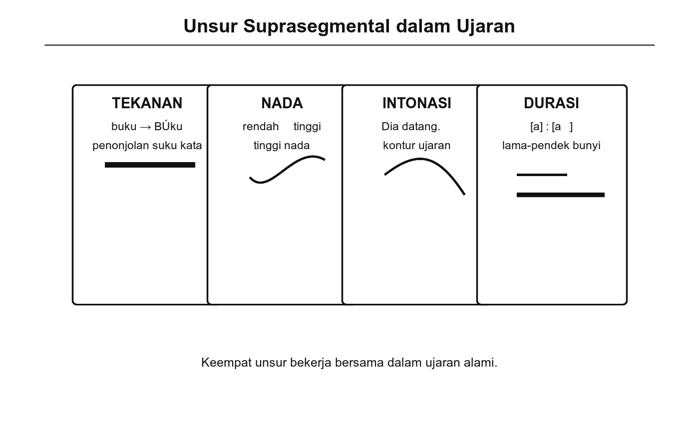
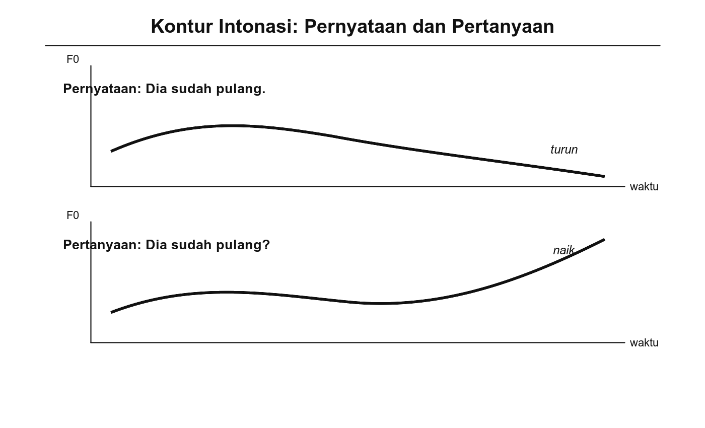

# Bab 4. Segmental dan Suprasegmental

## Tujuan Pembelajaran

Setelah mempelajari bab ini, pembaca diharapkan mampu:

1. Menjelaskan perbedaan antara bunyi segmental dan bunyi suprasegmental.
2. Mengidentifikasi unsur-unsur suprasegmental (tekanan, nada, intonasi, dan durasi) dalam ujaran bahasa Indonesia.
3. Memberikan contoh bagaimana perubahan intonasi atau tekanan dapat mengubah makna atau maksud ujaran.
4. Menjelaskan relevansi bunyi suprasegmental dalam komunikasi sehari-hari, baik formal maupun informal.

## Pengantar Bab

Pada Bab 3, kita telah mempelajari klasifikasi vokal dan konsonan sebagai bunyi segmental. Namun, komunikasi lisan tidak hanya bergantung pada fonem-fonem individual. Bayangkan seseorang mengucapkan kalimat "Kamu sudah makan" dengan nada datar, lalu mengucapkan kalimat yang persis sama tetapi dengan nada naik di akhir. Tidak ada fonem yang berubah, tetapi makna ujarannya bergeser dari pernyataan menjadi pertanyaan. Perubahan ini dimungkinkan oleh **bunyi suprasegmental**, yaitu unsur-unsur bunyi yang melampaui batas fonem individual.

Bab ini membahas kedua jenis bunyi secara lebih mendalam: bunyi segmental sebagai fondasi dan bunyi suprasegmental sebagai unsur yang memperkaya dan mengarahkan makna ujaran. Kedua jenis bunyi ini tidak dapat dipisahkan dalam komunikasi lisan yang efektif (Crystal, 2008; Roach, 2009).

## 4.1 Bunyi Segmental

Bunyi segmental adalah bunyi bahasa yang dapat dipisahkan menjadi unit-unit fonem individual (Chaer, 2009). Disebut "segmental" karena bunyi-bunyi ini membentuk segmen-segmen berurutan dalam ujaran, tersusun secara linear satu demi satu. Setiap kata terdiri dari rangkaian fonem segmental: kata "batu" tersusun dari /b/ + /a/ + /t/ + /u/.

Bunyi segmental terdiri dari dua kelompok utama yang telah dibahas pada Bab 3:

**Vokal** adalah bunyi yang dihasilkan tanpa hambatan berarti dalam aliran udara. Bahasa Indonesia memiliki enam vokal: /i/, /e/, /ə/, /a/, /u/, /o/. Perbedaan antarvokal ditentukan oleh posisi lidah dan bentuk bibir (Chaer, 2009).

**Konsonan** adalah bunyi yang dihasilkan dengan hambatan pada aliran udara di titik-titik tertentu dalam saluran vokal. Bahasa Indonesia memiliki sekitar 22–24 fonem konsonan, diklasifikasikan berdasarkan tempat artikulasi, cara artikulasi, dan kebersuaraan (Ladefoged & Johnson, 2011).

Bunyi segmental menjadi dasar fonologi karena perbedaan dalam fonem segmental dapat mengubah makna kata secara langsung. Contohnya, mengganti satu fonem pada kata "tali" menjadi "tuli" mengubah makna sepenuhnya. Kemampuan membedakan makna inilah yang menjadikan fonem sebagai satuan dasar sistem bunyi bahasa.

## 4.2 Bunyi Suprasegmental

Bunyi suprasegmental adalah unsur bunyi yang tidak berdiri sendiri sebagai segmen fonem, melainkan menyebar melintasi suku kata, kata, atau frasa (Ladefoged & Johnson, 2011). Istilah "suprasegmental" berarti "di atas segmen," menunjukkan bahwa unsur-unsur ini bersifat "menumpang" pada bunyi segmental. Crystal (2008) mengidentifikasi empat unsur suprasegmental utama: tekanan, nada, intonasi, dan durasi.

{width="5.8in"}

Gambar 4.1 Empat Unsur Suprasegmental

### Tekanan (*Stress*)

Tekanan merujuk pada pemberian aksen atau penekanan pada suku kata tertentu dalam kata, atau pada kata tertentu dalam kalimat. Suku kata yang mendapat tekanan biasanya terdengar lebih keras, lebih tinggi nadanya, dan sedikit lebih panjang durasinya dibandingkan suku kata lain (Roach, 2009).

Dalam bahasa Indonesia, tekanan umumnya bersifat tetap dan jatuh pada suku kata kedua dari akhir (*penultimate stress*), misalnya: "maKAN," "seKOlah," "uniVERsitas" (Chaer, 2009). Namun, tekanan dalam bahasa Indonesia tidak bersifat fonemik, artinya mengubah posisi tekanan tidak mengubah makna kata. Ini berbeda dari bahasa Inggris yang tekanannya dapat membedakan makna dan kelas kata, misalnya *RE*cord (kata benda) vs. re*CORD* (kata kerja).

Meskipun tekanan kata dalam bahasa Indonesia tidak fonemik, **tekanan kalimat** berperan penting dalam menyoroti informasi. Perhatikan perbedaan fokus berikut:

- **SAYA** pergi ke pasar besok. (Menekankan siapa yang pergi, yaitu saya, bukan orang lain.)
- Saya pergi ke **PASAR** besok. (Menekankan tujuan, yaitu pasar, bukan tempat lain.)
- Saya pergi ke pasar **BESOK**. (Menekankan waktu, yaitu besok, bukan hari lain.)

Halliday (1967) menyebut tekanan kalimat semacam ini sebagai *information focus*, yaitu bagian ujaran yang dianggap paling penting oleh penutur.

### Nada (*Tone*)

Nada merujuk pada tinggi-rendah bunyi yang dihasilkan oleh frekuensi getaran pita suara. Dalam **bahasa tonal** seperti Mandarin, perbedaan nada pada suku kata yang sama menghasilkan makna yang berbeda. Misalnya, dalam bahasa Mandarin, suku kata "mā" (nada tinggi datar) berarti 'ibu,' sedangkan "mǎ" (nada turun-naik) berarti 'kuda'. Contoh ini diambil dari bahasa Mandarin karena bahasa Indonesia bukan bahasa tonal (Yip, 2002).

Bahasa Indonesia bukan bahasa tonal: perbedaan nada pada suku kata tidak membedakan makna kata (Chaer, 2009). Namun, nada tetap berperan dalam intonasi kalimat, ekspresi emosi, dan penandaan sikap penutur. Misalnya, nada yang naik tajam di akhir ujaran "Masa?" menandakan keterkejutan atau ketidakpercayaan.

### Intonasi

Intonasi adalah pola naik-turun nada sepanjang kalimat atau frasa. Berbeda dari nada yang beroperasi pada tataran suku kata, intonasi beroperasi pada tataran kalimat (Crystal, 2008; Roach, 2009). Dalam bahasa Indonesia, intonasi merupakan unsur suprasegmental yang paling berpengaruh karena dapat mengubah fungsi ujaran tanpa mengubah kata-kata yang digunakan.

**Tabel 4.1** Pola Intonasi Dasar dalam Bahasa Indonesia

| **Pola intonasi** | **Fungsi ujaran** | **Contoh** |
|---|---|---|
| Intonasi turun di akhir | Pernyataan (deklaratif) | "Dia sudah pulang." ↘ |
| Intonasi naik di akhir | Pertanyaan (interogatif) | "Dia sudah pulang?" ↗ |
| Intonasi naik tajam | Perintah/seruan (imperatif) | "Pergi sekarang!" ↑ |
| Intonasi datar lalu turun | Perintah halus | "Tolong duduk." → ↘ |

Halim (1984) mengidentifikasi beberapa pola intonasi dasar dalam bahasa Indonesia dan menunjukkan bahwa penutur bahasa Indonesia sangat bergantung pada intonasi untuk membedakan pertanyaan dari pernyataan, karena bahasa Indonesia tidak selalu menggunakan penanda gramatikal (seperti inversi subjek-verba) untuk menandai pertanyaan.

### Durasi

Durasi merujuk pada panjang-pendek suatu bunyi dalam ujaran. Dalam beberapa bahasa, durasi bersifat fonemik, artinya perbedaan panjang bunyi mengubah makna kata. Misalnya, dalam bahasa Jepang, "obasan" (bibi) dan "obaasan" (nenek) dibedakan oleh panjang vokal /a/. Contoh ini diambil dari bahasa Jepang karena bahasa Indonesia tidak menggunakan durasi sebagai pembeda makna (Tsujimura, 2014).

Dalam bahasa Indonesia, durasi tidak bersifat fonemik tetapi digunakan secara ekspresif (Chaer, 2009). Penutur dapat memperpanjang vokal untuk menekankan sesuatu, menunjukkan emosi, atau memberi efek dramatis. Misalnya, ujaran "Apaaa?" dengan vokal /a/ yang diperpanjang menyiratkan keterkejutan atau kebingungan yang lebih kuat daripada "Apa?" biasa. Dalam pidato atau presentasi, perpanjangan durasi kata-kata kunci digunakan sebagai teknik retorika untuk menarik perhatian pendengar.

### Coba Perhatikan

Ucapkan kalimat "Saya pergi ke pasar besok" empat kali, setiap kali beri tekanan pada kata yang berbeda: **SAYA** pergi ke pasar besok, Saya **PERGI** ke pasar besok, Saya pergi ke **PASAR** besok, Saya pergi ke pasar **BESOK**. Perhatikan bagaimana fokus pesan berubah hanya karena perpindahan tekanan, meskipun kata-kata yang digunakan persis sama.

## 4.3 Relevansi Bunyi Suprasegmental dalam Komunikasi

Unsur suprasegmental bukan sekadar "hiasan" dalam ujaran; unsur-unsur ini berperan sentral dalam menentukan makna dan efektivitas komunikasi. Crystal (2008) menyebut unsur suprasegmental sebagai "musik bahasa" yang tanpanya ujaran akan terdengar datar, ambigu, dan sulit dipahami.

### Dalam Komunikasi Sehari-hari

Dalam percakapan sehari-hari, kita secara otomatis menggunakan intonasi, tekanan, dan jeda untuk menambahkan lapisan makna pada kata-kata. Intonasi yang bervariasi menunjukkan emosi (antusiasme, marah, sedih), sikap (persetujuan, keraguan, ironi), dan hubungan sosial (sopan, akrab, berjarak). Penutur yang intonasinya sangat datar dan monoton sering kali terdengar "membosankan" atau "tidak tulus" meskipun kata-kata yang diucapkannya tepat.

Sneddon (2003) mencatat bahwa perbedaan ragam formal dan informal dalam bahasa Indonesia tidak hanya terletak pada pilihan kata, tetapi juga pada pola suprasegmental. Ragam informal cenderung memiliki intonasi yang lebih bervariasi, tempo yang lebih cepat, dan jeda yang lebih pendek. Ragam formal cenderung memiliki intonasi yang lebih terkendali, tempo yang lebih lambat, dan jeda yang lebih jelas.

### Dalam Konteks Lintas Budaya

Pola suprasegmental juga bervariasi antarbahasa dan antarbudaya. Penutur bahasa Indonesia yang belajar bahasa Inggris sering mengalami kesulitan dengan tekanan kata bahasa Inggris yang tidak tetap dan dapat membedakan makna. Sebaliknya, penutur bahasa Inggris yang belajar bahasa Indonesia mungkin menggunakan pola tekanan bahasa Inggris yang terdengar "asing" bagi telinga penutur asli bahasa Indonesia. Pemahaman tentang perbedaan suprasegmental antarbahasa membantu mengurangi kesalahpahaman dalam komunikasi lintas budaya (Roach, 2009).

### Trivia

Dalam bahasa Indonesia, intonasi saja sudah cukup untuk membedakan pernyataan dan pertanyaan tanpa mengubah satu kata pun. Bandingkan "Kamu sudah makan." (intonasi turun = pernyataan) dengan "Kamu sudah makan?" (intonasi naik = pertanyaan). Struktur kalimat persis sama, tetapi intonasi mengubah fungsi ujaran secara keseluruhan. Dalam percakapan informal, penutur bahasa Indonesia bahkan sering tidak menggunakan kata tanya "apakah". Cukup dengan menaikkan intonasi di akhir, pernyataan berubah menjadi pertanyaan.

{width="5.8in"}

Gambar 4.2 Kontur Intonasi: Pernyataan dan Pertanyaan

## Rangkuman

Bab ini membedakan dua jenis bunyi bahasa. **Bunyi segmental** adalah bunyi yang dapat dipisahkan menjadi unit fonem individual (vokal dan konsonan), tersusun secara linear dalam ujaran. **Bunyi suprasegmental** melampaui batas fonem individual dan meliputi tekanan, nada, intonasi, dan durasi.

Dalam bahasa Indonesia, tekanan kata umumnya jatuh pada suku kata kedua dari akhir dan tidak bersifat fonemik, tetapi tekanan kalimat berperan penting dalam mengarahkan fokus informasi. Bahasa Indonesia bukan bahasa tonal, sehingga nada tidak membedakan makna kata, tetapi intonasi sangat berperan dalam membedakan pernyataan, pertanyaan, dan perintah. Durasi dalam bahasa Indonesia tidak fonemik tetapi digunakan secara ekspresif.

Unsur suprasegmental berperan sentral dalam komunikasi sehari-hari. Intonasi, tekanan, dan jeda menambahkan lapisan makna berupa emosi, sikap, dan fokus informasi. Pemahaman tentang unsur suprasegmental juga membantu dalam komunikasi lintas budaya, karena pola suprasegmental bervariasi antarbahasa.

## Latihan Akhir Bab

1. Jelaskan perbedaan antara bunyi segmental dan suprasegmental. Mengapa keduanya sama-sama penting dalam komunikasi lisan?

2. Ucapkan kalimat "Dia pergi ke sekolah" dua kali: pertama sebagai pernyataan, kedua sebagai pertanyaan. Catat perbedaan intonasi yang kamu gunakan. Unsur suprasegmental apa yang berubah?

3. Berikan tiga contoh kalimat bahasa Indonesia di mana perpindahan tekanan pada kata yang berbeda mengubah fokus pesan. Jelaskan perubahan fokus pada masing-masing contoh.

4. Mengapa bahasa Indonesia dapat mengubah pernyataan menjadi pertanyaan hanya dengan menaikkan intonasi di akhir kalimat, tanpa mengubah kata-kata atau urutan kata? Apa implikasi fenomena ini terhadap peran intonasi dalam bahasa Indonesia?

## 🧠 Istilah yang dipelajari pada bab ini

- **Bunyi segmental**: bunyi bahasa yang dapat dipisahkan menjadi unit fonem individual, yaitu vokal dan konsonan, tersusun secara linear dalam ujaran.
- **Bunyi suprasegmental**: unsur bunyi yang melampaui batas fonem individual, meliputi tekanan, nada, intonasi, dan durasi.
- **Tekanan** (*stress*): pemberian aksen pada suku kata atau kata tertentu dalam ujaran, yang memengaruhi keras, tinggi, dan durasi bunyi.
- **Tekanan kalimat**: penekanan pada kata tertentu dalam kalimat untuk menyoroti informasi yang dianggap paling penting.
- **Nada** (*tone*): tinggi-rendah bunyi yang ditentukan oleh frekuensi getaran pita suara; dalam bahasa tonal, nada membedakan makna kata.
- **Intonasi** (*intonation*): pola naik-turun nada sepanjang kalimat atau frasa yang membedakan pernyataan, pertanyaan, dan perintah.
- **Durasi** (*duration/length*): panjang-pendek suatu bunyi dalam ujaran; dalam bahasa Indonesia bersifat ekspresif, bukan fonemik.
- **Bahasa tonal**: bahasa yang menggunakan perbedaan nada pada suku kata untuk membedakan makna kata, misalnya bahasa Mandarin.
- ***Penultimate stress***: pola tekanan yang jatuh pada suku kata kedua dari akhir, yang merupakan pola umum dalam bahasa Indonesia.
