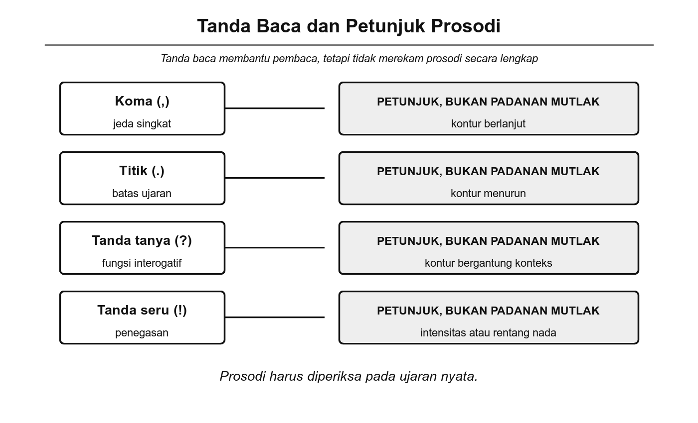
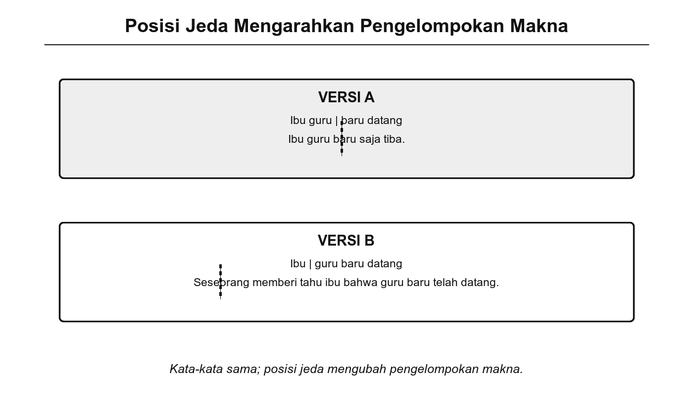

# Bab 5. Pungtuasi

## Tujuan Pembelajaran

Setelah mempelajari bab ini, pembaca diharapkan mampu:

1. Menjelaskan hubungan antara tanda baca dalam tulisan dan elemen suprasegmental dalam ujaran lisan.
2. Mengidentifikasi fungsi jeda, tekanan, dan intonasi sebagai bentuk pungtuasi dalam komunikasi lisan.
3. Memberikan contoh bagaimana jeda dan intonasi yang berbeda dapat mengubah makna suatu ujaran.
4. Membedakan penggunaan pungtuasi lisan dalam konteks formal dan informal.

## Pengantar Bab

Pada Bab 4, kita telah membahas unsur suprasegmental seperti tekanan, nada, intonasi, dan durasi. Bab ini melangkah lebih jauh dengan mengaitkan unsur-unsur suprasegmental tersebut dengan konsep **pungtuasi**, yaitu cara mengatur struktur dan aliran ujaran.

Dalam konteks fonologi, *pungtuasi* tidak hanya merujuk pada tanda baca dalam tulisan (titik, koma, tanda tanya), tetapi juga pada penggunaan elemen suprasegmental seperti jeda, intonasi, tekanan, dan durasi yang berfungsi mengatur aliran ujaran lisan (Crystal, 2008; Roach, 2009). Tanda baca dalam tulisan pada dasarnya merupakan representasi grafis dari pungtuasi lisan: koma mewakili jeda pendek, titik mewakili jeda panjang dengan intonasi turun, dan tanda tanya mewakili intonasi naik di akhir kalimat.

Memahami hubungan ini penting karena pungtuasi lisan sering kali menentukan makna ujaran secara lebih langsung daripada kata-kata itu sendiri. Jeda yang salah posisi atau intonasi yang tidak tepat dapat mengubah makna kalimat secara drastis.

{width="5.8in"}

Gambar 5.1 Hubungan Pungtuasi Tulisan dan Pungtuasi Lisan

## 5.1 Fungsi Pungtuasi dalam Ujaran Lisan

Dalam komunikasi lisan, pungtuasi diwakili oleh elemen-elemen suprasegmental yang bekerja secara simultan. Crystal (2008) mengidentifikasi tiga fungsi utama pungtuasi lisan dalam mengatur ujaran.

### Menandai Batas Gagasan

Jeda berfungsi memisahkan satu gagasan dari gagasan lain dalam ujaran. Tanpa jeda, pendengar akan kesulitan memilah informasi. Perhatikan perbedaan berikut:

- "Saya pergi ke pasar (jeda) lalu saya membeli buah." Jeda setelah "pasar" memberi waktu bagi pendengar untuk memproses informasi pertama (tujuan) sebelum menerima informasi kedua (kegiatan).
- Tanpa jeda: "Saya pergi ke pasar lalu saya membeli buah" terdengar seperti satu aliran informasi yang lebih sulit dicerna.

Halim (1984) menunjukkan bahwa jeda dalam bahasa Indonesia umumnya ditempatkan di batas klausa, batas frasa preposisional, atau sebelum konjungsi. Penempatan ini bukan kebetulan, melainkan mencerminkan struktur sintaksis kalimat.

### Membedakan Fungsi Kalimat

Intonasi merupakan alat utama untuk membedakan fungsi kalimat dalam bahasa Indonesia. Seperti telah disinggung pada Bab 4, perubahan intonasi dapat mengubah pernyataan menjadi pertanyaan tanpa mengubah kata-kata yang digunakan:

- "Kamu sudah makan." (intonasi turun di akhir = pernyataan)
- "Kamu sudah makan?" (intonasi naik di akhir = pertanyaan)

Kemampuan ini sangat penting dalam bahasa Indonesia karena, berbeda dari bahasa seperti bahasa Inggris yang memiliki inversi subjek-verba untuk menandai pertanyaan ("You are going" → "Are you going?"), bahasa Indonesia tidak memiliki perubahan urutan kata yang wajib untuk membentuk pertanyaan (Sneddon dkk., 2010). Intonasi sering kali menjadi satu-satunya penanda.

### Menekankan Informasi Penting

Tekanan kalimat membantu menyoroti informasi yang dianggap paling penting oleh penutur. Dalam kalimat "Saya mau pergi **sekarang**," penekanan pada kata "sekarang" menandakan urgensi waktu. Jika tekanan dipindahkan ke "**Saya** mau pergi sekarang," fokus bergeser ke identitas orang yang akan pergi.

Muslich (2013) mencatat bahwa tekanan kalimat dalam bahasa Indonesia bersifat fleksibel dan sangat bergantung pada konteks komunikasi. Pembicara yang terampil memanfaatkan tekanan kalimat secara sadar untuk mengarahkan perhatian pendengar.

## 5.2 Tanda Baca Utama dan Padanan Lisannya

Setiap tanda baca utama dalam tulisan memiliki padanan suprasegmental dalam ujaran lisan. Tabel berikut merangkum hubungan tersebut:

**Tabel 5.1** Tanda Baca dan Padanan Suprasegmentalnya

| **Tanda baca** | **Padanan lisan** | **Ciri suprasegmental** | **Contoh** |
|---|---|---|---|
| Koma (,) | Jeda pendek | Jeda singkat; intonasi belum tuntas, menandakan ada kelanjutan | "Hari ini, saya pergi ke pasar." |
| Titik (.) | Jeda panjang + intonasi turun | Jeda lebih lama; nada menurun di akhir, menandakan ujaran selesai | "Dia sudah pulang." |
| Tanda tanya (?) | Intonasi naik di akhir | Nada naik pada suku kata terakhir atau kata terakhir | "Kamu sudah selesai?" |
| Tanda seru (!) | Intonasi tinggi, volume naik | Nada dan/atau volume meningkat, menandakan emosi atau urgensi | "Awas, ada lubang!" |

**Koma** dalam ujaran lisan diwakili oleh jeda pendek yang memberi pendengar waktu singkat untuk memproses informasi sebelum kalimat berlanjut. Intonasi pada posisi koma biasanya belum tuntas, artinya nada tidak turun sepenuhnya sehingga pendengar tahu bahwa ujaran masih berlanjut (Crystal, 2008).

**Titik** diwakili oleh jeda yang lebih panjang disertai penurunan intonasi yang menandakan bahwa ide atau kalimat telah selesai. Penurunan intonasi ini merupakan sinyal universal dalam banyak bahasa untuk menandai akhir pernyataan (Roach, 2009).

**Tanda tanya** diwakili oleh intonasi naik di akhir ujaran. Dalam bahasa Indonesia, kenaikan intonasi ini biasanya terjadi pada suku kata terakhir atau pada kata terakhir kalimat (Halim, 1984).

**Tanda seru** diwakili oleh peningkatan nada, volume, atau keduanya. Dalam ujaran perintah atau seruan, penutur biasanya meningkatkan intensitas suaranya untuk menunjukkan urgensi atau emosi yang kuat.

## 5.3 Tanda Baca Tambahan dan Elemen Prosodi

Selain tanda baca utama, beberapa elemen suprasegmental berfungsi sebagai "tanda baca tambahan" yang memperkaya makna ujaran dalam konteks tertentu.

### Jeda Panjang untuk Penekanan atau Keraguan

Jeda yang lebih panjang dari biasanya dapat menandakan keraguan, ketidakpastian, atau penekanan dramatis. Dalam percakapan, jeda semacam ini sering disertai bunyi pengisi (*filler*) seperti "eh," "em," atau "anu" (Chaer, 2009).

Contoh: "Aku... tidak yakin dengan jawabannya." Jeda setelah "Aku" menyiratkan keraguan atau kesulitan mengartikulasikan pikiran.

### Perubahan Nada untuk Sikap

Perubahan nada di luar pola intonasi standar dapat menandakan sikap penutur, seperti ironi, sarkasme, ketidakpercayaan, atau humor. Misalnya, ujaran "Oh, jadi kamu mau pergi...?" dengan nada naik yang berlebihan pada "jadi" dapat menandakan ketidakpercayaan atau ironi, bukan sekadar pertanyaan biasa.

Wells (2006) menyebut penggunaan nada untuk menandai sikap ini sebagai *attitudinal function* dari intonasi, yang merupakan salah satu fungsi intonasi yang paling kompleks dan paling sulit dikuasai oleh pemelajar bahasa kedua.

### Jeda Retoris

Dalam situasi formal seperti pidato atau presentasi, jeda panjang sering digunakan secara sengaja untuk memberikan efek retoris: menarik perhatian pendengar, memberi waktu untuk merenungkan pernyataan sebelumnya, atau membangun antisipasi terhadap pernyataan berikutnya.

> Contoh: "Ini bukan hanya tentang kita. (jeda panjang) Ini tentang masa depan anak-anak kita."

Jeda retoris efektif karena memanfaatkan prinsip psikologis: keheningan di tengah ujaran menciptakan ketegangan yang meningkatkan perhatian pendengar (Crystal, 2008).

## 5.4 Pungtuasi dalam Konteks Formal dan Informal

Penggunaan pungtuasi lisan berbeda secara signifikan antara konteks formal dan informal. Perbedaan ini bukan sekadar soal "kebenaran," melainkan mencerminkan penyesuaian terhadap situasi komunikasi (Sneddon, 2003).

### Konteks Formal

Dalam situasi formal seperti pidato, presentasi, atau ceramah, pungtuasi lisan cenderung lebih terstruktur:

- Jeda ditempatkan secara terencana di batas klausa dan sebelum informasi penting.
- Intonasi diatur untuk menjaga kejelasan dan profesionalisme.
- Tempo ujaran cenderung lebih lambat agar pendengar dapat mengikuti gagasan.
- Tekanan kata digunakan secara sadar untuk mengarahkan fokus informasi.

### Konteks Informal

Dalam percakapan sehari-hari, pungtuasi lisan lebih fleksibel dan sering kali dipengaruhi oleh kecepatan bicara serta kedekatan antarpenutur:

- Jeda lebih pendek atau bahkan hilang, sehingga ujaran terdengar mengalir cepat.
- Intonasi lebih bervariasi, mencerminkan emosi dan sikap secara lebih ekspresif.
- Tekanan sering kali berpindah untuk memberi efek humor, ironi, atau penekanan spontan.
- Elisi (penghilangan bunyi) sering terjadi, misalnya "tidak apa-apa" menjadi "gak papa" (lihat Bab 7 tentang fonem hilang dalam kolokasi).

**Tabel 5.2** Perbedaan Pungtuasi Lisan dalam Konteks Formal dan Informal

| **Aspek** | **Formal** | **Informal** |
|---|---|---|
| Jeda | Terencana, di batas klausa | Pendek, sering hilang |
| Intonasi | Terkendali, stabil | Bervariasi, ekspresif |
| Tempo | Lambat, terukur | Cepat, fleksibel |
| Tekanan | Sadar, untuk fokus informasi | Spontan, untuk efek emosi |
| Elisi | Jarang | Sering |

## 5.5 Pengaruh Pungtuasi terhadap Pemahaman

Pungtuasi lisan bukan sekadar pelengkap ujaran; elemen ini secara langsung memengaruhi bagaimana pesan dipahami oleh pendengar (Muslich, 2013). Kesalahan dalam menempatkan jeda atau memilih intonasi dapat menyebabkan makna ujaran berubah secara drastis.

### Kesalahan Umum

Salah satu kesalahan yang sering terjadi dalam presentasi atau pidato adalah menempatkan jeda di posisi yang salah. Perhatikan kalimat berikut:

- "Ibu guru / baru datang." (Jeda setelah "guru"): Ibu guru baru saja tiba.
- "Ibu / guru baru datang." (Jeda setelah "Ibu"): Seseorang memberitahu ibu bahwa guru baru telah datang.

Hanya dengan memindahkan posisi jeda, makna kalimat berubah total. Kata-kata yang digunakan persis sama, tetapi pungtuasi lisan (jeda) menentukan bagaimana pendengar mengelompokkan kata-kata tersebut dan memahami strukturnya (Halim, 1984).

{width="5.8in"}

Gambar 5.2 Pengaruh Posisi Jeda terhadap Makna Kalimat

### Contoh Nyata

Dalam konteks hukum, posisi jeda dan intonasi dalam ujaran lisan dapat menjadi sumber sengketa. Pertimbangkan kalimat "Tembak, jangan biarkan dia lari" vs. "Tembak jangan, biarkan dia lari." Dalam tulisan, koma menjelaskan makna. Dalam ujaran lisan, posisi jeda menentukan apakah perintahnya adalah "tembak" atau "jangan tembak." Contoh ini menunjukkan bahwa pungtuasi, baik tertulis maupun lisan, dapat memiliki konsekuensi nyata yang serius.

## Rangkuman

Pungtuasi dalam konteks fonologi mencakup penggunaan elemen suprasegmental (jeda, intonasi, tekanan, durasi) untuk mengatur struktur dan aliran ujaran lisan. Tanda baca utama dalam tulisan memiliki padanan suprasegmental: koma diwakili oleh jeda pendek, titik oleh jeda panjang dengan intonasi turun, tanda tanya oleh intonasi naik, dan tanda seru oleh peningkatan nada atau volume.

Elemen pungtuasi lisan tambahan meliputi jeda panjang untuk penekanan atau keraguan, perubahan nada untuk menandakan sikap (ironi, sarkasme), dan jeda retoris dalam situasi formal. Penggunaan pungtuasi lisan berbeda antara konteks formal (lebih terstruktur dan terkendali) dan informal (lebih fleksibel, sering disertai elisi).

Kesalahan pungtuasi lisan, terutama penempatan jeda yang tidak tepat, dapat mengubah makna ujaran secara drastis. Oleh karena itu, pemahaman tentang pungtuasi lisan penting bagi siapa pun yang ingin menjadi komunikator yang efektif, baik dalam percakapan sehari-hari maupun dalam konteks formal seperti pidato dan presentasi.

## Latihan Akhir Bab

1. Jelaskan hubungan antara tanda baca dalam tulisan dan elemen suprasegmental dalam ujaran lisan. Berikan padanan suprasegmental untuk tanda koma, titik, tanda tanya, dan tanda seru.

2. Ucapkan kalimat "Anak presiden itu cerdas" dengan jeda di dua posisi berbeda sehingga menghasilkan dua makna yang berbeda. Jelaskan makna masing-masing dan identifikasi peran jeda dalam menentukan makna.

3. Perhatikan kalimat berikut: "Saya tidak mau makan nasi goreng." Ucapkan kalimat ini empat kali dengan tekanan pada kata yang berbeda setiap kali. Catat bagaimana makna atau fokus pesan berubah pada setiap versi.

4. Jelaskan perbedaan penggunaan pungtuasi lisan dalam konteks formal (misalnya pidato) dan informal (misalnya percakapan santai). Berikan contoh konkret untuk masing-masing konteks.

## 🧠 Istilah yang dipelajari pada bab ini

- **Pungtuasi lisan**: penggunaan elemen suprasegmental (jeda, intonasi, tekanan) untuk mengatur struktur dan aliran ujaran lisan, padanan dari tanda baca dalam tulisan.
- **Jeda** (*pause*): penghentian ujaran sesaat yang berfungsi memisahkan gagasan, memberi waktu proses, atau menandai batas kalimat.
- **Jeda retoris**: jeda panjang yang ditempatkan secara sengaja dalam pidato atau presentasi untuk efek dramatis atau menarik perhatian pendengar.
- **Bunyi pengisi** (*filler*): bunyi atau kata yang diucapkan untuk mengisi jeda saat penutur berpikir, misalnya "eh," "em," atau "anu."
- **Fungsi atitudinal intonasi**: penggunaan intonasi untuk menandakan sikap penutur seperti ironi, sarkasme, ketidakpercayaan, atau humor.
- **Prosodi** (*prosody*): istilah umum untuk aspek-aspek suprasegmental ujaran, termasuk intonasi, tekanan, tempo, dan jeda.
