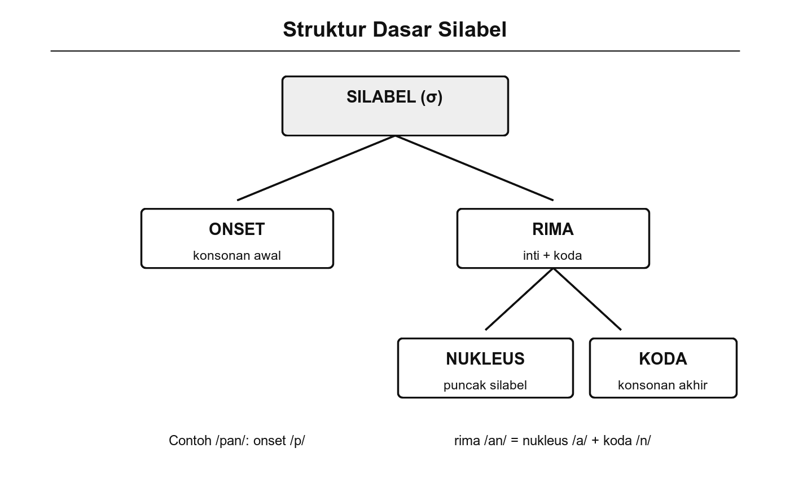
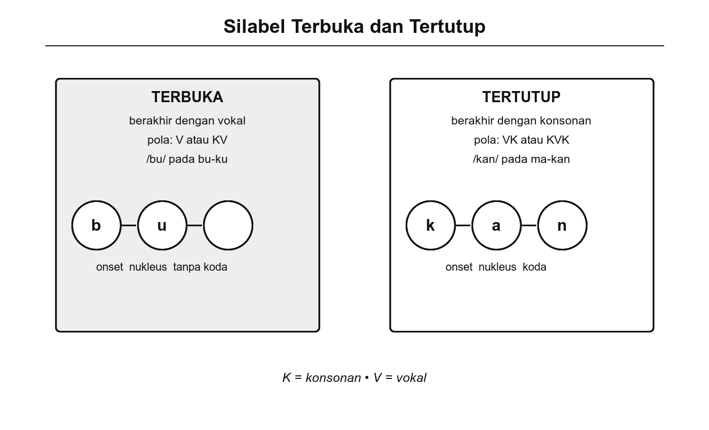

# Bab 6. Silabel

## Tujuan Pembelajaran

Setelah mempelajari bab ini, pembaca diharapkan mampu:

1. Menjelaskan pengertian silabel dan komponen-komponen penyusunnya (onset, nukleus, koda).
2. Mengidentifikasi pola silabel yang ditemukan dalam bahasa Indonesia.
3. Membedakan silabel terbuka dan silabel tertutup serta memberikan contoh masing-masing.
4. Menjelaskan pengaruh struktur silabel terhadap ejaan dan pemenggalan kata dalam bahasa Indonesia.

## Pengantar Bab

Sebelum sebuah kata terbentuk utuh, bunyi-bunyi bahasa terlebih dahulu diorganisasi ke dalam satuan yang lebih kecil dari kata tetapi lebih besar dari fonem individual. Satuan itu disebut **silabel** atau suku kata. Silabel adalah satuan ritmis terkecil dalam arus ujaran, biasanya terdiri dari satu vokal sebagai inti dan satu atau lebih konsonan sebagai pendamping.

Pemahaman tentang silabel menjadi dasar penting untuk mempelajari fonotaktik (Bab 9), diftong dan kluster (Bab 10), serta deret fonem (Bab 11). Bab ini membahas struktur silabel, pola-pola silabel dalam bahasa Indonesia, perbedaan silabel terbuka dan tertutup, serta pengaruh silabel terhadap ejaan.

## 6.1 Struktur dan Fungsi Silabel

Silabel (suku kata) adalah satuan ritmis terkecil dalam arus ujaran yang ditandai oleh satu puncak kenyaringan atau *sonoritas* (Chaer, 2009). Puncak sonoritas ini hampir selalu jatuh pada vokal karena vokal memiliki tingkat kenyaringan tertinggi di antara bunyi-bunyi bahasa. Dalam bahasa Indonesia, setiap silabel tersusun dari tiga komponen (Marsono, 2019):

{width="5.8in"}

Gambar 6.1 Struktur Silabel: Onset, Nukleus, dan Koda

- **Onset**: konsonan atau gugus konsonan yang mengawali silabel, hadir sebelum vokal. Onset bersifat opsional; tidak semua silabel harus memiliki onset. Contoh: "m" pada suku kata **ma** dalam kata "mata."
- **Nukleus** (inti silabel): vokal yang menjadi puncak kenyaringan. Nukleus bersifat wajib; setiap silabel harus memiliki nukleus. Contoh: "a" pada suku kata **ma**.
- **Koda**: konsonan yang mengakhiri silabel, hadir setelah vokal. Koda bersifat opsional. Contoh: "n" pada suku kata **man** dalam kata "mandi."

Kemungkinan urutan bunyi konsonan-vokal dalam silabel diatur oleh kaidah **fonotaktik** (Chaer, 2009; Marsono, 2019), yang akan dibahas secara mendalam pada Bab 9.

### Prinsip Dasar Silabisasi

Silabisasi, yaitu proses penguraian kata menjadi suku-suku kata, dalam bahasa Indonesia mengikuti beberapa prinsip dasar (Chaer, 2009; Muslich, 2013):

1. **Setiap silabel harus memiliki satu vokal sebagai inti.** Vokal adalah unsur wajib; konsonan bersifat pendamping. Jumlah silabel dalam satu kata sama dengan jumlah puncak sonoritas (umumnya sama dengan jumlah vokal).

2. **Jika terdapat satu konsonan di antara dua vokal, konsonan itu menjadi onset silabel berikutnya.** Contoh: "mata" → ma-ta (bukan mat-a).

3. **Jika terdapat dua konsonan di antara dua vokal, umumnya konsonan pertama menjadi koda silabel sebelumnya dan konsonan kedua menjadi onset silabel berikutnya.** Contoh: "tangan" → ta-ngan; "panda" → pan-da.

4. **Diftong tidak dipisahkan.** Diftong seperti /ai/ dan /au/ dianggap sebagai satu kesatuan vokal dalam satu silabel. Contoh: "santai" → san-tai (bukan san-ta-i).

### Fungsi Silabel

Silabel memiliki beberapa fungsi dalam sistem bahasa Indonesia (Chaer, 2009):

- **Membentuk satuan ritmis.** Silabel menjadi unit dasar ritme ujaran. Jumlah dan pola silabel memengaruhi bagaimana sebuah kata atau frasa terdengar secara ritmis.
- **Menentukan aturan fonotaktik.** Pola silabisasi menentukan kombinasi fonem yang diizinkan dalam bahasa, termasuk gugus konsonan mana yang boleh muncul di onset dan koda (lihat Bab 9).
- **Memengaruhi proses fonologis.** Silabisasi memengaruhi proses seperti pemenggalan kata, penempatan tekanan, dan perubahan bunyi di batas silabel.

## 6.2 Pola Silabel dalam Bahasa Indonesia

Bahasa Indonesia memiliki beragam pola silabel yang dilambangkan dengan K (konsonan) dan V (vokal). Tabel berikut merangkum pola-pola silabel yang ditemukan (Chaer, 2009; Muslich, 2013):

**Tabel 6.1** Pola Silabel Bahasa Indonesia

| **Pola** | **Contoh suku kata** | **Dalam kata** | **Keterangan** |
|---|---|---|---|
| V | a- | **a**-dik | Vokal saja, tanpa konsonan |
| VK | an- | **an**-da | Vokal diikuti konsonan |
| KV | bu | i-**bu** | Pola paling umum, silabel terbuka |
| KVK | duk | du-**duk** | Pola umum, silabel tertutup |
| KKV | tra | pu-**tra** | Gugus konsonan di onset |
| KKKV | stra | **stra**-ta | Tiga konsonan di onset (kata serapan) |
| KKVK | trak | kon-**trak** | Gugus konsonan + koda |
| KKKVK | struk | **struk**-tur | Tiga konsonan + koda (kata serapan) |
| VKK | eks | **eks**-plo-i-ta-si | Vokal + dua konsonan koda |
| KVKK | teks | kon-**teks** | Konsonan + vokal + dua koda |

Dari tabel ini terlihat bahwa pola KV (konsonan-vokal) merupakan pola silabel yang paling umum dan paling khas dalam bahasa Indonesia. Pola-pola dengan gugus konsonan yang kompleks (KKV, KKKV, KKVK, KKKVK) hampir seluruhnya ditemukan pada kata serapan dari bahasa Sanskerta, Belanda, atau Inggris. Kata-kata asli bahasa Indonesia didominasi oleh pola V, VK, KV, dan KVK (Lapoliwa, 1981).

### Coba Perhatikan

Pecahkan kata "perpustakaan" menjadi suku kata: **per-pus-ta-ka-an**. Perhatikan pola setiap silabelnya: "per" (KVK), "pus" (KVK), "ta" (KV), "ka" (KV), "an" (VK). Empat dari lima silabel mengikuti pola KV atau KVK yang merupakan pola paling umum dalam bahasa Indonesia.

## 6.3 Silabel Terbuka dan Tertutup

Berdasarkan bunyi akhirnya, silabel dibedakan menjadi dua jenis (Chaer, 2009; Muslich, 2013):

{width="5.8in"}

Gambar 6.2 Silabel Terbuka dan Silabel Tertutup

**Silabel terbuka** adalah suku kata yang berakhir dengan vokal, berpola (K)V. Contoh: "ba" dan "ta" pada kata "ba-ta," "i" pada kata "i-bu." Silabel terbuka merupakan pola yang paling dominan dalam bahasa Indonesia dan umumnya lebih mudah diucapkan. Dominasi pola KV ini menjadikan bahasa Indonesia termasuk bahasa yang relatif mudah dalam hal pelafalan (Lapoliwa, 1981).

**Silabel tertutup** adalah suku kata yang berakhir dengan konsonan, berpola (K)VK. Contoh: "man" pada kata "man-di," "duk" pada kata "du-duk." Silabel tertutup memberi kesan lebih "berat" dalam pengucapan dan sering muncul di akhir kata.

**Tabel 6.2** Perbandingan Silabel Terbuka dan Tertutup

| **Aspek** | **Silabel terbuka** | **Silabel tertutup** |
|---|---|---|
| Pola | Berakhir vokal: V, KV, KKV | Berakhir konsonan: VK, KVK, KKVK |
| Frekuensi dalam BI | Sangat tinggi, dominan | Cukup tinggi, terutama di akhir kata |
| Contoh | "ba" (ba-tu), "i" (i-kan) | "man" (man-di), "rak" (rak-yat) |
| Kesan artikulasi | Lebih ringan, mengalir | Lebih berat, tertahan |

### Trivia

Bahasa Indonesia termasuk bahasa yang didominasi oleh silabel terbuka (berakhir vokal). Jika kita menghitung silabel dalam teks bahasa Indonesia, sekitar 60–70% silabel berpola KV terbuka (Lapoliwa, 1981). Bandingkan dengan bahasa Inggris yang memiliki proporsi silabel tertutup yang jauh lebih tinggi karena banyaknya gugus konsonan di akhir kata (misalnya "strengths" yang berakhir dengan empat konsonan /ŋkθs/).

## 6.4 Pengaruh Silabel terhadap Ejaan

Struktur silabel berpengaruh langsung terhadap beberapa aspek ejaan bahasa Indonesia (Muslich, 2013; Chaer, 2009):

### Pemenggalan Kata

Pemenggalan kata di akhir baris dalam penulisan mengikuti batas silabel. Pedoman Umum Ejaan Bahasa Indonesia (PUEBI) menetapkan bahwa kata dipenggal di antara suku kata. Misalnya, kata "mengajar" dipenggal menjadi "meng-ajar" (bukan "me-ngajar" atau "menga-jar") karena "ng" merupakan satu fonem /ŋ/ yang tidak dipisahkan dari vokal yang mengikutinya.

### Perubahan Ejaan Akibat Afiksasi

Ketika afiks ditambahkan pada kata dasar, silabel baru dapat terbentuk dan memengaruhi ejaan. Misalnya, penambahan akhiran "-an" pada kata "makan" menghasilkan "makanan" dengan struktur silabel yang berubah: ma-kan → ma-ka-nan. Perubahan ini menunjukkan bahwa batas silabel dapat bergeser akibat proses morfologis.

### Adaptasi Kata Serapan

Kata serapan dari bahasa asing sering membawa struktur silabel yang tidak sesuai dengan pola dominan bahasa Indonesia. Proses adaptasi biasanya melibatkan penyesuaian silabel agar lebih sesuai dengan pola bahasa Indonesia. Contohnya, kata Belanda *school* [sxoːl] yang berpola KKVK diadaptasi menjadi "sekolah" dengan pola KV-KV-KVK yang lebih lazim. Proses adaptasi ini akan dibahas lebih lanjut pada Bab 9 (Fonotaktik).

### Korespondensi Ejaan dan Silabel

Bahasa Indonesia memiliki korespondensi yang cukup teratur antara ejaan dan silabisasi. Hal ini dimungkinkan karena hubungan grafem-fonem dalam bahasa Indonesia relatif konsisten (satu huruf umumnya mewakili satu fonem). Namun, beberapa ketidakteraturan tetap ada, terutama pada digraf "ng" (/ŋ/) dan "ny" (/ɲ/) yang masing-masing dua huruf tetapi mewakili satu fonem, serta huruf "e" yang dapat mewakili dua fonem berbeda (/e/ atau /ə/). Pembahasan mendalam tentang hubungan grafem-fonem akan disajikan pada Bab 12 (Grafemik dan Ejaan).

## Rangkuman

Silabel (suku kata) adalah satuan ritmis terkecil dalam ujaran, ditandai oleh satu puncak kenyaringan yang jatuh pada vokal. Setiap silabel tersusun dari onset (konsonan awal, opsional), nukleus (vokal sebagai inti, wajib), dan koda (konsonan akhir, opsional).

Bahasa Indonesia memiliki beragam pola silabel mulai dari yang paling sederhana (V, KV) hingga yang kompleks (KKKVK), dengan pola kompleks umumnya ditemukan pada kata serapan. Pola KV terbuka merupakan pola paling dominan. Silabel terbuka (berakhir vokal) mendominasi bahasa Indonesia, sementara silabel tertutup (berakhir konsonan) lebih sering muncul di akhir kata.

Struktur silabel berpengaruh pada ejaan, terutama pada pemenggalan kata, perubahan ejaan akibat afiksasi, dan adaptasi kata serapan. Pemahaman tentang silabel menjadi dasar penting untuk mempelajari fonotaktik (Bab 9) dan diftong serta kluster (Bab 10).

## Latihan Akhir Bab

1. Jelaskan tiga komponen penyusun silabel (onset, nukleus, koda) dan berikan contoh masing-masing dari kata bahasa Indonesia.

2. Pecahkan kata-kata berikut menjadi suku kata dan tentukan pola setiap suku katanya (V, KV, KVK, KKV, dst.): "universitas," "struktur," "membaca," "sekolah."

3. Jelaskan perbedaan silabel terbuka dan silabel tertutup. Berikan tiga contoh kata yang seluruh silabelnya terbuka dan tiga contoh kata yang memiliki campuran silabel terbuka dan tertutup.

4. Mengapa kata serapan seperti "struktur" dan "abstrak" memiliki pola silabel yang berbeda dari kebanyakan kata asli bahasa Indonesia? Jelaskan dari sudut pandang pola silabel.

5. Pilih sebuah paragraf pendek dari buku atau artikel berbahasa Indonesia, lalu hitung jumlah silabel terbuka dan silabel tertutup. Berapa persentase silabel terbuka? Apa kesimpulan yang dapat ditarik?

## 🧠 Istilah yang dipelajari pada bab ini

- **Silabel** (suku kata): satuan ritmis terkecil dalam arus ujaran, terdiri dari satu puncak kenyaringan yang biasanya jatuh pada vokal.
- **Onset**: konsonan atau gugus konsonan yang mengawali silabel, terletak sebelum nukleus. Bersifat opsional.
- **Nukleus** (inti silabel): vokal yang menjadi puncak kenyaringan dalam silabel. Bersifat wajib.
- **Koda**: konsonan yang mengakhiri silabel, terletak setelah nukleus. Bersifat opsional.
- ***Sonoritas*** (kenyaringan): tingkat kejelasan atau kelantangan relatif suatu bunyi. Vokal memiliki sonoritas tertinggi.
- **Silabel terbuka**: suku kata yang berakhir dengan vokal, berpola (K)V.
- **Silabel tertutup**: suku kata yang berakhir dengan konsonan, berpola (K)VK.
- **Silabisasi**: proses penguraian kata menjadi suku-suku kata berdasarkan aturan fonologis.
- **Pemenggalan kata**: pemisahan kata menjadi bagian-bagian saat berpindah baris dalam penulisan, mengikuti aturan silabisasi.
- **Fonotaktik**: aturan tentang urutan dan kombinasi fonem yang diizinkan dalam suatu bahasa (dibahas pada Bab 9).
