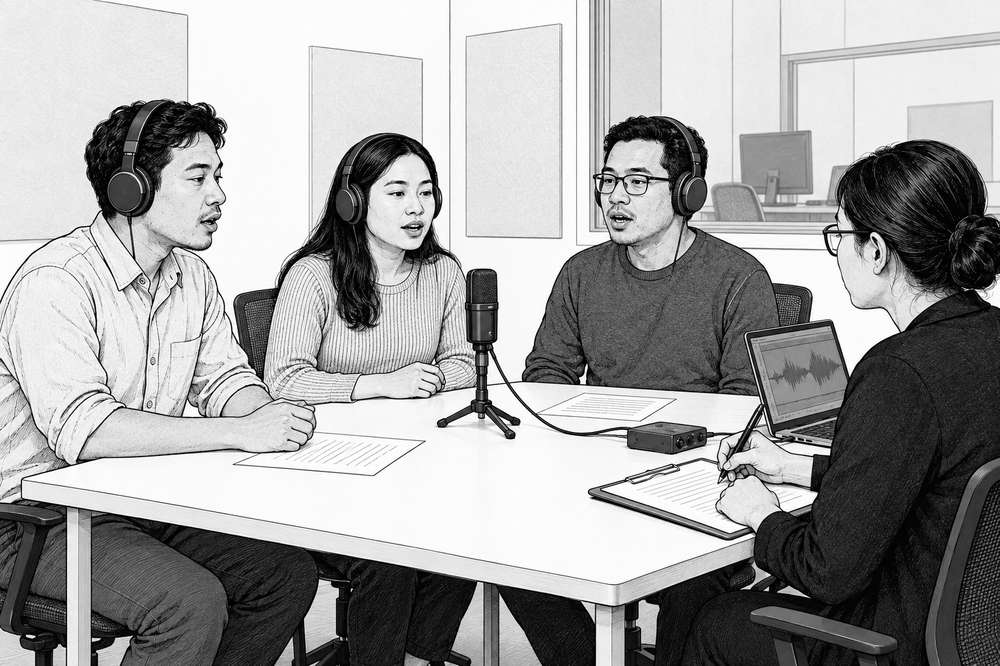
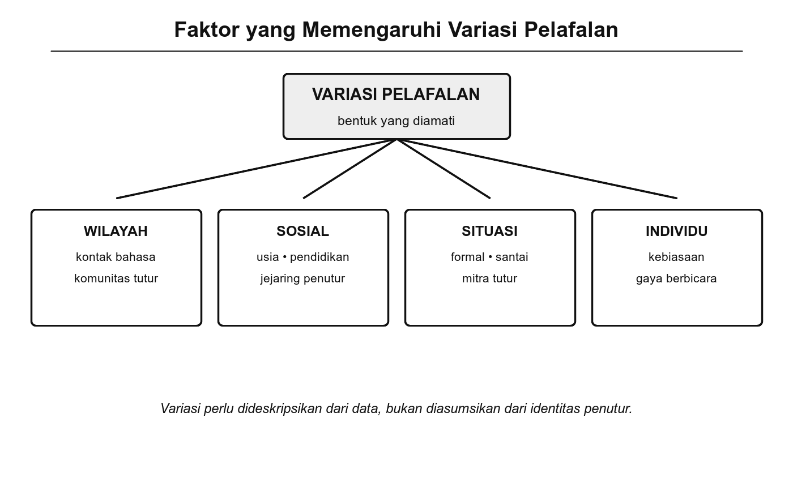

# Bab 7. Variasi Fonem

## Tujuan Pembelajaran

Setelah mempelajari bab ini, pembaca diharapkan mampu:

1. Menjelaskan konsep fonem, alofon, dan pasangan minimal serta hubungan ketiganya.
2. Mengidentifikasi variasi fonem yang terjadi antardialek dalam bahasa Indonesia.
3. Menjelaskan fenomena fonem hilang dalam kolokasi beserta proses fonologis yang mendasarinya.
4. Mengaitkan variasi fonem dengan faktor sosiolinguistik seperti kelas sosial, gender, dan identitas regional.

## Pengantar Bab

Pada bab sebelumnya, kita telah mempelajari struktur silabel sebagai satuan ritmis terkecil dalam ujaran. Kini kita bergerak dari tataran struktur ke tataran variasi: bagaimana fonem yang "sama" dapat diucapkan secara berbeda oleh penutur yang berbeda, di daerah yang berbeda, atau dalam situasi yang berbeda.

Variasi fonem bukan sekadar penyimpangan dari norma. Variasi ini justru mencerminkan kekayaan linguistik dan dinamika sosial suatu bahasa. Ketika seseorang dari Jakarta mengucapkan kata "apa" sebagai [apɛ] dan seseorang dari Surabaya mengucapkannya sebagai [ɔpɔ], keduanya menggunakan bahasa Indonesia, tetapi dengan realisasi fonem yang berbeda. Perbedaan semacam ini, jika diamati secara sistematis, mengungkapkan banyak hal tentang hubungan antara bunyi bahasa, wilayah, dan masyarakat.

Bab ini membahas alofon dan pasangan minimal, perubahan fonem antardialek, fonem yang hilang dalam kolokasi, serta peran sosiolinguistik dalam variasi bunyi.

## 7.1 Fonem dan Variannya

Fonem adalah satuan bahasa terkecil yang bersifat fungsional, artinya fonem memiliki fungsi untuk membedakan makna (Chaer, 2009; Muslich, 2013). Sebagai satuan abstrak, fonem tidak berdiri sendiri dalam ujaran. Setiap kali seseorang berbicara, fonem terwujud sebagai **fon**, yaitu bunyi konkret yang terdengar. Fon-fon yang merupakan variasi dari satu fonem disebut **alofon** (Marsono, 2019).

Untuk membuktikan bahwa dua bunyi merupakan fonem yang berbeda, digunakan teknik **pasangan minimal** (*minimal pair*), yaitu sepasang kata yang hanya berbeda satu bunyi dan memiliki makna yang berlainan.

### Pasangan Minimal

Pasangan minimal merupakan alat uji dasar dalam analisis fonemik (Chaer, 2009). Jika mengganti satu bunyi dalam suatu kata menghasilkan kata lain yang bermakna berbeda, maka kedua bunyi itu adalah fonem yang berbeda. Perhatikan contoh berikut:

**Tabel 7.1** Contoh Pasangan Minimal dalam Bahasa Indonesia

| **Kata 1** | **Kata 2** | **Fonem yang berkontras** | **Bukti** |
|------------|------------|--------------------------|-----------|
| /batuk/ | /patuk/ | /b/ ≠ /p/ | Bersuara vs. tak bersuara |
| /dara/ | /tara/ | /d/ ≠ /t/ | Bersuara vs. tak bersuara |
| /galah/ | /kalah/ | /g/ ≠ /k/ | Bersuara vs. tak bersuara |
| /tali/ | /tuli/ | /a/ ≠ /u/ | Vokal rendah vs. vokal tinggi |
| /baru/ | /biru/ | /a/ ≠ /i/ | Vokal rendah vs. vokal tinggi depan |

Melalui pasangan minimal, kita dapat memastikan status fonemik bunyi-bunyi bahasa Indonesia secara empiris, bukan berdasarkan asumsi semata.

### Premis Fonologis

Analisis fonem berlandaskan beberapa premis dasar yang telah dirumuskan oleh para fonolog strukturalis (Pike, 1947; Chaer, 2009):

1. Bunyi bahasa cenderung dipengaruhi oleh lingkungan sekitarnya. Bunyi yang sama dapat terdengar sedikit berbeda tergantung bunyi lain yang mengapitnya.

2. Sistem bunyi suatu bahasa cenderung bersifat simetris. Jika bahasa memiliki seri plosif tak bersuara /p, t, k/, kemungkinan besar bahasa itu juga memiliki seri pasangan bersuaranya /b, d, g/.

3. Bunyi-bunyi yang secara fonetis mirip tetapi berkontras dalam lingkungan yang sama harus digolongkan ke dalam fonem yang berbeda. Inilah yang dibuktikan oleh pasangan minimal.

4. Bunyi-bunyi yang secara fonetis mirip dan terdapat dalam **distribusi komplementer** (tidak pernah muncul di lingkungan yang sama) harus dimasukkan ke dalam fonem yang sama sebagai alofon.

### Alofon

Alofon adalah varian pengucapan dari satu fonem yang tidak membedakan makna (Muslich, 2013). Kemunculan alofon ditentukan oleh lingkungan fonetis, yaitu bunyi-bunyi lain yang berada di sekitarnya. Tabel berikut menunjukkan beberapa contoh alofon dalam bahasa Indonesia:

**Tabel 7.2** Alofon Beberapa Fonem Bahasa Indonesia

| **Fonem** | **Alofon** | **Lingkungan** | **Contoh** | **Keterangan** |
|-----------|-----------|----------------|------------|----------------|
| /k/ | [k] | Awal dan tengah kata | [k]opi, su[k]a | Plosif velar standar |
| | [ʔ] | Akhir kata (ragam informal) | bapa[ʔ], masa[ʔ] | Hambat glotal menggantikan /k/ |
| /t/ | [t] | Awal dan tengah kata | [t]ikus, a[t]as | Plosif alveolar standar |
| | [t̚] | Akhir kata | mulu[t̚] | Tak terlepas (*unreleased*) |
| /b/ | [b] | Awal kata | [b]aju, [b]uku | Plosif bilabial standar |
| | [β] | Antarvokal (ragam cepat) | a[β]i | Frikatif bilabial, spirantisasi |

Perlu dicatat bahwa status alofon [β] untuk /b/ antarvokal masih diperdebatkan dalam literatur fonologi bahasa Indonesia. Tidak semua penutur menunjukkan spirantisasi ini, dan fenomena ini lebih umum dalam ragam ujaran cepat (Lapoliwa, 1981).

{width="5.8in"}

Gambar 7.1 Pengamatan Variasi Pelafalan melalui Rekaman dan Pencatatan Data

## 7.2 Perubahan Fonem dalam Dialek

Setiap dialek memiliki sistem fonologis yang khas, yang sering kali berbeda dari bahasa standar maupun dialek lain (Trudgill, 2000). Perbedaan itu dapat berupa pergeseran pelafalan, hilangnya fonem tertentu, munculnya fonem baru, atau penggabungan dua fonem menjadi satu. Bagian ini menguraikan beberapa jenis perubahan fonem antardialek yang dapat diamati di Indonesia.

### Perbedaan Pelafalan Fonem Antardialek

Perbedaan paling mendasar antardialek adalah perbedaan cara melafalkan fonem yang sama. Fonem tetap "ada" dalam sistem, tetapi wujud bunyinya berbeda. Beberapa contoh penting dalam konteks bahasa Indonesia dan bahasa-bahasa daerah:

**Elisi fonem /h/.** Dalam dialek Betawi, fonem /h/ di akhir kata cenderung dihilangkan (Muhadjir, 1984). Kata "sudah" diucapkan [suda], "rumah" menjadi [ruma], dan "tanah" menjadi [tana]. Fenomena ini juga ditemukan dalam dialek Melayu Riau dan beberapa variasi Melayu lainnya. Dalam bahasa Indonesia baku, fonem /h/ akhir tetap dilafalkan.

**Pergeseran realisasi /r/.** Fonem /r/ merupakan salah satu fonem yang paling bervariasi di Nusantara. Dalam bahasa Indonesia baku, /r/ direalisasikan sebagai getar apikal [r], yaitu ujung lidah bergetar di gusi. Dalam dialek Minangkabau, /r/ sering direalisasikan sebagai [ʀ] (getar uvular) atau [ɣ] (frikatif uvular), terutama di posisi antarvokal (Moussay, 1998). Variasi ini tidak mengubah makna tetapi langsung menandai asal daerah penuturnya.

**Devoicing konsonan akhir.** Dalam beberapa subdialek bahasa Jawa, konsonan bersuara di akhir kata mengalami *devoicing* (menjadi tak bersuara). Fenomena ini juga tampak pada kata serapan dalam bahasa Indonesia, misalnya "jihad" yang sering terdengar sebagai [jihat] (Chaer, 2009).

### Pengurangan dan Penggabungan Fonem

Dalam beberapa dialek, dua fonem yang berbeda dalam bahasa standar tidak lagi dibedakan. Fenomena ini disebut **penggabungan fonem** (*merger*). Penggabungan fonem mengurangi jumlah fonem dalam sistem fonologis dialek tersebut (Crowley & Bowern, 2010).

Contohnya, dalam beberapa variasi Melayu, fonem /s/ dan /ʃ/ tidak dibedakan. Penutur menggunakan [s] untuk kedua fonem, sehingga kata seperti "syarat" dan "sarat" dilafalkan dengan bunyi awal yang sama. Penggabungan ini terjadi karena fonem /ʃ/ berasal dari kata serapan Arab dan tidak termasuk inventaris fonem asli Melayu (Adelaar & Himmelmann, 2005).

### Penambahan Fonem Akibat Kontak Bahasa

Sebaliknya, kontak dengan bahasa lain dapat memperkaya inventaris fonem suatu dialek. Dalam bahasa Indonesia baku, fonem /f/, /v/, /z/, dan /ʃ/ merupakan fonem serapan yang tidak ada dalam sistem fonem Melayu asli (Chaer, 2009). Fonem-fonem ini masuk melalui bahasa Arab (/f/, /z/, /ʃ/), Belanda (/f/, /v/), dan Inggris (/z/). Tidak semua penutur bahasa Indonesia menggunakan fonem-fonem ini secara konsisten. Beberapa penutur menggantikan /f/ dengan [p] ("pikir" untuk "fikir") atau /v/ dengan [p] ("pakem" untuk "vakum"), terutama penutur yang bahasa pertamanya tidak memiliki fonem tersebut.

### Variasi Vokal Antardialek

Pergeseran vokal merupakan penanda dialektal yang paling mudah dikenali di Indonesia. Beberapa pola yang sudah dikenal luas:

**Tabel 7.3** Variasi Realisasi Vokal /a/ di Akhir Kata Terbuka

| **Ragam/Dialek** | **Realisasi /a/ akhir** | **Contoh** | **Keterangan** |
|-------------------|------------------------|------------|----------------|
| Baku | [a] | "apa" [apa] | Vokal rendah pusat |
| Betawi/Jakarta | [ɛ] | "apa" [apɛ] | Bergeser ke depan tengah |
| Jawa Timuran | [ɔ] | "apa" [ɔpɔ] | Bergeser ke belakang bulat |
| Sunda (sebagian) | [a] | "apa" [apa] | Relatif sama dengan baku |

Pergeseran vokal semacam ini bersifat reguler: dalam dialek Betawi, hampir semua /a/ di akhir kata terbuka bergeser ke [ɛ], bukan hanya pada kata-kata tertentu (Muhadjir, 1984). Keteraturan ini menunjukkan bahwa perubahan tersebut bersifat sistematis, bukan acak.

### Coba Perhatikan

Ucapkan kata "sudah" dalam tiga konteks berikut: (1) dalam situasi formal seperti presentasi, (2) dalam percakapan santai dengan teman, (3) dalam pesan singkat lisan yang cepat. Banyak penutur akan melafalkannya sebagai [sudah], [suda], atau bahkan [uda] tergantung konteks. Perhatikan fonem mana yang hilang dan di konteks mana. Ini menunjukkan bahwa variasi fonem bukan hanya soal daerah, tetapi juga soal situasi komunikasi.

## 7.3 Fonem Hilang dalam Kolokasi

Dalam percakapan sehari-hari, fonem yang seharusnya diucapkan kadang hilang ketika kata-kata tertentu diucapkan secara berurutan. Fenomena ini sering terjadi dalam **kolokasi**, yaitu gabungan kata yang sering muncul bersama dalam ujaran (Chaer, 2009). Hilangnya fonem ini bukan kesalahan berbahasa, melainkan fenomena fonologis yang wajar dan ditemukan di hampir semua bahasa di dunia. Tiga proses utama yang menyebabkan hilangnya fonem dalam kolokasi adalah elisi, asimilasi, dan kompresi fonetik (Crowley & Bowern, 2010).

### Elisi

*Elisi* adalah hilangnya satu atau lebih fonem dalam ujaran, biasanya untuk mempermudah artikulasi. Dalam bahasa Indonesia lisan, elisi sangat produktif, terutama pada percakapan cepat.

**Tabel 7.4** Contoh Elisi dalam Bahasa Indonesia Lisan

| **Bentuk baku** | **Bentuk dengan elisi** | **Fonem yang hilang** | **Proses** |
|-----------------|------------------------|-----------------------|------------|
| "apa itu" | [apitu] atau [aptu] | /a/ pada "itu" | Elisi vokal |
| "tidak mau" | [tidaʔ mau] → [gaʔ mau] | /tid-/ | Elisi silabel |
| "sudah makan" | [uda makan] | /s/ dan /h/ | Elisi konsonan |
| "melihat" | [meliат] → [mliat] | /ə/ | Elisi vokal tengah |

Elisi terjadi lebih sering pada ujaran cepat dan ragam informal. Dalam ujaran formal atau pembacaan teks, penutur cenderung mempertahankan semua fonem. Perbedaan ini menunjukkan bahwa elisi bersifat **opsional dan bergradasi**, bukan otomatis (Odden, 2014).

### Asimilasi

*Asimilasi* adalah proses ketika satu fonem berubah menjadi lebih mirip dengan fonem lain yang berdekatan. Dalam konteks kolokasi, asimilasi sering menyebabkan satu fonem "melebur" ke dalam bunyi sekitarnya sehingga tampak hilang.

Contoh yang umum dalam bahasa Indonesia:

- Frasa "teh panas" dalam ujaran cepat sering terdengar sebagai [tepanas]. Fonem /h/ pada "teh" hilang karena berada di antara vokal dan plosif, posisi yang secara fonetis lemah.
- Frasa "anak kecil" dalam ujaran cepat dapat terdengar sebagai [anaʔkecil], di mana /k/ akhir "anak" dan /k/ awal "kecil" melebur menjadi satu hambatan.

Asimilasi lintas kata semacam ini merupakan fenomena yang lazim dalam bahasa-bahasa dunia. Dalam fonologi, fenomena ini disebut *sandhi* eksternal, yaitu perubahan bunyi yang terjadi di perbatasan kata (Odden, 2014).

### Kompresi Fonetik

*Kompresi fonetik* adalah penyederhanaan pelafalan yang melampaui hilangnya satu fonem. Dalam kompresi, serangkaian fonem atau bahkan seluruh silabel dipadatkan menjadi bentuk yang jauh lebih singkat.

Contoh kompresi yang sangat umum dalam bahasa Indonesia sehari-hari:

- "tidak apa-apa" → [gaʔ papa]: kata "tidak" kehilangan seluruh silabel awal dan tengahnya, sementara "apa-apa" mengalami penyederhanaan.
- "bagaimana" → [gimana]: tiga silabel awal dipadatkan menjadi satu.
- "sebentar" → [bentar] atau bahkan [tar]: silabel demi silabel dihilangkan sesuai tingkat keinformalannya.

Kompresi menunjukkan bahwa penutur memiliki skala pilihan: dari pelafalan penuh (ragam formal) hingga pelafalan sangat ringkas (ragam paling informal). Pilihan ini dipengaruhi oleh konteks, kecepatan bicara, dan hubungan antarpenutur.

### Konteks dan Pemahaman

Meskipun fonem hilang, pendengar biasanya tidak mengalami kesulitan memahami ujaran. Hal ini dimungkinkan oleh beberapa faktor: konteks kalimat, kebiasaan kolokasi yang sudah dikenal, serta kemampuan otak untuk "mengisi" bunyi yang hilang berdasarkan pengalaman bahasa sebelumnya. Dalam psikolinguistik, kemampuan ini dikenal sebagai *phonemic restoration effect* (Warren, 1970). Otak pendengar secara otomatis merekonstruksi bunyi yang hilang sehingga ujaran tetap terasa utuh.

## 7.4 Fonem dan Peran Sosiolinguistik

Variasi fonem tidak terjadi dalam ruang hampa. Di balik setiap variasi, terdapat faktor sosial yang memengaruhi mengapa penutur tertentu menggunakan varian tertentu. **Sosiolinguistik**, yaitu cabang ilmu bahasa yang mempelajari hubungan antara bahasa dan masyarakat, memberikan kerangka untuk memahami variasi ini (Wardhaugh & Fuller, 2015; Trudgill, 2000).

{width="5.8in"}

Gambar 7.2 Faktor-Faktor yang Memengaruhi Variasi Fonem

### Variasi Fonem dan Kelas Sosial

Salah satu temuan paling berpengaruh dalam sosiolinguistik adalah hubungan antara variasi fonem dan kelas sosial. Studi klasik Labov (1966/2006) di New York City menunjukkan bahwa pengucapan fonem /r/ pascavokal (misalnya dalam kata "car" atau "floor") berkorelasi dengan kelas sosial penutur. Penutur dari kelas sosial atas cenderung melafalkan /r/ secara konsisten, sementara penutur dari kelas sosial bawah cenderung menghilangkannya. Labov juga menemukan bahwa dalam situasi formal, penutur dari semua kelas sosial meningkatkan frekuensi pelafalan /r/, fenomena yang ia sebut *style shifting*.

Dalam konteks Indonesia, pola serupa dapat diamati. Sneddon (2003) mencatat bahwa penutur bahasa Indonesia dalam situasi formal cenderung menghindari ciri-ciri dialektal seperti elisi /h/ akhir atau pergeseran vokal /a/ → [ɛ], dan beralih ke pelafalan yang lebih dekat dengan bahasa baku. Peralihan ini menunjukkan bahwa pilihan varian fonem bukan semata-mata kebiasaan mekanis, melainkan juga tindakan sosial yang disadari.

### Variasi Fonem dan Identitas Regional

Fonem sering kali berfungsi sebagai **penanda identitas regional**. Seorang penutur dapat langsung dikenali berasal dari Jakarta, Jawa Timur, atau Minangkabau berdasarkan cara ia melafalkan fonem tertentu. Ciri-ciri ini menjadi bagian dari identitas sosial yang kadang dipertahankan secara sadar, kadang pula ditinggalkan ketika penutur ingin menyesuaikan diri dengan lingkungan baru.

Sneddon (2003) mengamati bahwa penutur bahasa Indonesia yang tinggal di Jakarta sering mengadopsi ciri dialek Betawi (seperti elisi /h/ dan pergeseran /a/ → [ɛ]) meskipun bukan penutur asli Betawi. Adopsi ini berfungsi sebagai penanda keanggotaan dalam komunitas Jakarta dan menunjukkan bahwa variasi fonem berperan dalam pembentukan identitas sosial.

### Variasi Fonem dan Kontak Bahasa

Indonesia merupakan negara multilingual dengan lebih dari 700 bahasa daerah (Badan Pengembangan dan Pembinaan Bahasa, 2022). Dalam masyarakat yang multilingual seperti ini, kontak antarbahasa memengaruhi sistem fonem secara signifikan.

Pengaruh kontak bahasa terhadap fonem bahasa Indonesia dapat diamati dalam beberapa fenomena:

1. **Penambahan fonem serapan.** Kontak dengan bahasa Arab, Belanda, dan Inggris telah menambahkan fonem /f/, /v/, /z/, dan /ʃ/ ke dalam bahasa Indonesia (Chaer, 2009). Namun, tingkat penerimaan fonem-fonem ini bervariasi antarkelompok penutur.

2. **Transfer fonologis.** Penutur yang bahasa pertamanya adalah bahasa daerah sering mentransfer ciri fonologis bahasa daerah ke bahasa Indonesia. Misalnya, penutur bahasa Jawa yang tidak memiliki fonem /f/ dalam bahasa ibunya cenderung menggantikan /f/ dengan [p] dalam bahasa Indonesia: "fikir" menjadi [pikir] (Chaer, 2009).

3. **Campur kode fonologis.** Dalam percakapan informal, penutur bilingual sering kali mencampur sistem fonologis dua bahasa, menghasilkan ujaran yang menampilkan ciri fonologis dari kedua bahasa secara bergantian.

### Contoh Nyata

Perhatikan bagaimana fonem /f/ diucapkan oleh penutur Indonesia dari berbagai latar belakang. Seorang penutur yang terbiasa dengan bahasa Inggris atau Arab mungkin mengucapkan "film" dengan [f] labiodental yang jelas. Seorang penutur yang bahasa pertamanya adalah bahasa Jawa mungkin mengucapkannya sebagai [pilm] atau [pilem]. Seorang penutur bahasa Sunda mungkin mengucapkannya sebagai [pilm]. Ketiga pelafalan ini merujuk pada kata yang sama, tetapi mencerminkan latar belakang fonologis yang berbeda. Tidak satu pun dari pelafalan ini "salah" dalam percakapan sehari-hari, tetapi dalam konteks baku, [film] dengan /f/ labiodental yang dianggap standar.

### Trivia

Variasi fonem tidak hanya ditemukan dalam percakapan alami. Dalam dunia hiburan, penyanyi dangdut dan pop Indonesia sering kali sengaja memodifikasi pelafalan fonem untuk efek estetis atau humor. Misalnya, pelafalan /r/ yang digetarkan panjang [rː] pada genre dangdut merupakan pilihan stilistis, bukan dialek alami. Fenomena ini menunjukkan bahwa variasi fonem juga dapat bersifat performatif, yaitu ditampilkan secara sengaja untuk tujuan tertentu.

## Rangkuman

Bab ini membahas variasi fonem dari beberapa sudut pandang. Fonem sebagai satuan pembeda makna memiliki varian pengucapan (alofon) yang muncul karena lingkungan fonetis, dan keberadaannya dapat diuji melalui pasangan minimal. Premis fonologis dasar memandu pengelompokan bunyi ke dalam fonem berdasarkan kontras dan distribusi komplementer.

Variasi fonem terjadi antardialek: beberapa dialek menghilangkan fonem tertentu (elisi /h/ akhir dalam dialek Betawi), mengubah realisasinya (getar apikal /r/ vs. getar uvular [ʀ] dalam dialek Minangkabau), atau menggabungkan dua fonem menjadi satu (*merger*). Pergeseran vokal /a/ di akhir kata terbuka merupakan salah satu penanda dialektal yang paling mudah dikenali di Indonesia.

Dalam kolokasi dan percakapan cepat, fonem dapat hilang melalui proses elisi, asimilasi, atau kompresi fonetik. Hilangnya fonem ini bersifat opsional, bergradasi sesuai tingkat keformalan, dan umumnya tidak menghambat pemahaman berkat dukungan konteks dan kemampuan rekonstruksi fonemis pendengar.

Dari perspektif sosiolinguistik, variasi fonem terkait erat dengan identitas sosial, kelas, dan kontak bahasa. Studi Labov (1966/2006) menunjukkan bahwa pengucapan fonem tertentu dipengaruhi oleh kelas sosial penuturnya. Di Indonesia, pilihan varian fonem juga mencerminkan identitas regional dan hubungan antara bahasa Indonesia dengan bahasa-bahasa daerah. Variasi fonem dengan demikian bukan sekadar fenomena bunyi, melainkan juga fenomena sosial yang mencerminkan keragaman masyarakat Indonesia.

## Latihan Akhir Bab

1. Jelaskan pengertian alofon dan berikan satu contoh alofon dari bahasa Indonesia beserta lingkungan kemunculannya.

2. Susunlah tiga pasangan minimal dalam bahasa Indonesia yang membuktikan bahwa bunyi-bunyi berikut merupakan fonem yang berbeda: (a) /p/ dan /b/, (b) /i/ dan /u/, (c) /m/ dan /n/.

3. Berikan dua contoh variasi fonem antardialek di Indonesia. Untuk setiap contoh, sebutkan dialeknya, fonem yang bervariasi, dan bagaimana realisasinya berbeda dari bahasa baku.

4. Rekam diri sendiri mengucapkan frasa berikut dalam ragam formal dan ragam santai: "tidak apa-apa," "sudah makan," dan "bagaimana." Catat fonem-fonem yang hilang atau berubah pada ragam santai dan identifikasi apakah prosesnya termasuk elisi, asimilasi, atau kompresi.

5. Jelaskan bagaimana kontak bahasa memengaruhi sistem fonem bahasa Indonesia. Berikan contoh fonem serapan dan jelaskan bagaimana penutur dari latar belakang bahasa daerah yang berbeda mungkin merealisasikan fonem tersebut secara berbeda.

## 🧠 Istilah yang dipelajari pada bab ini

- **Fonemisasi**: proses penentuan fonem dari alofon-alofon dalam suatu lingkungan fonologis.
- **Pasangan minimal** (*minimal pair*): dua bentuk bahasa yang sama kecuali satu bunyi, digunakan untuk membuktikan bahwa dua bunyi merupakan fonem yang berbeda.
- **Premis fonologis**: prinsip-prinsip dasar yang mengatur penggolongan bunyi ke dalam fonem, termasuk pengaruh lingkungan, distribusi komplementer, dan kemiripan fonetis.
- **Distribusi komplementer**: kondisi ketika dua bunyi tidak pernah muncul di lingkungan yang sama, sehingga digolongkan sebagai alofon dari fonem yang sama.
- **Penggabungan fonem** (*merger*): proses ketika dua fonem yang berbeda tidak lagi dibedakan dalam suatu dialek, sehingga jumlah fonem berkurang.
- ***Sound shift*** (pergeseran bunyi): perubahan sistematis dalam realisasi fonem yang terjadi dalam suatu dialek atau sepanjang sejarah bahasa.
- **Kolokasi**: gabungan dua atau lebih kata yang sering muncul bersama dalam ujaran.
- **Kompresi fonetik**: penyederhanaan pelafalan yang melampaui hilangnya satu fonem, melibatkan pemadatan silabel atau seluruh kata.
- ***Sandhi***: perubahan bunyi yang terjadi di perbatasan kata atau morfem ketika diucapkan berurutan.
- **Sosiolinguistik**: cabang ilmu bahasa yang mempelajari hubungan antara bahasa dan masyarakat, termasuk bagaimana variasi bahasa dipengaruhi faktor sosial.
- ***Style shifting***: perubahan cara berbahasa (termasuk pelafalan fonem) yang dilakukan penutur ketika berpindah dari situasi formal ke informal atau sebaliknya.
- **Transfer fonologis**: pemindahan ciri fonologis bahasa pertama ke bahasa kedua, misalnya penutur bahasa Jawa yang menggantikan /f/ dengan [p] dalam bahasa Indonesia.
