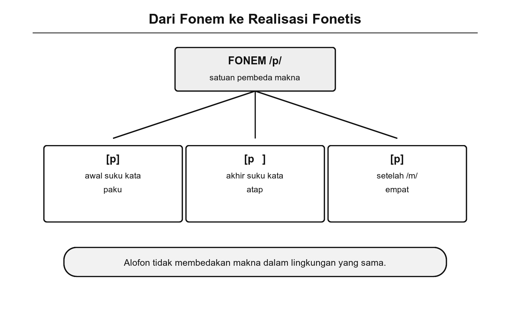
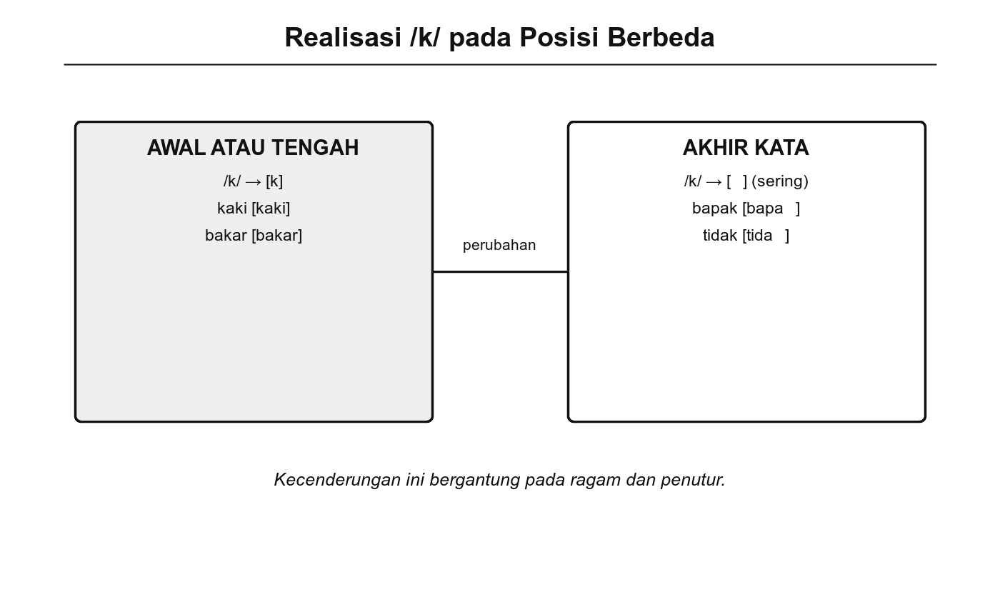
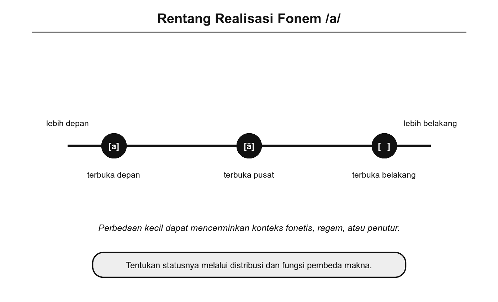

# Bab 8. Realisasi Fonem

## Tujuan Pembelajaran

Setelah mempelajari bab ini, pembaca diharapkan mampu:

1. Membedakan fonem sebagai satuan abstrak dan fon sebagai wujud bunyi konkretnya.
2. Mengidentifikasi alofon dari fonem tertentu dalam bahasa Indonesia beserta lingkungan kemunculannya.
3. Menjelaskan proses fonologis utama yang memengaruhi realisasi fonem (nasalisasi, aspirasi, glotalisasi, dan palatalisasi).
4. Membandingkan perbedaan realisasi fonem antardialek dengan menggunakan data yang jelas.

## Pengantar Bab

Pada bab-bab sebelumnya, kita telah mengenal fonem sebagai satuan bunyi terkecil yang membedakan makna. Kita juga telah membahas bagaimana fonem bervariasi dalam dialek yang berbeda dan dalam kolokasi tertentu. Namun, ada satu pertanyaan yang belum dijawab secara mendalam: bagaimana sebenarnya fonem "hidup" dalam ujaran sehari-hari?

Fonem bersifat abstrak. Fonem /k/, misalnya, bukanlah satu bunyi tunggal yang selalu terdengar sama. Ketika kita mengucapkan kata "kaki", bunyi [k] di awal terdengar berbeda dari bunyi [k] di akhir kata "bapak" yang sering terealisasi sebagai hambat glotal [ʔ]. Keduanya adalah fonem /k/, tetapi wujud bunyinya (yang disebut *fon* atau *alofon*) berbeda tergantung posisi dan lingkungan fonetisnya.

Bab ini mengajak kita menyelidiki realisasi fonem secara sistematis. Kita akan mengamati data ujaran nyata, mengidentifikasi alofon dari beberapa fonem bahasa Indonesia, menelusuri proses fonologis yang mendasari variasi tersebut, dan membandingkan realisasi fonem antardialek.

## 8.1 Fonem dalam Konteks Nyata

Dalam kajian fonologi, kita membedakan dua tataran bunyi (Chaer, 2009). Tataran pertama adalah **fonem**, satuan abstrak yang tersimpan dalam sistem bahasa (*langue*). Tataran kedua adalah **fon**, wujud bunyi konkret yang benar-benar terdengar ketika seseorang berbicara (*parole*). Hubungan keduanya dapat diilustrasikan sebagai berikut: fonem adalah "cetak biru," sedangkan fon adalah "bangunan jadi" yang mungkin sedikit berbeda dari cetaknya tergantung bahan, cuaca, dan tukang yang membangunnya.

{width="5.8in"}

Gambar 8.1 Hubungan Fonem dan Alofon: Satu Fonem, Beberapa Realisasi

Setiap kali kita berbicara, fonem terealisasi sebagai fon. Fon-fon yang merupakan variasi dari satu fonem disebut **alofon**. Alofon muncul karena pengaruh lingkungan fonetis, yaitu bunyi-bunyi lain yang berada di sekitarnya, serta posisi bunyi tersebut dalam kata atau suku kata.

Perhatikan contoh berikut. Fonem /n/ dalam bahasa Indonesia memiliki setidaknya dua realisasi yang berbeda:

- Pada kata "nanti," /n/ terealisasi sebagai [n] alveolar biasa.
- Pada kata "angka," kombinasi /ng/ terealisasi sebagai [ŋ] velar nasal, bunyi yang dihasilkan di belakang rongga mulut.

Kedua bunyi ini berbeda secara fonetis, tetapi penutur bahasa Indonesia memperlakukannya sebagai "jenis bunyi yang berbeda" karena keduanya memang fonem yang berbeda (/n/ vs /ŋ/). Bandingkan dengan fonem /t/ pada kata "tari" [tari] dan kata "putra" [putra]. Dalam ujaran cepat, /t/ pada "putra" kadang terealisasi sedikit berbeda dari /t/ pada "tari," namun perbedaan itu tidak mengubah makna. Bunyi-bunyi ini adalah alofon dari fonem /t/.

### Coba Perhatikan

Ucapkan kata-kata berikut secara perlahan, lalu ulangi dalam kecepatan percakapan normal:

1. **keras** → [kəras]
2. **bapak** → [bapaʔ]
3. **kakak** → [kakaʔ]

Perhatikan bahwa bunyi [k] di awal kata "keras" terasa berbeda dari bunyi di akhir kata "bapak" dan "kakak." Di akhir kata, banyak penutur bahasa Indonesia menggantikan [k] dengan hambat glotal [ʔ], yaitu bunyi singkat yang dihasilkan dengan menutup pita suara secara cepat. Ini adalah contoh alofoni: fonem /k/ memiliki alofon [k] dan [ʔ] yang muncul di lingkungan berbeda.

## 8.2 Alofon dari Fonem Tertentu

Tidak semua fonem memiliki variasi alofon yang mencolok. Beberapa fonem relatif stabil dalam semua posisi, sementara fonem lain menunjukkan variasi yang cukup jelas. Bagian ini membahas beberapa fonem bahasa Indonesia yang alofonnya paling mudah diamati.

### Fonem /k/

Fonem /k/ merupakan contoh klasik alofoni dalam bahasa Indonesia (Muslich, 2013). Realisasinya bergantung pada posisi dalam kata:

**Tabel 8.1** Alofon Fonem /k/ dalam Bahasa Indonesia

| **Posisi** | **Realisasi** | **Contoh** | **Transkripsi fonetis** |
|------------|---------------|------------|-------------------------|
| Awal kata | [k] plosif velar | kuda | [kuda] |
| Tengah kata (antarvokal) | [k] plosif velar | suka | [suka] |
| Akhir kata | [ʔ] hambat glotal | bapak | [bapaʔ] |
| Akhir kata (formal/baku) | [k̚] tak terlepas | bapak | [bapak̚] |

Variasi ini menunjukkan bahwa fonem /k/ di akhir kata memiliki dua kemungkinan realisasi yang bergantung pada ragam bahasa. Dalam percakapan sehari-hari, realisasi glotal [ʔ] lebih umum. Dalam ujaran formal atau pembacaan teks, beberapa penutur mempertahankan [k̚] yang tak terlepas (Chaer, 2009).

### Fonem /a/

Vokal /a/ dalam bahasa Indonesia juga menunjukkan variasi alofonik meskipun sering dianggap stabil. Perhatikan perbedaan berikut:

- Pada suku kata terbuka akhir, /a/ cenderung terealisasi sebagai [a] terbuka penuh: "saya" [saja].
- Pada suku kata tertutup oleh nasal, /a/ dapat sedikit dinasalisasi: "tangan" [taŋan] dengan vokal [a] yang sedikit bergeser.
- Di depan konsonan velar, /a/ kadang mundur sedikit ke belakang: "makan" [makan] dengan [a] yang sedikit lebih posterior.

Perbedaan-perbedaan ini halus dan umumnya tidak disadari oleh penutur asli, tetapi dapat diukur secara akustik menggunakan perangkat seperti Praat (yang akan dibahas pada Bab 13).

### Fonem /t/ dan /d/

Pasangan plosif alveolar /t/ dan /d/ menarik karena realisasinya dipengaruhi oleh konteks formal dan informal:

- **Formal**: /t/ terealisasi sebagai [t] alveolar di semua posisi, termasuk akhir kata ("urat" [urat]).
- **Informal**: /t/ di akhir kata kadang terealisasi tak terlepas [t̚] atau bahkan hilang melalui elisi ("empat" → [əmpa]).

Proses serupa terjadi pada /d/ di posisi akhir kata serapan, misalnya "jihad" yang dalam ragam informal sering terdengar sebagai [jihat] atau [jiha].

## 8.3 Proses Fonologis dalam Realisasi Fonem

Variasi realisasi fonem tidak terjadi secara acak. Di baliknya terdapat proses fonologis yang sistematis, yaitu aturan-aturan yang mengubah wujud fonem berdasarkan lingkungan fonetisnya (Ladefoged & Johnson, 2011). Beberapa proses fonologis utama yang memengaruhi realisasi fonem dalam bahasa Indonesia diuraikan berikut ini.

### 1. Nasalisasi

*Nasalisasi* adalah proses ketika bunyi vokal menjadi sedikit sengau karena berada di dekat konsonan nasal. Dalam bahasa Indonesia, vokal yang diapit konsonan nasal sering mengalami nasalisasi ringan. Misalnya, vokal /a/ pada kata "mana" [mãna] sedikit ternasalisasi karena diapit /m/ dan /n/.

Nasalisasi juga terjadi secara morfologis. Ketika awalan *meN-* bertemu konsonan tertentu, konsonan awal kata dasar dapat luluh dan digantikan nasal:

- meN- + *tulis* → **menulis** (bukan "mentulis")
- meN- + *pukul* → **memukul** (bukan "menpukul")

Proses ini merupakan salah satu contoh realisasi fonem yang dipengaruhi oleh konteks morfologis, bukan hanya lingkungan fonetis semata.

### 2. Glotalisasi

*Glotalisasi* adalah proses penggantian bunyi plosif dengan hambat glotal [ʔ]. Seperti telah dibahas pada subbab 8.2, fonem /k/ dan kadang /t/ di akhir kata dapat terealisasi sebagai [ʔ] dalam ujaran informal. Proses ini sangat produktif dalam bahasa Indonesia lisan:

- "tidak" → [tidaʔ]
- "kakak" → [kakaʔ]
- "masak" → [masaʔ]

{width="5.8in"}

Gambar 8.2 Realisasi Fonem /k/ pada Posisi Berbeda

### 3. Aspirasi

*Aspirasi* adalah hembusan udara singkat yang menyertai pelepasan bunyi plosif. Dalam bahasa Indonesia, aspirasi bukan fitur pembeda makna (berbeda dengan bahasa Hindi atau Thai yang membedakan /tʰ/ dan /t/). Namun, dalam kata serapan tertentu, beberapa penutur menghasilkan aspirasi ringan, misalnya pada kata "khusus" yang kadang diucapkan dengan [kʰ] di awal.

### 4. Palatalisasi

*Palatalisasi* terjadi ketika konsonan bergeser tempat artikulasinya ke arah langit-langit keras (*palatum*) karena pengaruh vokal depan tinggi seperti /i/. Dalam bahasa Indonesia, fenomena ini terlihat pada beberapa dialek ketika konsonan /t/ atau /d/ di depan /i/ cenderung bergeser ke arah [tʃ] atau [dʒ]:

- "tiga" → [tʃiga] (dalam beberapa dialek)
- "di" → [dʒi] (dalam ujaran cepat dialek tertentu)

### Trivia

Bahasa Indonesia termasuk bahasa yang relatif "sederhana" dalam hal alofoni dibandingkan bahasa-bahasa seperti bahasa Inggris atau Hindi. Dalam bahasa Inggris, fonem /p/ saja memiliki setidaknya tiga alofon utama: [pʰ] (beraspirat di awal kata seperti "pin"), [p] (tak beraspirat setelah /s/ seperti "spin"), dan [p̚] (tak terlepas di akhir suku kata seperti "tap"). Penutur asli bahasa Inggris menggunakan ketiga varian ini secara otomatis tanpa pernah memikirkannya (Ladefoged & Johnson, 2011).

## 8.4 Variasi Realisasi Fonem Antardialek

Pada Bab 7, kita telah membahas variasi fonem secara umum. Bab ini melangkah lebih jauh dengan mengamati bagaimana fonem yang "sama" terealisasi secara berbeda dalam dialek-dialek bahasa Indonesia. Perbedaan realisasi antardialek bukan kesalahan, melainkan cerminan keragaman sistem fonologis yang berkembang dalam komunitas penutur yang berbeda.

### Realisasi /r/

Fonem /r/ merupakan salah satu fonem yang paling bervariasi realisasinya di seluruh Nusantara:

**Tabel 8.2** Variasi Realisasi Fonem /r/ Antardialek

| **Dialek/Daerah** | **Realisasi** | **Deskripsi** | **Contoh** |
|--------------------|---------------|---------------|------------|
| Bahasa Indonesia baku | [r] | Getar apikal (ujung lidah bergetar di gusi) | "rasa" [rasa] |
| Melayu Jakarta | [r] ~ [ʀ] | Bervariasi antara getar apikal dan getar uvular | "rasa" [rasa] ~ [ʀasa] |
| Bahasa Jawa (sebagian) | [r] ~ [ɾ] | Getar atau ketuk tunggal | "rasa" [ɾasa] |
| Bahasa Sunda | [r] | Getar apikal, kadang retrofleks | "rasa" [rasa] |

Variasi ini menunjukkan bahwa "bunyi r" yang dianggap satu fonem oleh penutur bahasa Indonesia sebenarnya memiliki wujud fonetis yang beragam. Selama realisasinya masih dikenali sebagai /r/ oleh pendengar, komunikasi tetap berjalan lancar.

### Realisasi Vokal /a/ di Akhir Kata

Perbedaan realisasi vokal /a/ di akhir kata terbuka merupakan penanda dialektal yang paling mudah dikenali:

- **Bahasa Indonesia baku**: /a/ terealisasi sebagai [a] terbuka. "Saya" → [saja].
- **Dialek Melayu Jakarta / Betawi**: /a/ di akhir kata sering bergeser ke [ɛ]. "Saya" → [sajɛ], "apa" → [apɛ].
- **Dialek Jawa Timuran**: /a/ di akhir kata terbuka cenderung menjadi [ɔ]. "Apa" → [ɔpɔ].

{width="5.8in"}

Gambar 8.3 Rentang Realisasi Fonetis Fonem /a/

### Contoh Nyata

Perhatikan kalimat sederhana "Saya mau makan nasi" dan bagaimana realisasinya berbeda dalam beberapa ragam:

- **Baku**: [saja mau makan nasi]
- **Jakarta informal**: [sajɛ mau makaŋ nasi] atau bahkan [gue mau makan nasi]
- **Jawa Timuran informal**: [sɔjɔ arep mangan sego] (dengan campur kode bahasa Jawa)

Contoh ini menunjukkan bahwa realisasi fonem tidak hanya bervariasi pada tataran bunyi individual, tetapi juga dipengaruhi oleh pilihan leksikal dan campur kode yang merupakan bagian dari identitas sosial penutur, sebagaimana dibahas pada Bab 7.

## Rangkuman

Bab ini membahas bagaimana fonem yang bersifat abstrak terwujud sebagai bunyi konkret (fon) dalam ujaran nyata. Setiap fonem dapat memiliki beberapa varian pengucapan yang disebut alofon, dan kemunculan alofon ini ditentukan oleh lingkungan fonetis serta konteks sosiolinguistik.

Beberapa fonem bahasa Indonesia menunjukkan alofoni yang cukup jelas. Fonem /k/ terealisasi sebagai plosif velar [k] di awal dan tengah kata, tetapi sering berubah menjadi hambat glotal [ʔ] di akhir kata dalam ragam informal. Vokal /a/ menunjukkan variasi halus tergantung posisi dan konsonan sekitarnya.

Proses fonologis yang mendasari variasi realisasi meliputi nasalisasi (pengaruh konsonan nasal pada vokal sekitarnya), glotalisasi (penggantian plosif dengan hambat glotal), aspirasi (hembusan udara pada pelepasan plosif), dan palatalisasi (pergeseran artikulasi ke arah langit-langit keras). Proses-proses ini bersifat sistematis dan dapat diramalkan berdasarkan lingkungan fonetisnya.

Pada tataran antardialek, perbedaan realisasi fonem yang paling menonjol terlihat pada fonem /r/ (getar apikal, uvular, atau ketuk) dan vokal /a/ di akhir kata terbuka (tetap [a], bergeser ke [ɛ] dalam dialek Jakarta, atau ke [ɔ] dalam dialek Jawa Timuran). Variasi-variasi ini bukan kesalahan berbahasa, melainkan bagian dari kekayaan fonologis bahasa Indonesia.

## Latihan Akhir Bab

1. Jelaskan perbedaan antara fonem, fon, dan alofon. Berikan satu contoh dari bahasa Indonesia untuk masing-masing konsep tersebut.

2. Perhatikan kata-kata berikut: "kakak," "kuda," "masak," "suka." Identifikasi realisasi fonem /k/ pada setiap kata tersebut dan jelaskan mengapa terjadi perbedaan.

3. Rekam diri sendiri mengucapkan kalimat "Kakak membawa buku ke kamar" dalam ragam formal dan ragam santai. Bandingkan realisasi fonem /k/ pada kedua ragam tersebut. Apakah terjadi glotalisasi? Di posisi mana?

4. Cari tiga contoh kata bahasa Indonesia yang menunjukkan proses nasalisasi akibat awalan *meN-*. Jelaskan fonem apa yang berubah dan bagaimana perubahannya.

5. Wawancarai dua orang yang berasal dari daerah berbeda di Indonesia. Minta mereka mengucapkan kata-kata berikut: "rasa," "saya," "apa," "bapak." Catat perbedaan realisasi yang kita dengar dan kelompokkan berdasarkan fonem yang bervariasi.

## 🧠 Istilah yang dipelajari pada bab ini

- **Realisasi fonem**: wujud bunyi konkret dari fonem abstrak yang muncul dalam ujaran nyata.
- **Fon** (*phone*): bunyi bahasa konkret yang benar-benar dihasilkan dan didengar dalam ujaran, ditulis di antara kurung siku [...].
- **Alofon** (*allophone*): varian pengucapan dari satu fonem yang muncul dalam lingkungan fonetis tertentu tanpa mengubah makna.
- **Lingkungan fonetis**: bunyi-bunyi yang mengelilingi suatu fonem dalam ujaran dan memengaruhi cara fonem tersebut terealisasi.
- **Nasalisasi**: proses fonologis ketika bunyi vokal menjadi sedikit sengau karena pengaruh konsonan nasal di sekitarnya.
- **Glotalisasi**: proses penggantian bunyi plosif dengan hambat glotal [ʔ], terutama di posisi akhir kata dalam ragam informal.
- **Aspirasi**: hembusan udara singkat yang menyertai pelepasan bunyi plosif, ditulis dengan tanda [ʰ] (misalnya [pʰ]).
- **Palatalisasi**: pergeseran tempat artikulasi konsonan ke arah langit-langit keras (*palatum*), biasanya karena pengaruh vokal depan tinggi seperti /i/.
- **Plosif** (*stop*): bunyi konsonan yang dihasilkan dengan menghambat aliran udara secara total lalu melepaskannya, misalnya [p], [t], [k], [b], [d], [g].
- **Hambat glotal** (*glottal stop*): bunyi yang dihasilkan dengan menutup dan membuka pita suara secara cepat, dilambangkan [ʔ].
- **Getar apikal** (*apical trill*): realisasi fonem /r/ dengan menggetarkan ujung lidah di gusi, cara pelafalan /r/ yang paling umum dalam bahasa Indonesia baku.
- **Distribusi**: pola kemunculan suatu bunyi dalam posisi-posisi tertentu dalam kata atau suku kata.
