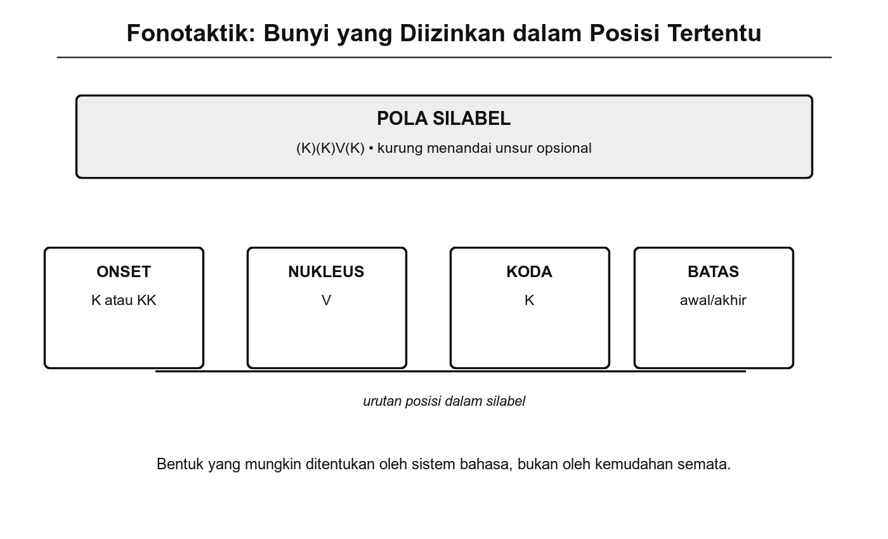
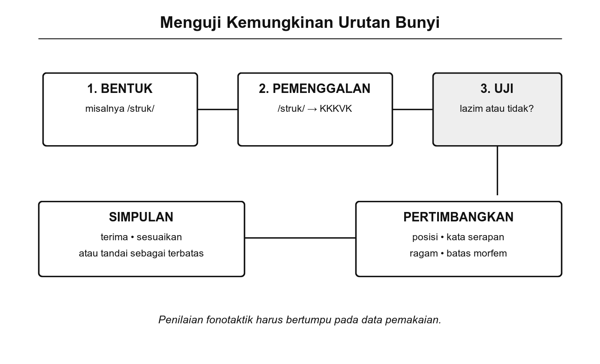
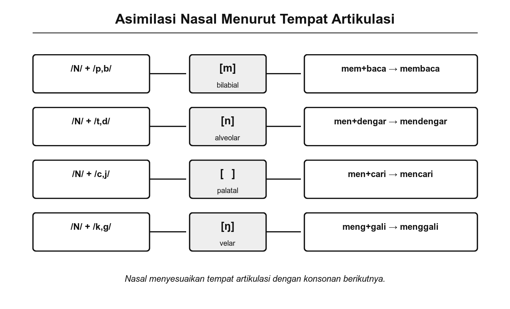

# Bab 9. Fonotaktik

## Tujuan Pembelajaran

Setelah mempelajari bab ini, pembaca diharapkan mampu:

1. Menjelaskan pengertian fonotaktik dan perannya dalam sistem fonologi bahasa Indonesia.
2. Mengidentifikasi aturan urutan dan kombinasi fonem yang diizinkan serta yang tidak diizinkan dalam bahasa Indonesia.
3. Menganalisis batasan fonotaktik bahasa Indonesia dengan membandingkannya terhadap bahasa lain.
4. Menjelaskan bagaimana aturan fonotaktik berperan dalam penyesuaian kata serapan dan pembentukan kata baru.
5. Melakukan analisis fonotaktik sederhana berdasarkan data kebahasaan.

## Pengantar Bab

Pada Bab 6, kita telah mengenal struktur silabel: onset, nukleus, dan koda. Pada Bab 8, kita membahas bagaimana fonem terealisasi dalam ujaran nyata. Kini muncul pertanyaan berikutnya: apakah semua fonem dapat digabungkan secara bebas? Mengapa kita bisa mengucapkan "pra-" tetapi tidak "*nra-"? Mengapa kata "struktur" terasa wajar tetapi "*ngktur" terasa mustahil?

Jawaban atas pertanyaan-pertanyaan ini terletak pada **fonotaktik**, yaitu seperangkat aturan yang mengatur urutan dan kombinasi fonem yang diizinkan dalam suatu bahasa. Fonotaktik menentukan bunyi mana saja yang boleh berdampingan, di posisi mana saja suatu bunyi boleh muncul, dan gugus konsonan apa saja yang sah dalam bahasa tertentu. Setiap bahasa memiliki aturan fonotaktiknya sendiri, dan aturan ini sangat memengaruhi cara kita menyerap kata asing, membentuk kata baru, bahkan menilai apakah suatu deretan bunyi "terdengar seperti bahasa Indonesia" atau tidak.

Bab ini mengajak kita menyelidiki aturan fonotaktik bahasa Indonesia secara sistematis, memahami batasan-batasannya, mengamati perannya dalam pembentukan kata dan penyesuaian kata serapan, serta mencoba menganalisis pola distribusi bunyi berdasarkan data.

## 9.1 Aturan Fonotaktik dalam Bahasa

Fonotaktik (dari bahasa Yunani *phōnē* 'bunyi' dan *taktikós* 'berkenaan dengan penyusunan') adalah cabang fonologi yang mengkaji aturan tentang urutan dan kombinasi fonem yang diizinkan dalam suatu bahasa (Crystal, 2008). Setiap bahasa memiliki kaidah fonotaktiknya sendiri. Kaidah ini bersifat konvensional: bukan soal kemampuan fisik alat ucap, melainkan soal kebiasaan sistem bahasa tersebut.

### Fonotaktik dan Struktur Silabel

Aturan fonotaktik sangat erat kaitannya dengan struktur silabel yang telah dibahas pada Bab 6. Jika kita ingat, setiap silabel bahasa Indonesia tersusun dari onset (konsonan awal), nukleus (vokal), dan koda (konsonan akhir). Fonotaktik menentukan fonem apa saja yang boleh mengisi posisi onset, nukleus, dan koda, serta berapa banyak konsonan yang boleh berjajar di setiap posisi.

{width="5.8in"}

Gambar 9.1 Struktur Fonotaktik Silabel Bahasa Indonesia

### Distribusi Fonem Berdasarkan Posisi

Tidak semua fonem bahasa Indonesia dapat muncul di semua posisi. Beberapa fonem memiliki distribusi terbatas, artinya hanya muncul di posisi tertentu dalam kata atau silabel. Tabel berikut merangkum distribusi beberapa fonem konsonan bahasa Indonesia:

**Tabel 9.1** Distribusi Fonem Konsonan Bahasa Indonesia Berdasarkan Posisi

| **Fonem** | **Awal kata** | **Tengah kata** | **Akhir kata** | **Contoh** |
|-----------|:---:|:---:|:---:|------------|
| /p/ | ✓ | ✓ | ✓ | padi, apa, atap |
| /b/ | ✓ | ✓ | ✗ | buku, abad |
| /t/ | ✓ | ✓ | ✓ | tari, atas, mulut |
| /d/ | ✓ | ✓ | ✗ | dari, ada |
| /k/ | ✓ | ✓ | ✓ | kuda, suka, masak |
| /g/ | ✓ | ✓ | ✗ | gajah, agar |
| /m/ | ✓ | ✓ | ✓ | makan, aman, dalam |
| /n/ | ✓ | ✓ | ✓ | nasi, anak, makan |
| /ŋ/ | ✗ | ✓ | ✓ | (tidak ada), angka, tolong |
| /ɲ/ | ✓ | ✓ | ✗ | nyala, menyapu |
| /r/ | ✓ | ✓ | ✓ | rasa, arah, pasar |
| /l/ | ✓ | ✓ | ✓ | laut, alas, modal |
| /h/ | ✓ | ✓ | ✓ | hari, tahun, merah |
| /f/ | ✓ | ✓ | ✗ | film, kafir |
| /ʃ/ | ✓ | ✓ | ✗ | syarat, isyarat |
| /x/ | ✓ | ✓ | ✗ | khusus, akhir |

Dari tabel ini terlihat pola penting: konsonan hambat bersuara (/b/, /d/, /g/) dalam bahasa Indonesia asli tidak muncul di posisi akhir kata. Ini merupakan salah satu aturan fonotaktik mendasar bahasa Indonesia (Chaer, 2009). Ketika kata serapan memiliki konsonan bersuara di akhir, bahasa Indonesia cenderung menyesuaikannya. Misalnya, kata Arab "adab" yang dalam pelafalan baku sering terdengar dengan [p] di akhir, atau kata "jihad" yang sering terdengar sebagai [jihat].

### Coba Perhatikan

Coba buat daftar sepuluh kata bahasa Indonesia asli (bukan serapan) yang berakhiran konsonan. Apakah ada di antaranya yang berakhir dengan /b/, /d/, atau /g/? Kemungkinan besar tidak ada. Ini menunjukkan bahwa aturan fonotaktik bukan sekadar teori, melainkan pola nyata yang berlaku dalam kosakata bahasa Indonesia.

### Gugus Konsonan di Onset

Salah satu ciri fonotaktik yang paling mudah diamati adalah gugus konsonan (*consonant cluster*) di posisi onset, yaitu dua atau lebih konsonan yang berjajar di awal silabel. Dalam bahasa Indonesia, gugus konsonan awal silabel umumnya terbatas pada kombinasi tertentu:

**Tabel 9.2** Gugus Konsonan yang Diizinkan di Posisi Onset

| **Pola** | **Contoh gugus** | **Contoh kata** | **Keterangan** |
|----------|-----------------|----------------|----------------|
| Plosif + /r/ | /pr/, /br/, /tr/, /dr/, /kr/, /gr/ | prakata, brosur, tradisi, drama, krisis, grafik | Paling produktif |
| Plosif + /l/ | /pl/, /bl/, /kl/, /gl/ | planet, blok, klinik, global | Cukup umum |
| Frikatif + plosif | /sp/, /st/, /sk/ | spesial, strategi, skor | Umumnya kata serapan |
| Frikatif + nasal | /sm/, /sn/ | smart, snack | Terbatas, kata serapan |
| /s/ + plosif + /r/ atau /l/ | /str/, /spl/, /skr/ | struktur, splendid, skripsi | Tiga konsonan, kata serapan |

Perhatikan bahwa hampir semua gugus konsonan yang terdiri dari tiga konsonan berasal dari kata serapan. Kata-kata asli bahasa Indonesia sangat jarang memiliki lebih dari dua konsonan berurutan di awal silabel. Pola KV (konsonan-vokal) dan V (vokal saja) mendominasi silabel bahasa Indonesia asli.

### Konsonan di Posisi Koda

Di posisi koda (akhir silabel), bahasa Indonesia juga memiliki batasan. Tidak semua konsonan dapat mengisi posisi ini. Selain larangan konsonan hambat bersuara di akhir kata, gugus konsonan di koda juga terbatas. Gugus konsonan akhir silabel seperti /-ks/ pada "teks" atau /-ps/ pada "korps" hampir selalu ditemukan pada kata serapan.

### Trivia

Bahasa Hawaii memiliki aturan fonotaktik yang sangat ketat: setiap silabel harus berakhir dengan vokal dan hanya diizinkan satu konsonan di onset. Akibatnya, semua kata dalam bahasa Hawaii berakhir dengan vokal, dan tidak ada gugus konsonan sama sekali. Kata "Honolulu" mengikuti pola KV-KV-KV-KV yang sempurna. Sebaliknya, bahasa Georgia (Kartuli) mengizinkan deretan konsonan yang sangat panjang di awal kata, seperti /gvprtskvnis/ 'kamu mengupas kami'. Bahasa Indonesia berada di antara keduanya, dengan aturan yang cukup longgar pada onset tetapi cukup ketat pada koda (Crystal, 2008).

## 9.2 Batasan dan Keterbatasan Fonotaktik

Aturan fonotaktik bukan hanya menentukan kombinasi yang **diizinkan**, tetapi juga mengungkapkan kombinasi yang **dilarang** atau **tidak pernah muncul**. Memahami batasan ini membantu kita mengenali identitas fonologis bahasa Indonesia dan membandingkannya dengan bahasa lain.

### Batasan Fonotaktik Bahasa Indonesia

Berikut beberapa batasan fonotaktik utama dalam bahasa Indonesia:

1. **Konsonan hambat bersuara tidak muncul di akhir kata asli.** Fonem /b/, /d/, dan /g/ tidak mengisi posisi koda pada kata asli bahasa Indonesia. Kata seperti "adab" dan "jihad" merupakan serapan dari bahasa Arab yang dalam banyak dialek mengalami penyesuaian pelafalan (lihat Bab 8 tentang realisasi fonem).

2. **Fonem /ŋ/ tidak muncul di awal kata.** Meskipun nasal velar /ŋ/ sangat umum di tengah dan akhir kata ("angka," "tolong"), fonem ini tidak pernah memulai kata dalam bahasa Indonesia. Bandingkan dengan bahasa Vietnam yang mengizinkan /ŋ/ di awal kata, seperti *ngày* 'hari'.

3. **Fonem /ɲ/ tidak muncul di akhir kata.** Nasal palatal /ɲ/ hanya mengisi posisi awal ("nyala") dan tengah kata ("menyapu"), tidak pernah di akhir kata.

4. **Gugus konsonan di koda sangat terbatas.** Dalam kata asli, silabel umumnya berakhir dengan satu konsonan saja. Gugus konsonan di koda (seperti /-ks/ pada "teks" atau /-ns/ pada "trans") hampir seluruhnya merupakan ciri kata serapan.

5. **Deret vokal identik jarang terjadi.** Bahasa Indonesia umumnya menghindari dua vokal identik yang berurutan dalam satu kata dasar. Ketika vokal identik bertemu akibat afiksasi, sering terjadi penyisipan konsonan atau perubahan bentuk. Misalnya, "ke-" + "enak" menjadi "keenakan" yang dalam ujaran sering terdengar dengan penyisipan hambat glotal [kəʔenakan].

{width="5.8in"}

Gambar 9.2 Prosedur Menguji Batasan Fonotaktik Bahasa Indonesia

### Perbandingan dengan Bahasa Lain

Aturan fonotaktik sangat bervariasi antarbahasa. Perbandingan berikut membantu meletakkan posisi bahasa Indonesia dalam konteks tipologi fonologis:

**Tabel 9.3** Perbandingan Aturan Fonotaktik Beberapa Bahasa

| **Aspek** | **Bahasa Indonesia** | **Bahasa Inggris** | **Bahasa Jepang** | **Bahasa Arab** |
|-----------|---------------------|-------------------|--------------------|-----------------|
| Gugus konsonan onset | Hingga 3 (serapan) | Hingga 3 (/str/) | Tidak ada | Tidak ada |
| Gugus konsonan koda | Hingga 2 (serapan) | Hingga 4 (/ksts/) | Tidak ada | Hingga 2 |
| Konsonan bersuara di akhir | Tidak (kata asli) | Ya | Tidak | Ya |
| Pola silabel dominan | KV, KVK | KV, KVK, KKVKK | KV, V | KVK, KVKK |
| Vokal berurutan | Terbatas | Jarang | Umum | Tidak ada |

Bahasa Jepang, misalnya, memiliki aturan fonotaktik yang jauh lebih ketat daripada bahasa Indonesia. Hampir semua silabel bahasa Jepang berpola KV atau V, dan satu-satunya konsonan yang boleh berdiri sendiri di koda adalah /n/. Inilah sebabnya kata serapan bahasa Inggris dalam bahasa Jepang mengalami perubahan drastis: "strike" menjadi *sutoraiku* [sɯtoɾaikɯ], di mana setiap konsonan diberi vokal pendukung agar sesuai dengan aturan fonotaktik bahasa Jepang (Tsujimura, 2014).

### Contoh Nyata

Perhatikan bagaimana nama merek asing disesuaikan oleh penutur bahasa Indonesia dalam ujaran sehari-hari. Kata "Starbucks" sering diucapkan [ˈstarbaks] dengan relatif utuh karena gugus /st/ dan /ks/ memang diizinkan (walau marginal) dalam fonotaktik bahasa Indonesia. Bandingkan dengan bahasa Jepang yang mengubahnya menjadi *Sutābakkusu* [sɯtaːbakkɯsɯ]. Perbedaan ini cukup dramatis dan sepenuhnya ditentukan oleh aturan fonotaktik masing-masing bahasa.

### Kesalahan Umum

Mahasiswa sering mengira bahwa fonotaktik adalah soal "kemampuan lidah." Kenyataannya, penutur bahasa Indonesia secara fisik mampu mengucapkan gugus konsonan /ŋr/ atau /bd/, tetapi kombinasi itu tidak pernah digunakan karena bukan bagian dari sistem bahasa Indonesia. Aturan fonotaktik bersifat konvensional (berdasarkan kebiasaan bahasa), bukan fisiologis (berdasarkan kemampuan alat ucap).

## 9.3 Fonotaktik dalam Pembentukan Kata

Aturan fonotaktik tidak hanya berlaku untuk kata yang sudah ada; aturan ini juga mengarahkan pembentukan kata baru, penyesuaian kata serapan, dan proses morfologis. Ketika bahasa Indonesia menyerap kata dari bahasa lain atau menciptakan kata baru, aturan fonotaktik berfungsi sebagai "penyaring" yang memastikan kata tersebut sesuai dengan sistem bunyi bahasa Indonesia.

### Penyesuaian Kata Serapan

Kata serapan yang masuk ke bahasa Indonesia sering mengalami penyesuaian agar memenuhi aturan fonotaktik. Penyesuaian ini dapat berupa beberapa strategi:

**Tabel 9.4** Strategi Penyesuaian Kata Serapan Berdasarkan Fonotaktik

| **Strategi** | **Masalah fonotaktik** | **Bahasa sumber** | **Bentuk asli** | **Bentuk Indonesia** |
|-------------|----------------------|-------------------|-----------------|---------------------|
| Penyisipan vokal (*epenthesis*) | Gugus konsonan tidak lazim | Belanda | *school* /sxoːl/ | sekolah |
| Penyisipan vokal | Gugus konsonan di awal | Sanskerta | *grāma* | germa → gerama |
| Penghilangan konsonan | Konsonan akhir tidak lazim | Arab | *waqt* | waktu (penambahan vokal) |
| Penggantian bunyi | Fonem tidak ada di BI | Belanda | *verbod* /vɛrˈboːt/ | perbod → larang |
| Pengalihan konsonan | Konsonan bersuara di akhir | Arab | *ʕadab* | adab → [adap] (pelafalan) |
| Penyederhanaan gugus | Tiga+ konsonan berurutan | Inggris | *abstract* | abstrak |

Proses-proses ini menunjukkan bahwa aturan fonotaktik bukan hanya deskripsi pasif tentang pola yang ada, melainkan kekuatan aktif yang membentuk kosakata bahasa Indonesia. Setiap kali bahasa Indonesia bertemu dengan kata asing yang melanggar aturan fonotaktiknya, bahasa ini secara sistematis menyesuaikan kata tersebut.

### Coba Perhatikan

Kata "sekolah" berasal dari bahasa Belanda *school* [sxoːl]. Perhatikan penyesuaian yang terjadi: (1) gugus /sx/ dipecah dengan penyisipan vokal /ə/ menjadi /sə-ko-/, (2) vokal panjang /oː/ disesuaikan menjadi vokal pendek /o/, dan (3) konsonan /l/ di akhir kata ditambahi vokal /a/ dan /h/ sehingga kata berakhir dengan pola yang lebih lazim dalam bahasa Indonesia. Setiap perubahan ini didorong oleh aturan fonotaktik.

### Fonotaktik dan Proses Morfologis

Aturan fonotaktik juga berperan dalam proses morfologis bahasa Indonesia, terutama pada afiksasi. Beberapa perubahan bentuk afiks dapat dijelaskan sebagai upaya menjaga agar kombinasi fonem tetap memenuhi aturan fonotaktik:

1. **Nasalisasi awalan *meN-*.** Seperti telah disinggung pada Bab 8, awalan *meN-* mengalami penyesuaian nasal berdasarkan fonem awal kata dasar:
   - meN- + /p/: *menulis* → konsonan awal /p/ luluh, nasal /n/ muncul
   - meN- + /k/: *mengambil* → konsonan awal /k/ luluh, nasal /ŋ/ muncul
   - meN- + /s/: *menyapu* → konsonan awal /s/ luluh, nasal /ɲ/ muncul

   Proses ini sebagian dapat dilihat sebagai penyesuaian fonotaktik: bahasa Indonesia menghindari gugus nasal-plosif di awal kata (*ntulis, ngkambil) yang melanggar aturan fonotaktik onset.

2. **Bentuk awalan *peN-* dan *ber-*.** Pola serupa terjadi pada awalan *peN-* dan bentuk-bentuk afiks lain. Bahasa Indonesia secara konsisten menghindari gugus konsonan tertentu yang muncul akibat penggabungan afiks dengan kata dasar.

3. **Penyisipan bunyi pada reduplikasi.** Pada beberapa bentuk reduplikasi, bunyi penghubung dapat muncul untuk menghindari deretan bunyi yang melanggar aturan fonotaktik. Misalnya, bentuk reduplikasi "sayur-mayur" menyisipkan bunyi /m/ yang menciptakan pola KV- yang lazim.

### Fonotaktik dan Intuisi Penutur

Salah satu bukti paling menarik tentang kekuatan aturan fonotaktik adalah intuisi penutur terhadap kata-kata baru. Penutur bahasa Indonesia dapat "merasakan" apakah suatu kata buatan terdengar seperti kata Indonesia atau bukan, bahkan tanpa pernah belajar fonologi secara formal.

Coba bandingkan dua "kata" buatan berikut:

- **pranasi**: terdengar seperti kata Indonesia? Kebanyakan penutur akan mengangguk.
- **ngkrasi**: terdengar seperti kata Indonesia? Kebanyakan penutur akan menolak.

Perbedaannya terletak pada fonotaktik. "Pranasi" mengikuti aturan: gugus /pr/ diizinkan di onset, silabel berpola KKV-KV-KV. Sementara "ngkrasi" melanggar aturan: gugus /ŋkr/ tidak pernah muncul di onset bahasa Indonesia.

Kemampuan ini disebut **kompetensi fonotaktik** (*phonotactic competence*), yaitu pengetahuan implisit penutur tentang kombinasi bunyi yang sah dalam bahasanya (Chomsky & Halle, 1968). Kompetensi ini diperoleh secara alami melalui paparan bahasa sejak kecil, bukan melalui pembelajaran eksplisit.

## 9.4 Studi Kasus Fonotaktik dalam Korpus

Aturan fonotaktik yang telah kita bahas sejauh ini dirumuskan berdasarkan observasi terhadap pola-pola bahasa. Namun, bagaimana kita bisa menguji dan memverifikasi aturan tersebut secara lebih sistematis? Salah satu caranya adalah dengan menganalisis **korpus**, yaitu kumpulan teks bahasa yang besar dan representatif.

### Apa Itu Analisis Fonotaktik Berbasis Korpus?

Analisis fonotaktik berbasis korpus menggunakan data kebahasaan dalam jumlah besar untuk mengidentifikasi pola distribusi bunyi. Alih-alih mengandalkan intuisi atau sejumlah kecil contoh, analisis korpus memungkinkan kita menghitung frekuensi kemunculan setiap kombinasi fonem dan menemukan pola yang mungkin luput dari pengamatan biasa.

Langkah-langkah dasar analisis fonotaktik berbasis korpus meliputi:

1. **Menentukan korpus.** Pilih sumber data yang representatif. Untuk bahasa Indonesia, beberapa korpus yang dapat digunakan antara lain Korpus Leipzig (Leipzig Corpora Collection yang menyediakan data bahasa Indonesia), daftar kata KBBI, atau koleksi teks yang dikumpulkan sendiri dari sumber yang berizin.

2. **Mengonversi teks menjadi representasi fonemis.** Karena ejaan bahasa Indonesia cukup fonemis (hubungan grafem-fonem relatif teratur), konversi ini lebih mudah dibandingkan bahasa seperti Inggris. Namun tetap perlu memperhatikan beberapa ketidakteraturan, seperti grafem "ng" yang mewakili satu fonem /ŋ/ dan "ny" yang mewakili /ɲ/.

3. **Menghitung frekuensi bifonem.** Bifonem (*biphone*) adalah pasangan dua fonem yang berurutan. Menghitung frekuensi semua pasangan bifonem yang muncul dalam korpus akan mengungkapkan kombinasi mana yang umum, mana yang jarang, dan mana yang tidak pernah muncul.

4. **Menganalisis hasil.** Kombinasi yang tidak pernah muncul menunjukkan kemungkinan batasan fonotaktik. Kombinasi yang sangat jarang mungkin menunjukkan batasan yang hanya berlaku pada kata asli tetapi dilanggar oleh kata serapan.

### Contoh Analisis Sederhana

Berikut adalah contoh hasil analisis bifonem hipotetis dari sejumlah kata bahasa Indonesia. Tabel ini menunjukkan frekuensi relatif beberapa pasangan konsonan yang berurutan:

**Tabel 9.5** Contoh Frekuensi Bifonem Konsonan (Data Ilustratif)

| **Bifonem** | **Frekuensi relatif** | **Contoh kata** | **Status fonotaktik** |
|-------------|----------------------|-----------------|----------------------|
| /ŋk/ | Tinggi | angkat, mangkok, bangku | Lazim di tengah kata |
| /mp/ | Tinggi | ampun, kampung, sumpah | Lazim di tengah kata |
| /nt/ | Tinggi | rantai, pinta, antara | Lazim di tengah kata |
| /nd/ | Sedang | panda, kendaraan, sandal | Lazim di tengah kata |
| /pr/ | Sedang | prakarsa, pria, proses | Lazim di onset |
| /str/ | Rendah | struktur, strategi | Hanya kata serapan |
| /bd/ | Nol | (tidak ada) | Tidak diizinkan |
| /ŋr/ | Nol | (tidak ada) | Tidak diizinkan |
| /tl/ | Nol | (tidak ada) | Tidak diizinkan |

Data ini bersifat ilustratif untuk menunjukkan pendekatan analisis. Untuk hasil yang valid secara ilmiah, analisis perlu dilakukan terhadap korpus yang cukup besar dengan metodologi yang ketat.

### Latihan Singkat

Ambil sepuluh kata bahasa Indonesia yang kamu gunakan hari ini. Pecahkan setiap kata menjadi fonem-fonem penyusunnya, lalu catat semua pasangan fonem berurutan (bifonem). Apakah ada pasangan yang sama muncul di beberapa kata? Apakah ada pasangan yang hanya muncul sekali? Apakah ada pasangan yang terasa "aneh" dan ternyata berasal dari kata serapan?

### Bifonem dan Pola Nasal-Plosif

Salah satu pola fonotaktik yang paling konsisten dalam bahasa Indonesia adalah hubungan nasal-plosif (*nasal-stop cluster*) di tengah kata. Pola ini mengikuti kaidah bahwa nasal selalu *homorgan* (memiliki tempat artikulasi yang sama) dengan plosif yang mengikutinya:

**Tabel 9.6** Kaidah Homorgan Nasal-Plosif dalam Bahasa Indonesia

| **Nasal** | **Plosif pasangan** | **Tempat artikulasi** | **Contoh** |
|-----------|--------------------|-----------------------|------------|
| /m/ | /p/, /b/ | Bilabial | ampun, tembak |
| /n/ | /t/, /d/ | Alveolar | rantai, panda |
| /ɲ/ | /tʃ/, /dʒ/ | Palatal | muncul, panjang |
| /ŋ/ | /k/, /g/ | Velar | angkat, mangga |

Kaidah ini sangat kuat: dalam bahasa Indonesia asli, kita tidak akan menemukan kombinasi */mk/ (nasal bilabial + plosif velar) atau */ŋt/ (nasal velar + plosif alveolar) di dalam satu silabel. Ketika nasal dan plosif berurutan, keduanya selalu berbagi tempat artikulasi. Ini merupakan salah satu aturan fonotaktik bahasa Indonesia yang paling teratur dan mudah diamati (Lapoliwa, 1981).

{width="5.8in"}

Gambar 9.3 Kaidah Homorgan pada Urutan Nasal dan Konsonan

### Implikasi untuk Pemelajar Bahasa

Pemahaman fonotaktik sangat berguna bagi pemelajar bahasa Indonesia sebagai bahasa kedua. Pemelajar yang bahasa pertamanya memiliki aturan fonotaktik berbeda sering mengalami kesulitan dengan pola-pola tertentu bahasa Indonesia. Misalnya, penutur bahasa Mandarin yang tidak terbiasa dengan konsonan di akhir silabel mungkin menambahkan vokal setelah konsonan akhir ("makan" → *makane*). Sebaliknya, penutur bahasa Inggris yang terbiasa dengan gugus konsonan kompleks mungkin kesulitan dengan kaidah homorgan nasal-plosif dan mengucapkan */ŋp/ alih-alih /mp/.

## Rangkuman

Fonotaktik adalah seperangkat aturan yang mengatur urutan dan kombinasi fonem yang diizinkan dalam suatu bahasa. Aturan ini bersifat konvensional, bukan fisiologis, dan berbeda-beda antarbahasa.

Dalam bahasa Indonesia, beberapa aturan fonotaktik utama meliputi: (1) konsonan hambat bersuara (/b/, /d/, /g/) tidak muncul di akhir kata asli; (2) fonem /ŋ/ tidak muncul di awal kata; (3) gugus konsonan di onset cukup bervariasi tetapi di koda sangat terbatas; dan (4) nasal yang berurutan dengan plosif selalu homorgan.

Aturan fonotaktik berperan aktif dalam penyesuaian kata serapan, yang mana bahasa Indonesia menggunakan strategi seperti penyisipan vokal, penghilangan konsonan, atau penggantian bunyi agar kata serapan sesuai dengan sistemnya. Aturan yang sama juga menjelaskan sebagian proses morfologis seperti nasalisasi awalan *meN-*.

Analisis fonotaktik dapat dilakukan secara sistematis melalui pendekatan berbasis korpus. Dengan menghitung frekuensi bifonem dalam data kebahasaan yang besar, kita dapat mengidentifikasi pola distribusi bunyi, menemukan batasan fonotaktik, dan membedakan pola kata asli dari pola kata serapan. Pemahaman fonotaktik menjadi dasar penting untuk memahami diftong dan kluster (Bab 10) serta deret fonem (Bab 11).

## Latihan Akhir Bab

1. Jelaskan apa yang dimaksud dengan fonotaktik dan mengapa aturan fonotaktik bersifat konvensional, bukan fisiologis. Berikan satu contoh untuk mendukung penjelasan tersebut.

2. Perhatikan kata-kata berikut: "brosur," "grafik," "planet," "skripsi." Identifikasi gugus konsonan di posisi onset pada setiap kata tersebut. Apakah gugus-gugus tersebut umum dalam kata asli bahasa Indonesia atau merupakan ciri kata serapan?

3. Mengapa bahasa Indonesia tidak memiliki kata asli yang berakhir dengan konsonan /b/, /d/, atau /g/? Jelaskan dari sudut pandang aturan fonotaktik dan berikan contoh kata serapan yang menunjukkan penyesuaian terhadap aturan ini.

4. Analisis fonotaktik kata serapan berikut. Identifikasi apa yang "dilanggar" dari sudut pandang fonotaktik bahasa Indonesia dan bagaimana penyesuaiannya:
   - *school* (Belanda) → sekolah
   - *abstract* (Inggris) → abstrak
   - *film* (Inggris) → film

5. Ambil sepuluh kata dari halaman mana saja sebuah kamus bahasa Indonesia. Pecahkan setiap kata menjadi silabel, identifikasi pola silabel setiap suku kata (V, KV, KVK, KKV, dst.), lalu hitung: berapa persen silabel berpola KV? Apa kesimpulan yang dapat ditarik tentang pola silabel dominan dalam bahasa Indonesia?

6. Jelaskan kaidah homorgan nasal-plosif dalam bahasa Indonesia. Mengapa kombinasi seperti */mk/ atau */ŋt/ tidak muncul? Berikan empat contoh kata yang menunjukkan kaidah ini.

7. Buatlah tiga "kata buatan" yang mengikuti aturan fonotaktik bahasa Indonesia dan tiga "kata buatan" yang melanggar aturan tersebut. Jelaskan aturan apa yang diikuti atau dilanggar oleh masing-masing kata buatan tersebut.

## 🧠 Istilah yang dipelajari pada bab ini

- **Fonotaktik** (*phonotactics*): cabang fonologi yang mengkaji aturan tentang urutan dan kombinasi fonem yang diizinkan dalam suatu bahasa.
- **Gugus konsonan** (*consonant cluster*): dua atau lebih konsonan yang berurutan dalam satu silabel, misalnya /pr/ pada "prakata" atau /str/ pada "struktur."
- **Distribusi**: pola kemunculan suatu fonem di posisi-posisi tertentu dalam kata (awal, tengah, akhir).
- **Bifonem** (*biphone*): pasangan dua fonem yang berurutan, digunakan sebagai unit analisis dalam studi fonotaktik berbasis korpus.
- **Homorgan** (*homorganic*): memiliki tempat artikulasi yang sama; dalam konteks fonotaktik, merujuk pada kaidah bahwa nasal dan plosif yang berurutan selalu berbagi tempat artikulasi.
- **Epenthesis** (penyisipan): proses penambahan bunyi (biasanya vokal) ke dalam kata untuk memenuhi aturan fonotaktik, misalnya *school* → "sekolah."
- **Elisi**: penghilangan bunyi dari suatu kata, sering kali karena penyederhanaan fonetis dalam ujaran cepat.
- **Kompetensi fonotaktik** (*phonotactic competence*): pengetahuan implisit penutur tentang kombinasi bunyi yang sah dalam bahasanya, diperoleh secara alami melalui paparan bahasa.
- **Korpus**: kumpulan teks bahasa dalam jumlah besar yang dikumpulkan secara sistematis untuk keperluan analisis linguistik.
- **Kata serapan** (*loanword*): kata yang diambil dari bahasa lain dan disesuaikan ke dalam sistem bahasa penerima.
