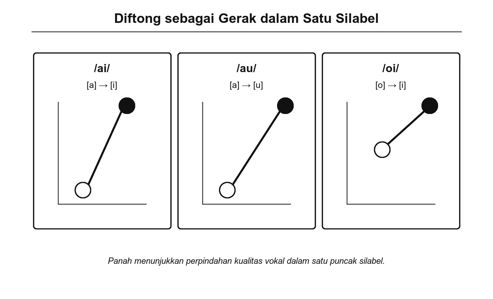
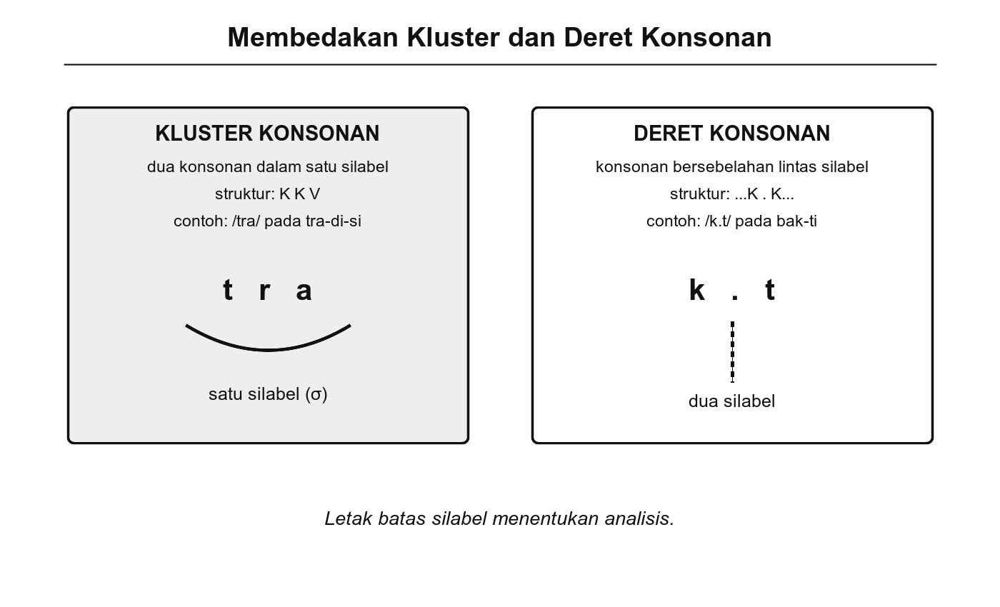

# Bab 10. Diftong dan Kluster

## Tujuan Pembelajaran

Setelah mempelajari bab ini, pembaca diharapkan mampu:

1. Menjelaskan pengertian diftong dan membedakannya dari monoftong serta deret vokal.
2. Mengklasifikasikan diftong dalam bahasa Indonesia berdasarkan arah pergerakan lidah.
3. Menjelaskan pengertian kluster konsonan dan mengidentifikasi kluster yang lazim dalam bahasa Indonesia.
4. Membandingkan diftong dan kluster dari segi struktur silabel, distribusi, dan asal-usul kata.
5. Melakukan transkripsi fonetis sederhana untuk kata-kata yang mengandung diftong dan kluster.

## Pengantar Bab

Pada Bab 9, kita telah mempelajari aturan fonotaktik yang mengatur kombinasi fonem dalam bahasa Indonesia. Kita mengetahui bahwa tidak semua fonem dapat digabungkan secara bebas. Kini kita akan mengamati dua fenomena bunyi yang sering menimbulkan kebingungan: **diftong** dan **kluster**.

Diftong adalah gabungan dua bunyi vokal yang diucapkan dalam satu silabel, seperti /ai/ pada "pandai" dan /au/ pada "danau." Kluster (gugus konsonan) adalah dua atau lebih konsonan yang berurutan dalam satu silabel, seperti /pr/ pada "prakarsa" dan /str/ pada "struktur." Keduanya merupakan pola fonotaktik yang khas dan menarik untuk diamati.

Mengapa topik ini penting? Karena diftong dan kluster sering kali menjadi titik persinggungan antara sistem bunyi asli dan sistem bunyi serapan. Banyak kluster konsonan yang kita temui dalam bahasa Indonesia berasal dari kata serapan, sementara diftong menempati posisi unik antara vokal tunggal dan deret vokal. Memahami keduanya membantu kita mengenali bagaimana bahasa Indonesia mengorganisasi bunyi-bunyinya dan beradaptasi dengan pengaruh bahasa lain.

## 10.1 Pengertian dan Klasifikasi Diftong

**Diftong** (*diphthong*, dari bahasa Yunani *di* 'dua' dan *phthongos* 'bunyi') adalah gabungan dua bunyi vokal yang diucapkan dalam satu silabel dengan perpindahan posisi lidah secara bertahap dari satu vokal ke vokal lain (Ladefoged & Johnson, 2011). Ciri utama diftong adalah keduanya membentuk satu puncak kenyaringan (sonoritas), bukan dua puncak terpisah. Artinya, diftong termasuk satu suku kata, bukan dua.

### Diftong dalam Bahasa Indonesia

Bahasa Indonesia secara tradisional diakui memiliki tiga diftong utama (Chaer, 2009; Muslich, 2013):

**Tabel 10.1** Diftong Bahasa Indonesia

| **Diftong** | **Arah pergerakan** | **Jenis** | **Contoh kata** | **Transkripsi fonetis** |
|-------------|--------------------|-----------|-----------------|-----------------------|
| /ai/ | Dari vokal rendah [a] ke vokal tinggi depan [i] | Diftong naik (*rising/closing*) | pandai, gulai, santai | [pandai̯], [gulai̯], [santai̯] |
| /au/ | Dari vokal rendah [a] ke vokal tinggi belakang [u] | Diftong naik (*rising/closing*) | danau, pulau, harimau | [danau̯], [pulau̯], [harimau̯] |
| /oi/ | Dari vokal belakang bulat [o] ke vokal tinggi depan [i] | Diftong naik (*rising/closing*) | amboi, sepoi | [amboi̯], [səpoi̯] |

Tanda [  ̯] (busur kecil di bawah huruf) dalam transkripsi fonetis menunjukkan bahwa vokal tersebut bukan puncak silabel, melainkan bagian luncuran (*glide*) dari diftong. Bunyi [i̯] dan [u̯] berfungsi sebagai semi-vokal yang "meluncur" dari vokal utama.

Ketiga diftong ini termasuk **diftong naik** atau **diftong menutup** (*closing diphthong*): posisi lidah bergerak dari vokal yang lebih terbuka (rendah) ke vokal yang lebih tertutup (tinggi). Bahasa Indonesia tidak memiliki diftong turun (*opening diphthong*) yang bergerak dari vokal tinggi ke vokal rendah.

{width="5.8in"}

Gambar 10.1 Arah Pergerakan Tiga Diftong Bahasa Indonesia

### Distribusi Diftong

Diftong dalam bahasa Indonesia memiliki distribusi yang terbatas. Ketiga diftong utama hampir selalu muncul di **akhir kata** (posisi final):

- /ai/: pandai, sampai, nilai, sungai
- /au/: danau, pisau, hijau, kerbau
- /oi/: amboi, sepoi, koboi

Diftong sangat jarang muncul di awal atau tengah kata dalam bahasa Indonesia asli. Ini merupakan ciri fonotaktik yang khas dan membedakan bahasa Indonesia dari bahasa-bahasa lain seperti bahasa Inggris, yang memiliki diftong di berbagai posisi ("boy," "out," "day").

### Coba Perhatikan

Ucapkan kata "pandai" secara perlahan. Apakah kamu mengucapkannya sebagai dua suku kata "pan-dai" (dengan /ai/ sebagai satu bunyi luncur) atau tiga suku kata "pan-da-i" (dengan /a/ dan /i/ sebagai dua vokal terpisah)? Jika kamu mengucapkannya dalam dua suku kata, maka /ai/ berfungsi sebagai diftong. Jika dalam tiga suku kata, maka /a/ dan /i/ merupakan deret vokal. Dalam pelafalan baku, "pandai" memiliki dua suku kata dengan diftong /ai/.

## 10.2 Perbedaan Diftong dan Monoftong

Perbedaan antara diftong dan monoftong (vokal tunggal) merupakan konsep fundamental yang perlu dipahami dengan jelas. Selain itu, diftong juga perlu dibedakan dari **deret vokal** (*vowel sequence*), yaitu dua vokal yang berurutan tetapi masing-masing menjadi inti silabel tersendiri.

### Diftong vs. Monoftong

**Monoftong** (*monophthong*) adalah vokal tunggal yang diucapkan tanpa perubahan kualitas bunyi selama produksinya. Posisi lidah relatif tetap dari awal sampai akhir. Contoh: [a] pada "ada," [i] pada "ini," [u] pada "ulu."

**Diftong** melibatkan perubahan posisi lidah selama satu silabel, menghasilkan bunyi yang "bergerak" dari satu kualitas vokal ke kualitas vokal lain. Perbedaan utamanya:

**Tabel 10.2** Perbandingan Monoftong dan Diftong

| **Aspek** | **Monoftong** | **Diftong** |
|-----------|---------------|-------------|
| Jumlah bunyi vokal | Satu | Dua (dalam satu silabel) |
| Pergerakan lidah | Relatif tetap | Bergeser dari satu posisi ke posisi lain |
| Jumlah silabel | Satu | Satu |
| Puncak sonoritas | Satu, stabil | Satu, dengan luncuran |
| Contoh (BI) | [a] pada "ada" | [ai̯] pada "pandai" |

### Diftong vs. Deret Vokal

Membedakan diftong dari deret vokal merupakan tantangan analitis yang penting dalam fonologi bahasa Indonesia. Keduanya sama-sama melibatkan dua bunyi vokal yang berurutan, tetapi berbeda dalam hal jumlah silabel:

**Tabel 10.3** Perbandingan Diftong dan Deret Vokal

| **Aspek** | **Diftong** | **Deret vokal** |
|-----------|-------------|-----------------|
| Jumlah silabel | Satu | Dua |
| Puncak sonoritas | Satu | Dua |
| Batas silabel | Tidak ada di antara kedua vokal | Ada di antara kedua vokal |
| Contoh | "pan-dai" (/ai/ = 1 silabel) | "la-in" (/a.i/ = 2 silabel) |
| Contoh | "da-nau" (/au/ = 1 silabel) | "ma-u" (/a.u/ = 2 silabel) |

Perhatikan pasangan berikut:

- **"pandai"** → pan-dai (2 silabel): /ai/ adalah diftong, satu suku kata
- **"damai"** → da-mai (2 silabel): /ai/ adalah diftong, satu suku kata
- **"lain"** → la-in (2 silabel): /a/ dan /i/ berada di silabel berbeda, deret vokal
- **"main"** → ma-in (2 silabel): /a/ dan /i/ berada di silabel berbeda, deret vokal

Bagaimana cara membedakan keduanya? Ada beberapa kriteria:

1. **Jumlah silabel.** Jika kedua vokal berada dalam satu silabel, itu diftong. Jika masing-masing membentuk silabel sendiri, itu deret vokal.

2. **Tes pemenggalan.** Dalam pemenggalan kata baku, diftong tidak dipisah: "pan-dai" (bukan "pan-da-i"). Deret vokal dipisah: "la-in" (bukan "lain" sebagai satu suku kata).

3. **Posisi dalam kata.** Diftong bahasa Indonesia cenderung muncul di akhir kata. Dua vokal berurutan di tengah kata lebih sering merupakan deret vokal.

### Contoh Nyata

Status bunyi /au/ pada kata "tahu" sering diperdebatkan. Apakah "tahu" (makanan dari kedelai) diucapkan "ta-hu" (dua silabel dengan deret vokal /a.u/ yang disisipi /h/) atau "tau" (satu silabel dengan diftong)? Dalam percakapan sehari-hari, banyak penutur mengucapkannya sebagai satu silabel [tau̯] ("gue tau") sehingga secara fonetis berfungsi sebagai diftong. Namun dalam pelafalan baku, "tahu" tetap dua silabel: [ta.hu]. Ini menunjukkan bahwa status diftong vs. deret vokal dapat bervariasi tergantung ragam bahasa dan kecepatan ujaran.

### Trivia

Bahasa Inggris memiliki lebih banyak diftong daripada bahasa Indonesia. Dalam *Received Pronunciation* (pengucapan baku Inggris Britania), terdapat delapan diftong: /eɪ/ (*day*), /aɪ/ (*my*), /ɔɪ/ (*boy*), /aʊ/ (*how*), /əʊ/ (*go*), /ɪə/ (*near*), /eə/ (*hair*), dan /ʊə/ (*tour*). Bahkan beberapa kata bahasa Inggris mengandung **triftong**, yaitu gabungan tiga vokal dalam satu silabel, seperti /aɪə/ pada "fire" [faɪə] (Roach, 2009). Bahasa Indonesia dengan tiga diftongnya termasuk cukup sederhana dalam hal ini.

## 10.3 Pengenalan Kluster Konsonan

**Kluster konsonan** (*consonant cluster*) atau **gugus konsonan** adalah dua atau lebih konsonan yang berurutan dalam satu silabel tanpa diselingi vokal (Crystal, 2008). Topik ini telah disinggung pada Bab 9 dalam konteks aturan fonotaktik. Pada bagian ini, kita akan membahas kluster secara lebih mendalam dari segi struktur, jenis, dan perilakunya dalam bahasa Indonesia.

### Kluster di Posisi Onset

Seperti telah dibahas pada Bab 9, bahasa Indonesia mengizinkan beberapa jenis kluster di posisi onset (awal silabel). Kluster onset bahasa Indonesia dapat dikelompokkan berdasarkan pola kombinasinya:

**Tabel 10.4** Jenis Kluster Onset dalam Bahasa Indonesia

| **Pola** | **Konsonan 1** | **Konsonan 2** | **Contoh** | **Asal kata** |
|----------|---------------|---------------|------------|---------------|
| Plosif + /r/ | /p, b, t, d, k, g/ | /r/ | prakarsa, brosur, tradisi, drama, krisis, grafik | Campuran |
| Plosif + /l/ | /p, b, k, g/ | /l/ | planet, blok, klinik, global | Serapan |
| Frikatif + plosif | /s/ | /p, t, k/ | spesial, stabil, skor | Serapan |
| /s/ + nasal | /s/ | /m, n/ | smart, snack | Serapan, jarang |
| /s/ + plosif + likuida | /s/ | /tr, pl, kr, kl/ | strategi, splendid, skripsi | Serapan |

Dari tabel ini, beberapa pengamatan penting:

1. **Kluster plosif + /r/** adalah yang paling produktif dan sebagian sudah menjadi bagian dari kata asli bahasa Indonesia atau Melayu (misalnya "prakarsa" dari Sanskerta).

2. **Kluster dengan /s/** sebagai anggota pertama hampir seluruhnya berasal dari kata serapan bahasa Eropa.

3. **Kluster tiga konsonan** (/str/, /spr/, /skr/) seluruhnya berasal dari kata serapan dan tidak ditemukan dalam kata asli.

### Kluster di Posisi Koda

Kluster konsonan di posisi koda (akhir silabel) jauh lebih terbatas dalam bahasa Indonesia dibandingkan onset. Beberapa kluster koda yang ditemukan:

**Tabel 10.5** Kluster Koda dalam Bahasa Indonesia

| **Kluster** | **Contoh** | **Asal kata** | **Keterangan** |
|-------------|-----------|---------------|----------------|
| /-ks/ | teks, kompleks | Serapan | Paling umum |
| /-ps/ | korps | Serapan | Sangat jarang |
| /-ns/ | trans | Serapan | Terbatas |
| /-rb/ | korb | Serapan | Sangat jarang |
| /-lf/ | golf | Serapan | Terbatas |

Dalam kata asli bahasa Indonesia, silabel hampir selalu berakhir dengan satu konsonan saja atau tanpa konsonan (silabel terbuka). Kluster koda merupakan ciri khas kata serapan, dan banyak penutur bahasa Indonesia dalam ujaran santai cenderung menyederhanakannya, misalnya "teks" yang kadang terdengar sebagai [tek] atau "kompleks" sebagai [komplek].

### Kluster vs. Deret Konsonan Lintas Silabel

Penting untuk membedakan kluster konsonan (dalam satu silabel) dari **deret konsonan lintas silabel** (dua konsonan yang berurutan tetapi berada di silabel berbeda). Perhatikan:

- **Kluster**: "pra-ja" → /pr/ berada di onset silabel yang sama
- **Deret lintas silabel**: "pan-dai" → /n/ adalah koda silabel pertama, /d/ adalah onset silabel kedua

Deret konsonan lintas silabel sangat umum dalam bahasa Indonesia (misalnya /mp/ pada "am-pun," /nt/ pada "pin-ta," /ŋk/ pada "bang-ku") dan bukan merupakan kluster dalam pengertian fonotaktik. Setiap konsonan dalam deret lintas silabel menjadi bagian dari silabel yang berbeda, sehingga tidak melanggar aturan fonotaktik tentang kombinasi konsonan dalam satu silabel.

{width="5.8in"}

Gambar 10.2 Perbedaan Kluster Konsonan dan Deret Konsonan Lintas Silabel

## 10.4 Diftong dan Kluster dalam Perbandingan

Diftong dan kluster konsonan, meskipun keduanya melibatkan penggabungan bunyi, merupakan fenomena yang berbeda secara fundamental. Bagian ini menyandingkan keduanya untuk memperjelas perbedaan dan kemiripannya.

### Perbandingan Struktural

**Tabel 10.6** Perbandingan Diftong dan Kluster Konsonan

| **Aspek** | **Diftong** | **Kluster konsonan** |
|-----------|-------------|---------------------|
| Bunyi yang terlibat | Dua vokal | Dua atau lebih konsonan |
| Posisi dalam silabel | Nukleus (inti) | Onset atau koda (pinggir) |
| Jumlah silabel | Satu | Satu |
| Sonoritas | Puncak tunggal dengan luncuran | Tidak menjadi puncak |
| Distribusi dalam BI | Terutama akhir kata | Onset lebih bervariasi, koda terbatas |
| Asal kata | Campuran asli dan serapan | Banyak dari serapan |
| Penyesuaian serapan | Diftong kadang menjadi monoftong | Kluster kadang dipecah dengan vokal sisipan |

### Kesejajaran dalam Penyesuaian

Menariknya, baik diftong maupun kluster menunjukkan kecenderungan penyesuaian yang serupa ketika bahasa Indonesia menyerap bunyi dari bahasa lain:

1. **Diftong asing → monoftong atau deret vokal.** Diftong bahasa sumber yang tidak sesuai dengan sistem bahasa Indonesia dapat disederhanakan. Misalnya, diftong /eɪ/ pada kata Inggris "cake" tidak diadopsi sebagai diftong, melainkan disesuaikan menjadi monoftong /e/ pada "kek."

2. **Kluster asing → dipecah dengan vokal sisipan.** Kluster yang melanggar fonotaktik bahasa Indonesia dipecah. Misalnya, *school* [skuːl] menjadi "sekolah" [səkolah] dengan penyisipan vokal /ə/ di antara /s/ dan /k/.

Kedua strategi ini mencerminkan prinsip yang sama: bahasa Indonesia cenderung menghindari kompleksitas bunyi yang tidak lazim dalam sistemnya, baik kompleksitas pada vokal (diftong asing) maupun pada konsonan (kluster asing).

### Latihan Singkat

Klasifikasikan bunyi yang dicetak tebal pada kata-kata berikut. Tentukan apakah termasuk diftong, deret vokal, kluster konsonan, atau deret konsonan lintas silabel:

1. pand**ai** → ...
2. la**in** → ...
3. **pr**akarsa → ...
4. am**pu**n → (perhatikan: /m/ dan /p/ lintas silabel, bukan kluster)
5. da**nau** → ...
6. a**bs**trak → ...
7. ma**in** → ...
8. **str**uktur → ...

### Kesalahan Umum

Banyak orang mencampuradukkan kluster konsonan dengan deret konsonan lintas silabel. Kata "kampung" memiliki deret konsonan /mp/ lintas silabel (kam-pung), **bukan** kluster. Kluster harus berada dalam satu silabel yang sama. Begitu pula, "pandai" memiliki deret /nd/ lintas silabel (pan-dai), bukan kluster. Untuk menentukan apakah dua konsonan berurutan merupakan kluster atau deret lintas silabel, pecahkan kata tersebut menjadi silabel terlebih dahulu.

## Rangkuman

Bab ini membahas dua fenomena bunyi penting dalam fonologi bahasa Indonesia: diftong dan kluster konsonan.

Diftong adalah gabungan dua bunyi vokal dalam satu silabel dengan perpindahan posisi lidah secara bertahap. Bahasa Indonesia memiliki tiga diftong utama: /ai/ ("pandai"), /au/ ("danau"), dan /oi/ ("amboi"), yang semuanya merupakan diftong naik dan umumnya muncul di akhir kata. Diftong perlu dibedakan dari monoftong (vokal tunggal tanpa pergerakan) dan deret vokal (dua vokal berurutan di silabel berbeda). Tes pemenggalan silabel merupakan cara praktis untuk membedakan keduanya.

Kluster konsonan adalah dua atau lebih konsonan berurutan dalam satu silabel. Dalam bahasa Indonesia, kluster onset yang paling produktif adalah pola plosif + /r/ ("prakarsa," "krisis"). Kluster koda sangat terbatas dan hampir seluruhnya berasal dari kata serapan. Kluster harus dibedakan dari deret konsonan lintas silabel, yang mana dua konsonan berurutan berada di silabel berbeda ("am-pun," "pan-dai").

Baik diftong maupun kluster menunjukkan pola penyesuaian yang serupa ketika bahasa Indonesia menyerap kata asing: diftong asing cenderung disederhanakan menjadi monoftong, dan kluster asing cenderung dipecah dengan penyisipan vokal. Pemahaman tentang diftong dan kluster menjadi dasar untuk membahas deret fonem secara lebih luas pada Bab 11.

## Latihan Akhir Bab

1. Sebutkan tiga diftong bahasa Indonesia dan berikan dua contoh kata untuk masing-masing. Jelaskan mengapa ketiga diftong tersebut disebut diftong naik (*closing diphthong*).

2. Tentukan apakah bunyi vokal berurutan pada kata-kata berikut merupakan diftong atau deret vokal. Jelaskan alasannya berdasarkan pemenggalan silabel:
   - santai
   - laut
   - maaf
   - kain
   - buah
   - gulai

3. Identifikasi kluster konsonan pada kata-kata berikut dan tentukan posisinya (onset atau koda). Apakah kata-kata tersebut asli bahasa Indonesia atau serapan?
   - prakarsa
   - abstrak
   - kompleks
   - blokir
   - strategi
   - tradisi

4. Jelaskan perbedaan antara kluster konsonan dan deret konsonan lintas silabel. Berikan dua contoh untuk masing-masing dan tunjukkan batas silabelnya.

5. Perhatikan kata serapan "cream" (bahasa Inggris) yang menjadi "krim" dalam bahasa Indonesia. Analisis: (a) kluster apa yang ada di kata aslinya, (b) apakah kluster tersebut dipertahankan dalam bentuk serapan, dan (c) mengapa?

6. Rekam diri sendiri mengucapkan kata-kata berikut dalam kecepatan biasa dan kecepatan cepat: "pandai," "sampai," "lain," "main." Apakah ada perbedaan dalam cara kamu mengucapkan diftong dan deret vokal pada kecepatan berbeda? Catat pengamatanmu.

## 🧠 Istilah yang dipelajari pada bab ini

- **Diftong** (*diphthong*): gabungan dua bunyi vokal yang diucapkan dalam satu silabel, dengan perpindahan posisi lidah secara bertahap dari satu vokal ke vokal lain.
- **Monoftong** (*monophthong*): vokal tunggal yang diucapkan tanpa perubahan kualitas bunyi, dengan posisi lidah relatif tetap selama produksinya.
- **Deret vokal** (*vowel sequence*): dua vokal berurutan yang masing-masing menjadi inti (nukleus) dari silabel yang berbeda, sehingga membentuk dua suku kata.
- **Diftong naik** (*closing/rising diphthong*): diftong yang pergerakan lidahnya bergerak dari vokal terbuka (rendah) ke vokal tertutup (tinggi), seperti /ai/ dan /au/.
- **Luncuran** (*glide*): bagian dari diftong yang bukan merupakan puncak sonoritas, ditandai [  ̯] dalam transkripsi fonetis.
- **Kluster konsonan** (*consonant cluster*): dua atau lebih konsonan berurutan dalam satu silabel tanpa diselingi vokal.
- **Deret konsonan lintas silabel**: dua konsonan berurutan yang masing-masing termasuk dalam silabel yang berbeda, seperti /m.p/ pada "am-pun."
- **Triftong** (*triphthong*): gabungan tiga bunyi vokal dalam satu silabel, tidak ditemukan dalam bahasa Indonesia tetapi ada dalam beberapa bahasa lain seperti bahasa Inggris.
- **Epenthesis vokal**: penyisipan vokal di antara konsonan untuk memecah kluster yang melanggar aturan fonotaktik bahasa penerima.
