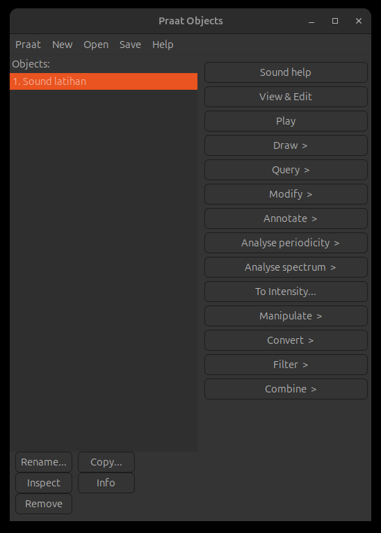
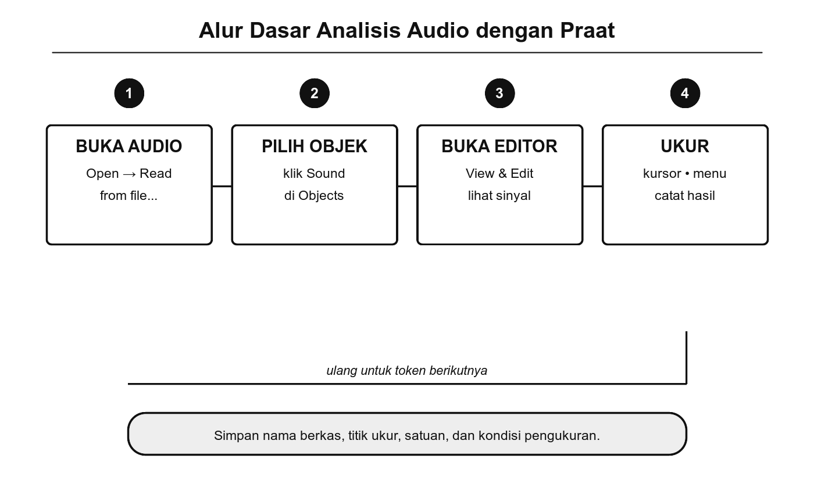
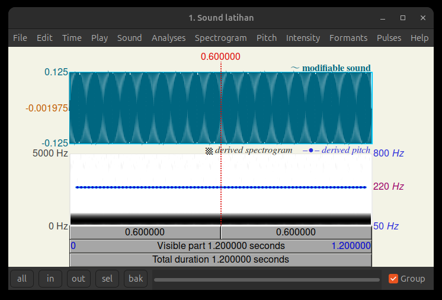
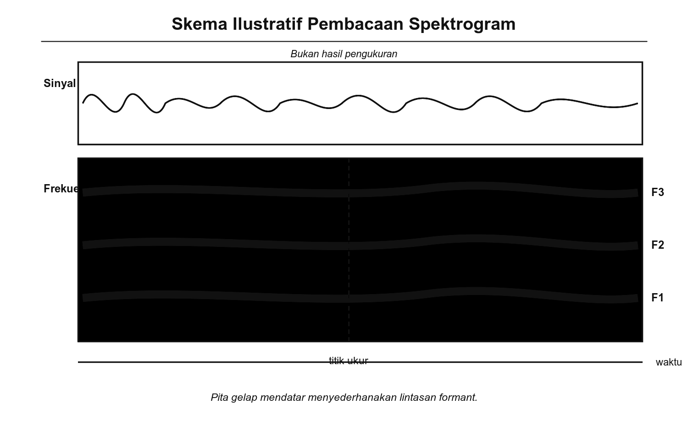
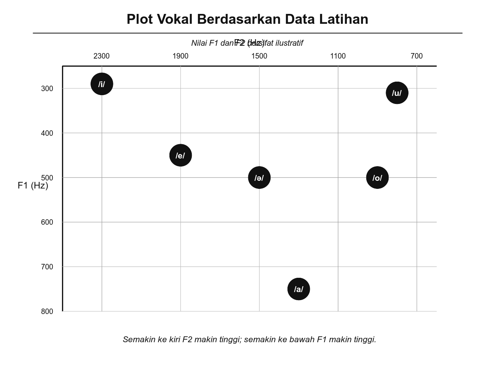

# Bab 13. Aplikasi Praat untuk Fonologi

## Tujuan Pembelajaran

Setelah mempelajari bab ini, pembaca diharapkan mampu:

1. Menjelaskan fungsi Praat sebagai perangkat lunak analisis fonetik akustik dan relevansinya bagi kajian fonologi.
2. Memasang dan menyiapkan Praat pada komputer masing-masing.
3. Merekam, membuka, dan menavigasi berkas suara di dalam Praat.
4. Membaca dan menginterpretasi tampilan gelombang bunyi (*waveform*), spektrogram, dan kontur nada dasar (*pitch contour*) untuk menganalisis bunyi bahasa Indonesia.
5. Melakukan analisis akustik sederhana terhadap vokal, konsonan, dan intonasi bahasa Indonesia.

## Pengantar Bab

Sepanjang bab-bab sebelumnya, kita telah membahas bunyi bahasa secara konseptual: klasifikasi fonem, struktur silabel, fonotaktik, realisasi fonem, hingga hubungan bunyi dan tulisan. Semua pembahasan itu berlandaskan pada pendengaran, transkripsi manual, dan penalaran fonologis. Namun, telinga manusia memiliki keterbatasan. Kita tidak selalu bisa membedakan perbedaan bunyi yang halus, mengukur durasi bunyi dalam satuan milidetik, atau melihat frekuensi getaran pita suara secara langsung.

Di sinilah perangkat lunak analisis fonetik berperan. **Praat** (kata dalam bahasa Belanda yang berarti 'bicara') adalah perangkat lunak gratis dan bersumber terbuka (*open source*) untuk analisis fonetik akustik, dikembangkan oleh Paul Boersma dan David Weenink dari Institute of Phonetic Sciences, Universitas Amsterdam (Boersma & Weenink, 2024). Praat telah menjadi alat standar dalam penelitian fonetik dan fonologi di seluruh dunia selama lebih dari tiga dekade, digunakan oleh ribuan peneliti, pengajar, dan mahasiswa linguistik.

Bab ini mengajak kita menggunakan Praat untuk mengamati bunyi bahasa Indonesia secara langsung: melihat gelombang bunyi, membaca spektrogram, mengukur frekuensi vokal, dan menganalisis pola intonasi. Dengan Praat, konsep-konsep fonologi yang telah dipelajari pada bab-bab sebelumnya dapat diamati, diukur, dan diverifikasi secara empiris.

## 13.1 Pengantar Aplikasi Praat

Praat adalah perangkat lunak analisis fonetik yang memungkinkan pengguna merekam suara, memvisualisasikan bunyi, mengukur parameter akustik, dan melakukan berbagai jenis analisis fonetik (Boersma & Weenink, 2024). Beberapa kemampuan utama Praat yang relevan untuk pembelajaran fonologi:

- **Merekam dan memutar suara.** Praat dapat merekam suara langsung dari mikrofon komputer dan menyimpannya sebagai berkas audio.
- **Menampilkan gelombang bunyi** (*waveform*). Tampilan visual yang menunjukkan amplitudo bunyi sepanjang waktu, memungkinkan kita melihat pola intensitas dan durasi bunyi.
- **Menampilkan spektrogram.** Representasi visual tiga dimensi yang menunjukkan frekuensi, waktu, dan intensitas bunyi secara bersamaan. Spektrogram adalah alat utama untuk mengidentifikasi vokal, konsonan, dan perbedaan kualitas bunyi.
- **Mengukur nada dasar** (*pitch/F0*). Praat dapat mendeteksi frekuensi getaran pita suara, yang menentukan tinggi-rendah nada suara.
- **Mengukur forman.** Forman adalah puncak energi pada frekuensi tertentu yang menentukan kualitas vokal. Forman pertama (F1) berkorelasi dengan tinggi-rendah posisi lidah, dan forman kedua (F2) berkorelasi dengan maju-mundur posisi lidah (Ladefoged & Johnson, 2011).
- **Menampilkan kontur intensitas.** Menunjukkan perubahan kekerasan (volume) bunyi sepanjang waktu.

### Mengapa Praat?

Praat dipilih untuk bab ini karena beberapa alasan:

1. **Gratis dan bersumber terbuka.** Praat tersedia secara gratis di situs resmi pengembang (https://www.fon.hum.uva.nl/praat/) dan dapat digunakan tanpa lisensi berbayar.
2. **Lintas platform.** Praat tersedia untuk Windows, macOS, dan Linux.
3. **Standar akademik.** Praat merupakan perangkat lunak yang paling banyak digunakan dan dirujuk dalam publikasi fonetik dan fonologi (Boersma & Weenink, 2024).
4. **Dokumentasi lengkap.** Praat memiliki manual bawaan yang komprehensif dan banyak tutorial daring yang tersedia secara gratis.

{width="5.8in"}

Gambar 13.1 Jendela Praat Objects setelah Berkas Audio Dibuka (Praat 7.0.02; audio uji sintetis)

## 13.2 Instalasi dan Penyiapan Praat

### Langkah Instalasi

Praat dapat dipasang pada komputer dengan langkah-langkah berikut (Boersma & Weenink, 2024):

**Langkah 1.** Buka situs resmi Praat di https://www.fon.hum.uva.nl/praat/.

**Langkah 2.** Pilih versi sesuai sistem operasi (Windows, macOS, atau Linux). Untuk Windows, unduh berkas ZIP yang berisi aplikasi Praat. Untuk macOS, unduh berkas DMG.

**Langkah 3.** Ekstrak (Windows) atau buka (macOS) berkas yang diunduh. Praat tidak memerlukan proses instalasi khusus; cukup jalankan berkas aplikasinya.

**Langkah 4.** Jalankan Praat. Dua jendela akan muncul: **Praat Objects** (jendela utama untuk mengelola berkas suara) dan **Praat Picture** (jendela untuk membuat gambar/grafik).

<!-- TODO: Tambahkan tangkapan layar langkah-langkah instalasi sesuai versi terbaru Praat yang tersedia saat finalisasi buku. -->

### Penyiapan Perekaman

Untuk kegiatan praktik pada bab ini, diperlukan mikrofon yang memadai. Beberapa panduan:

- **Mikrofon bawaan laptop** dapat digunakan untuk latihan awal, tetapi kualitasnya terbatas.
- **Mikrofon eksternal** (*headset* atau mikrofon meja USB) disarankan untuk hasil yang lebih baik.
- **Lingkungan perekaman** sebaiknya tenang, jauh dari sumber bising seperti kipas angin, lalu lintas, atau percakapan orang lain.
- **Format berkas.** Praat mendukung format WAV (disarankan) dan beberapa format audio lainnya. Rekam dengan frekuensi sampel (*sampling rate*) minimal 22.050 Hz, atau idealnya 44.100 Hz.

> **Catatan penting tentang etika perekaman.** Jika merekam ujaran orang lain untuk keperluan analisis, pastikan penutur telah memberikan persetujuan secara sadar (*informed consent*). Jelaskan tujuan perekaman, bagaimana rekaman akan digunakan, dan siapa yang akan mengaksesnya. Jangan merekam ujaran orang lain tanpa izin.

## 13.3 Analisis Bunyi dengan Praat

Setelah Praat terpasang, kita dapat mulai menganalisis bunyi bahasa Indonesia. Subbab ini memandu langkah-langkah dasar untuk membuka berkas suara, mengamati gelombang bunyi, dan membaca spektrogram.

### Membuka dan Menavigasi Berkas Suara

{width="5.8in"}

Gambar 13.2 Alur Dasar Analisis Audio dengan Praat

**Langkah 1.** Pada jendela Praat Objects, pilih menu **Open** → **Read from file...** untuk membuka berkas audio yang sudah ada, atau pilih **New** → **Record mono Sound...** untuk merekam suara baru.

**Langkah 2.** Setelah berkas suara muncul di daftar Objects, klik **View & Edit** untuk membuka jendela editor suara.

**Langkah 3.** Jendela editor menampilkan dua panel utama:
- **Panel atas**: gelombang bunyi (*waveform*) yang menunjukkan amplitudo sepanjang waktu.
- **Panel bawah**: spektrogram yang menunjukkan distribusi frekuensi sepanjang waktu. Area yang lebih gelap menandakan energi akustik yang lebih tinggi.

{width="6.0in"}

Gambar 13.3 Jendela *View & Edit* pada Praat 7.0.02 (audio uji sintetis)

### Membaca Gelombang Bunyi

Gelombang bunyi (*waveform*) menampilkan perubahan tekanan udara (amplitudo) sepanjang waktu. Dari gelombang bunyi, kita dapat mengamati:

- **Durasi bunyi.** Panjang gelombang pada sumbu horizontal menunjukkan berapa lama suatu bunyi berlangsung (dalam detik atau milidetik).
- **Intensitas relatif.** Tinggi gelombang pada sumbu vertikal menunjukkan kekerasan bunyi. Vokal biasanya memiliki amplitudo lebih besar daripada konsonan frikatif.
- **Perbedaan segmen.** Bunyi vokal terlihat sebagai pola gelombang yang teratur dan berulang. Bunyi konsonan frikatif (seperti [s]) terlihat sebagai pola acak (kebisingan). Bunyi plosif (seperti [p], [t]) terlihat sebagai jeda singkat diikuti letupan.

### Membaca Spektrogram

Spektrogram merupakan alat analisis yang lebih kaya informasi daripada gelombang bunyi. Pada spektrogram:

- **Sumbu horizontal** mewakili waktu.
- **Sumbu vertikal** mewakili frekuensi (dalam Hertz).
- **Intensitas warna** (gelap/terang) mewakili energi akustik: semakin gelap, semakin kuat energi pada frekuensi tersebut.

Pada spektrogram, vokal tampak sebagai pita-pita horizontal gelap yang disebut **forman**. Forman pertama (F1, pita terendah) berkorelasi dengan tinggi-rendah posisi lidah, dan forman kedua (F2, pita di atasnya) berkorelasi dengan maju-mundur posisi lidah (Ladefoged & Johnson, 2011). Dengan mengukur nilai F1 dan F2, kita dapat mengidentifikasi vokal yang diucapkan dan membandingkannya dengan data vokal bahasa Indonesia standar.

{width="5.8in"}

Gambar 13.4 Skema Ilustratif Pembacaan Spektrogram dan Forman (bukan hasil pengukuran)

## 13.4 Visualisasi Data Fonologi

Praat menyediakan beberapa jenis visualisasi yang berguna untuk analisis fonologis. Subbab ini membahas tiga visualisasi utama: kontur nada dasar (*pitch*), kontur intensitas, dan plot vokal.

### Kontur Nada Dasar (*Pitch Contour*)

Kontur nada dasar menampilkan perubahan frekuensi fundamental (F0) sepanjang ujaran. F0 ditentukan oleh frekuensi getaran pita suara dan berkorelasi langsung dengan tinggi-rendah nada yang kita dengar.

Dalam Praat, kontur nada dasar ditampilkan sebagai garis biru pada panel spektrogram (dapat diaktifkan melalui menu **Pitch** → **Show pitch**). Dengan mengamati kontur ini, kita dapat:

- **Membedakan intonasi pernyataan dan pertanyaan.** Seperti dibahas pada Bab 4 dan 5, pernyataan dalam bahasa Indonesia ditandai intonasi turun (F0 menurun di akhir kalimat), sedangkan pertanyaan ditandai intonasi naik (F0 meningkat di akhir kalimat).
- **Mengamati tekanan kata.** Suku kata yang mendapat tekanan biasanya memiliki F0 yang sedikit lebih tinggi, durasi yang lebih panjang, dan intensitas yang lebih kuat.
- **Membandingkan pola intonasi antarpenutur.** Penutur dari daerah yang berbeda mungkin menunjukkan pola kontur nada dasar yang berbeda untuk kalimat yang sama.

### Kontur Intensitas

Kontur intensitas menunjukkan perubahan kekerasan bunyi (dalam desibel, dB) sepanjang ujaran. Dalam Praat, kontur ini ditampilkan melalui menu **Intensity** → **Show intensity**. Vokal umumnya memiliki intensitas lebih tinggi daripada konsonan, dan puncak-puncak intensitas sering berkorelasi dengan puncak silabel.

### Plot Vokal

Salah satu kegiatan yang paling informatif dalam analisis akustik adalah membuat **plot vokal** (*vowel plot*), yaitu diagram yang menempatkan vokal berdasarkan nilai forman F1 (sumbu vertikal, dibalik) dan F2 (sumbu horizontal, dibalik). Plot vokal menghasilkan gambaran yang menyerupai trapesium vokal yang telah dibahas pada Bab 3, tetapi berdasarkan data akustik yang terukur, bukan perkiraan artikulatoris.

Untuk membuat plot vokal dari data Praat:

1. Rekam penutur mengucapkan kata-kata yang mengandung enam vokal bahasa Indonesia, misalnya: "ini" (/i/), "enak" (/e/), "empat" (/ə/), "ada" (/a/), "umur" (/u/), "obat" (/o/).
2. Buka rekaman di editor Praat.
3. Untuk setiap vokal, pilih bagian tengah vokal (bagian yang paling stabil) dan gunakan menu **Formant** → **Get first formant** dan **Get second formant** untuk mengukur F1 dan F2.
4. Catat nilai F1 dan F2 untuk setiap vokal.
5. Plot nilai-nilai tersebut pada diagram F1 (sumbu vertikal, terbalik) vs. F2 (sumbu horizontal, terbalik).

**Tabel 13.1** Contoh Nilai Forman Vokal Bahasa Indonesia (Data Ilustratif, Penutur Laki-laki)

| **Vokal** | **Kata sumber** | **F1 (Hz)** | **F2 (Hz)** |
|---|---|---|---|
| /i/ | ini | 290 | 2.300 |
| /e/ | enak | 450 | 1.900 |
| /ə/ | empat | 500 | 1.500 |
| /a/ | ada | 750 | 1.300 |
| /u/ | umur | 310 | 800 |
| /o/ | obat | 500 | 900 |

Nilai-nilai pada tabel ini bersifat ilustratif. Nilai forman bervariasi antarindividu, antarjenis kelamin (forman perempuan umumnya lebih tinggi karena saluran vokal lebih pendek), dan antardialek. Yang penting bukan angka absolutnya, melainkan pola relatifnya: /i/ memiliki F1 rendah dan F2 tinggi (vokal tinggi depan), /a/ memiliki F1 tinggi dan F2 sedang (vokal rendah pusat), dan seterusnya.

{width="5.8in"}

Gambar 13.5 Plot Vokal Berdasarkan Data Ilustratif pada Tabel 13.1

## 13.5 Praktik: Analisis Bunyi Bahasa Indonesia

Berikut adalah kegiatan praktik yang dapat dilakukan secara mandiri menggunakan Praat.

### Praktik 1: Mengamati Perbedaan Vokal

**Tujuan.** Mengukur nilai forman vokal bahasa Indonesia dan membandingkannya dengan trapesium vokal teoretis (Bab 3).

**Alat.** Praat, mikrofon, komputer.

**Langkah-langkah.**

1. Rekam diri sendiri mengucapkan enam kata yang masing-masing mengandung satu vokal target: "ini," "enak," "empat," "ada," "umur," "obat." Ucapkan setiap kata tiga kali dengan jeda antarkata.
2. Buka rekaman di editor Praat.
3. Untuk setiap vokal, pilih bagian tengah (sekitar 50 ms di titik paling stabil) dan catat nilai F1 dan F2 menggunakan menu Formant.
4. Rata-ratakan nilai dari tiga pengulangan.
5. Buat plot vokal pada kertas grafik atau spreadsheet.

**Hasil yang diharapkan.** Plot vokal yang dihasilkan akan menyerupai trapesium vokal bahasa Indonesia, dengan /i/ di kiri atas, /u/ di kanan atas, dan /a/ di bawah tengah.

**Evaluasi.** Bandingkan plot vokal dari data rekaman dengan trapesium vokal teoretis pada Bab 3. Apakah posisi relatif vokal sesuai? Jika ada perbedaan, faktor apa yang mungkin menyebabkannya?

### Praktik 2: Mengamati Perbedaan Intonasi

**Tujuan.** Membandingkan kontur nada dasar (F0) pada kalimat pernyataan dan pertanyaan.

**Alat.** Praat, mikrofon, komputer.

**Langkah-langkah.**

1. Rekam diri sendiri mengucapkan kalimat "Dia sudah pulang" dua kali: pertama sebagai pernyataan (intonasi turun), kedua sebagai pertanyaan (intonasi naik).
2. Buka rekaman di editor Praat.
3. Aktifkan tampilan kontur nada dasar (*pitch*) melalui menu Pitch → Show pitch.
4. Amati perbedaan kontur nada dasar di akhir kalimat pada kedua versi.

**Hasil yang diharapkan.** Pada versi pernyataan, kontur F0 menurun di akhir kalimat. Pada versi pertanyaan, kontur F0 naik di akhir kalimat. Perbedaan ini sesuai dengan pembahasan intonasi pada Bab 4 dan Bab 5.

### Praktik 3: Mengamati Hambat Glotal

**Tujuan.** Mengidentifikasi realisasi hambat glotal [ʔ] pada akhir kata bahasa Indonesia.

**Alat.** Praat, mikrofon, komputer.

**Langkah-langkah.**

1. Rekam diri sendiri mengucapkan kata "bapak" dan "kakak" dalam ragam santai.
2. Buka rekaman dan amati spektrogram di bagian akhir kata.
3. Perhatikan apakah ada jeda singkat (keheningan) sebelum akhir kata yang menandakan hambat glotal [ʔ], atau apakah ada letupan [k] yang jelas.

**Hasil yang diharapkan.** Dalam ragam santai, akhir kata kemungkinan menunjukkan jeda singkat tanpa letupan (hambat glotal [ʔ]), sesuai dengan pembahasan alofoni fonem /k/ pada Bab 8.

## 13.6 Studi Kasus: Penerapan Praat dalam Penelitian Fonologi

Praat bukan hanya alat pembelajaran; perangkat lunak ini merupakan instrumen standar dalam penelitian fonologi dan fonetik. Berikut contoh penerapannya yang relevan dengan konteks bahasa Indonesia.

### Penelitian Vokal Bahasa Indonesia

Penelitian tentang ruang vokal (*vowel space*) bahasa Indonesia menggunakan Praat untuk mengukur forman vokal dari berbagai penutur. Adisasmito-Smith dan Cohn (1996) menggunakan analisis akustik untuk memetakan vokal bahasa Indonesia dan menunjukkan bahwa penutur laki-laki dan perempuan memiliki nilai forman yang berbeda secara absolut, tetapi pola relatif antarvokal tetap konsisten. Temuan ini mendukung klasifikasi vokal bahasa Indonesia yang dibahas pada Bab 3.

### Penelitian Intonasi Bahasa Indonesia

Penelitian intonasi bahasa Indonesia juga banyak memanfaatkan Praat. Halim (1984) mendokumentasikan pola intonasi bahasa Indonesia secara sistematis, termasuk perbedaan kontur nada dasar antara pernyataan dan pertanyaan yang telah kita bahas pada Bab 4 dan Bab 5. Penelitian-penelitian yang lebih baru memanfaatkan Praat untuk memverifikasi dan memperluas temuan Halim dengan data akustik yang lebih terukur.

### Replikasi Sederhana

Pembaca dapat melakukan replikasi sederhana dari penelitian vokal dengan langkah-langkah berikut:

1. Rekam lima penutur bahasa Indonesia (campuran laki-laki dan perempuan) mengucapkan enam kata target vokal.
2. Ukur F1 dan F2 setiap vokal menggunakan Praat.
3. Bandingkan rata-rata forman antarpenutur.
4. Buat plot vokal untuk setiap penutur dan bandingkan pola-polanya.

Kegiatan ini memberikan pengalaman langsung dalam metode penelitian fonetik akustik dan membantu memahami hubungan antara teori fonologis dan data empiris.

## Rangkuman

Praat adalah perangkat lunak gratis dan bersumber terbuka untuk analisis fonetik akustik, dikembangkan oleh Paul Boersma dan David Weenink dari Universitas Amsterdam. Praat menjadi alat standar dalam penelitian fonetik dan fonologi serta dapat digunakan untuk pembelajaran fonologi secara praktis.

Tiga jenis visualisasi utama dalam Praat meliputi gelombang bunyi (menunjukkan amplitudo sepanjang waktu), spektrogram (menunjukkan distribusi frekuensi dan intensitas), dan kontur nada dasar (menunjukkan perubahan F0). Forman pada spektrogram digunakan untuk mengidentifikasi vokal: F1 berkorelasi dengan tinggi-rendah lidah dan F2 berkorelasi dengan maju-mundur lidah.

Kegiatan praktik dalam bab ini meliputi pengukuran forman vokal untuk membuat plot vokal akustik, perbandingan kontur intonasi pernyataan dan pertanyaan, serta pengamatan hambat glotal pada akhir kata. Kegiatan-kegiatan ini menghubungkan konsep fonologi dari bab-bab sebelumnya dengan data akustik yang terukur.

Praat juga digunakan secara luas dalam penelitian fonologi, termasuk penelitian vokal dan intonasi bahasa Indonesia. Pembaca didorong untuk mengeksplorasi Praat secara mandiri dan menerapkannya untuk menyelidiki fenomena fonologis yang telah dibahas sepanjang buku ini.

## Latihan Akhir Bab

1. Jelaskan apa itu spektrogram dan informasi apa saja yang dapat dibaca dari spektrogram. Apa yang diwakili oleh sumbu horizontal, sumbu vertikal, dan intensitas warna?

2. Lakukan Praktik 1 (analisis vokal): rekam diri sendiri mengucapkan enam kata target vokal, ukur F1 dan F2 setiap vokal menggunakan Praat, dan buat plot vokal. Bandingkan hasilnya dengan trapesium vokal pada Bab 3. Jelaskan temuan dan perbedaan yang muncul.

3. Lakukan Praktik 2 (analisis intonasi): rekam kalimat "Dia sudah pulang" sebagai pernyataan dan pertanyaan. Lampirkan tangkapan layar kontur nada dasar dari Praat untuk kedua versi. Jelaskan perbedaan yang terlihat.

4. Rekam kata "bapak" dalam ragam formal dan ragam santai. Amati spektrogram akhir kata pada kedua versi. Apakah terlihat perbedaan antara plosif velar [k] dan hambat glotal [ʔ]? Jelaskan temuan berdasarkan pembahasan alofoni pada Bab 8.

5. Mengapa nilai forman vokal berbeda antara penutur laki-laki dan perempuan? Jelaskan faktor anatomis yang memengaruhi perbedaan ini.

## 🧠 Istilah yang dipelajari pada bab ini

- **Praat**: perangkat lunak gratis dan bersumber terbuka untuk analisis fonetik akustik, dikembangkan oleh Paul Boersma dan David Weenink dari Universitas Amsterdam.
- **Gelombang bunyi** (*waveform*): tampilan visual yang menunjukkan perubahan amplitudo (tekanan udara) sepanjang waktu.
- **Spektrogram**: representasi visual yang menunjukkan distribusi frekuensi, waktu, dan intensitas bunyi secara bersamaan.
- **Nada dasar** (*fundamental frequency*, F0): frekuensi getaran pita suara yang menentukan tinggi-rendah nada suara yang didengar.
- **Kontur nada dasar** (*pitch contour*): garis yang menunjukkan perubahan F0 sepanjang ujaran.
- **Forman** (*formant*): puncak energi pada frekuensi tertentu dalam spektrum bunyi vokal. F1 berkorelasi dengan tinggi-rendah posisi lidah; F2 berkorelasi dengan maju-mundur posisi lidah.
- **Plot vokal** (*vowel plot*): diagram yang menempatkan vokal berdasarkan nilai F1 dan F2, menghasilkan gambaran ruang vokal akustik.
- **Frekuensi sampel** (*sampling rate*): jumlah sampel yang diambil per detik saat merekam suara digital, diukur dalam Hertz (Hz).
- **Intensitas** (*intensity*): kekerasan bunyi yang diukur dalam desibel (dB).
- ***Informed consent*** (persetujuan sadar): persetujuan yang diberikan oleh penutur setelah memahami tujuan dan penggunaan rekaman suaranya.
