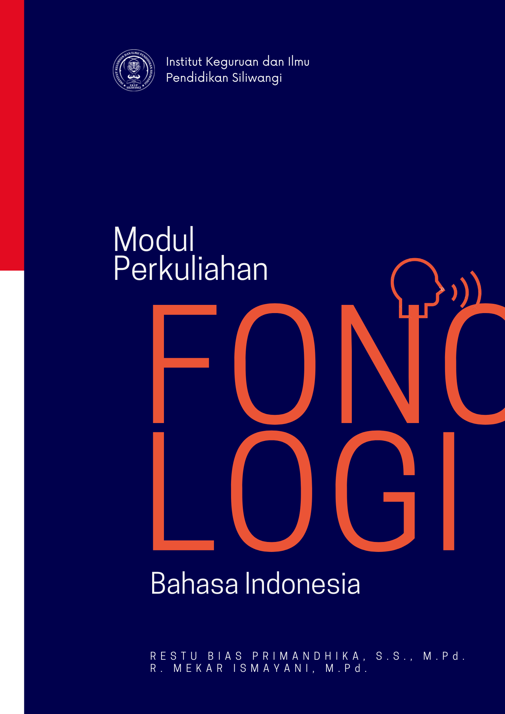

**Fonologi**

**FONOLOGI BAHASA INDONESIA**

Restu Bias Primandhika, S.S., M.Pd.

R. Mekar Ismayani, M.Pd.

IKIP Siliwangi Press

**FONOLOGI BAHASA INDONESIA**

Restu Bias Primandhika, S.S., M.Pd.  
R. Mekar Ismayani, M.Pd.

Editor : Eli Syarifah Aeni

Artistik: Ardiansyah

Pracetak: Dida Firmansyah

IKIP Siliwangi Press

Jl. Terusan Jendral Sudirman, Kebon Rumput, Kec. Baros, Cimahi Tengah 40521, Kota Cimahi

\(022\) 6658680

Email: press@ikipsiliwangi.ac.id

press@ikipsiliwangi.ac.id

ISBN : 978-602-1222-74-4  
  
Cetakan Pertama

Agustus 2023

HAK CIPTA PADA PENULIS DILINDUNGI UNDANG-UNDANG

**KATA PENGANTAR**

Puji syukur ke hadirat Tuhan Yang Maha Esa atas selesainya penulisan buku ini, yang berjudul "Fonologi, Fonetik, dan Fonemik dalam Bahasa Indonesia". Buku ini disusun sebagai bahan ajar dan referensi dalam kursus linguistik untuk mendukung pemahaman mendalam mahasiswa dari berbagai bidang studi, khususnya yang berkaitan dengan bahasa dan linguistik, tentang konsep-konsep fonologi, fonetik, dan fonemik. Tujuan dari buku ini adalah untuk menyediakan pemahaman komprehensif tentang bagaimana suara-suaranya diorganisir dan digunakan dalam Bahasa Indonesia, mulai dari dasar teori, metode analisis, hingga penerapannya dalam kehidupan sehari-hari.

Penyusunan buku ini tidak terlepas dari dukungan dan bantuan berbagai pihak. Oleh karena itu, penulis ingin mengucapkan terima kasih yang sebesar-besarnya kepada para kolaborator dan rekan sejawat di bidang linguistik, para mahasiswa yang dengan antusias memberikan *feedback*, serta semua pihak yang telah memberikan dukungan moral selama proses penulisan ini.

Penulis menyadari bahwa tidak ada karya ilmiah yang sempurna. Oleh karena itu, kritik dan saran yang konstruktif dari para pembaca sangat penulis harapkan untuk menyempurnakan edisi berikutnya dari buku ini. Semoga buku ini dapat memberikan manfaat yang luas dan meningkatkan minat serta pemahaman tentang ilmu fonologi, fonetik, dan fonemik di kalangan pembaca.

Cimahi, 23 Agustus 2023

Restu Bias Primandhika

R. Mekar Ismayani

**Belajar lebih banyak hal di sini**

**Kanal YouTube Restu Bias Primandhika**

Tempat belajar ilmu sastra, bahasa dan konten lainnya terkait bahasa dan teknologi yang disajikan langsung oleh penulis modul.

**DAFTAR ISI**

**Bab I: Fonologi, Fonetik, dan Fonemik**

A. Pengenalan Fonologi

B. Dasar Fonetik

C. Fonemik: Pengantar

D. Aplikasinya dalam Bahasa Indonesia

**Bab II: Produksi Bunyi Bahasa dan Alat Ucap**

A. Anatomi Alat Ucap

B. Mekanisme Produksi Bunyi

C. Klasifikasi Bunyi Berdasarkan Sumber

D. Bunyi Bahasa dan Variasinya

E. Interaksi Fonem dalam Produksi Bunyi

**Bab III: Klasifikasi Bunyi Bahasa**

A. Vokal dan Konsonan

B. Kategori Bunyi Lainnya

C. Fitur Distingtif

D. Sistem Fonologis Bahasa Indonesia

**Bab IV: Segmental dan Suprasegmental**

A. Unsur Segmental dalam Fonologi

B. Karakteristik Suprasegmental

C. Intonasi dan Tekanan

D. Rima dan Ritme

E. Pemetaan Suprasegmental dalam Ujaran

**Bab V: Pungtuasi**

A. Fungsi Pungtuasi dalam Lisan

B. Tanda Baca Utama

C. Tanda Baca Tambahan

D. Pungtuasi dalam Konteks Formal dan Informal

**Bab VI: Silabel**

A. Struktur dan Fungsi Silabel

B. Pola Silabisasi dalam Bahasa

C. Silabel Terbuka dan Tertutup

D. Pengaruh Silabel terhadap Ejaan

**Bab VI: Variasi Fonem**

A. Fonem dan Variannya

B. Perubahan Fonem dalam Dialek

C. Fonem Hilang dalam Kolokasi

D. Fonem dan Peran Sosiolinguistik

**Bab VII: Realisasi Fonem**

A. Fonem dalam Konteks Nyata

B. Alofon dari Fonem Tertentu

C. Proses Fonologis dalam Realisasi Fonem

D. Variasi Realisasi Fonem Antar Dialek

**Bab IX: Fonotaktik**

A. Aturan Fonotaktik dalam Bahasa

B. Batasan dan Keterbatasan Fonotaktik

C. Fonotaktik dalam Pembentukan Kata

D. Studi Kasus Fonotaktik dalam Korpus

**Bab X: Diftong dan Kluster**

A. Pengertian dan Klasifikasi Diftong

B. Perbedaan Diftong dan Monoftong

C. Pengenalan Kluster Konsonan

D. Diftong dan Kluster dalam Perbandingan

**Bab XI: Deret Fonem**

A. Serialisasi Fonem dalam Kata

B. Deret Fonem dalam Morfologi

C. Analisis Deret Fonem

D. Peran Deret Fonem dalam Semantik

**Bab XII: Grafemik dan Ejaan**

A. Dasar-Dasar Grafemik

B. Sistem Ejaan Bahasa Indonesia

C. Perubahan Ejaan: Historis dan Kontemporer

D. Grafemik dalam Konteks Multibahasa

E. Implikasi Ejaan terhadap Pendidikan

**Bab XIII: Aplikasi PRAAT untuk Fonologi**

A. Pengantar Aplikasi PRAAT

B. Instalasi dan Setup PRAAT

C. Analisis Fonemik dengan PRAAT

D. Visualisasi Data Fonologi

E. Praktik: Analisis Bunyi Bahasa

F. Studi Kasus: Penerapan PRAAT dalam Penelitian

**DAFTAR PUSTAKA**

**BAB I**

Fonologi, Fonetik dan Fonemik

Dalam kehidupan sehari-hari, kita sering kali tidak menyadari pengaruh besar yang dimiliki oleh suara dan cara pengucapannya terhadap komunikasi. Dari cara kita menekankan suatu kata hingga intonasi yang berbeda ketika marah atau senang, semua ini dikaji dalam fonologi dan fonetik. Bab ini akan mengajak Anda memahami dasar-dasar fonologi, fonetik dan fonemik, serta pentingnya elemen-elemen ini dalam berkomunikasi dan belajar bahasa.

1.  **Pengenalan Fonologi**

Fonologi adalah cabang linguistik tentang suara. Dalam bidang ini, kita akan mempelajari bagaimana suara dapat membentuk sebuah bahasa (sebagai simbol bunyi), terutama fokus pada fungsi suara dalam membedakan makna. Secara etimologis, fonologi berasal dari dua kata dalam bahasa Yunani ***Fon*** (φωνή), yang berarti 'bunyi' dan ***Logos*** (λόγος), yang berarti 'ilmu' atau 'kajian'. Dengan demikian, fonologi adalah ilmu yang mempelajari bunyi, khususnya bunyi bahasa yang dihasilkan oleh alat ucap manusia untuk komunikasi​. Bidang ilmu ini merupakan area kunci yang membantu kita memahami perbedaan cara suara diucapkan dan ditafsirkan dalam berbagai konteks dan dialek.

Fonologi mempelajari aturan dan pola di balik penggunaan bunyi bahasa, khususnya bagaimana bunyi-bunyi ini membentuk kata-kata dan kalimat, serta bagaimana perubahan kecil dalam bunyi (misalnya, perubahan dari /p/ ke /b/) dapat mengubah makna kata dalam suatu bahasa. Dalam Bahasa Indonesia, misalnya, kontras antara fonem /p/ dan /b/ sangat penting dalam membedakan makna kata. Contoh nyatanya adalah:

- **"Pita"** (sejenis perekat atau hiasan) vs **"Bita"** (Kelompok bit yang diproses sebagai satuan oleh komputer).

- juga /s/ dan /z/ - **"Pasar"** (tempat jual beli) vs **"Bazar"** (merupakan pasar yang sengaja diselenggarakan untuk jangka waktu beberapa hari).

Secara kontras, contoh tersebut menunjukkan bagaimana fonem yang berbeda dapat mengubah makna kata secara signifikan dan bagaimana pentingnya pemahaman fonologi untuk pemahaman yang tepat atas struktur suara suatu bahasa. Di dalam Fonologi juga dipelajari pola mana yang mungkin atau tidak mungkin dalam suatu bahasa, seperti penggunaan kluster konsonan dan tempat fonem dapat muncul dalam kata. Dalam Bahasa Indonesia, tidak umum menemukan kata-kata yang berakhir dengan konsonan tertentu seperti /f/, /v/, atau /z/, yang memberikan wawasan menarik mengenai batasan fonologis bahasa ini.

2.  **Bunyi Bahasa**

Bunyi bahasa adalah bunyi yang dihasilkan oleh alat ucap manusia dan diartikulasikan sehingga membentuk gelombang bunyi yang diterima oleh telinga manusia. Bunyi ini memiliki fungsi komunikasi dan dapat membedakan makna dalam suatu bahasa.

Dalam bahasa, bunyi bahasa terbagi menjadi dua bentuk utama:

1.  **Fon**: Bunyi terkecil dalam bahasa yang tidak memiliki fungsi untuk membedakan makna, tetapi berfungsi sebagai unit dasar dari fonem.

2.  **Fonem**: Unit bunyi terkecil yang berfungsi untuk membedakan makna dalam bahasa. Misalnya, perbedaan antara /b/ dan /p/ dapat membedakan kata "batu" dan "patu."

Tidak semua bunyi yang dihasilkan oleh alat ucap manusia dianggap sebagai bunyi bahasa. Beberapa contoh bunyi yang dihasilkan oleh alat ucap tetapi bukan merupakan bagian dari bahasa antara lain batuk, bersin, bersendawa, bersiul atau mendengkur

Bunyi-bunyi tersebut dihasilkan oleh alat ucap manusia tetapi tidak termasuk dalam sistem komunikasi linguistik karena tidak berfungsi untuk membedakan makna kata atau kalimat dalam bahasa.

Secara sederhana, bunyi bahasa adalah bunyi yang terstruktur dan diatur dalam sistem bahasa untuk menyampaikan makna, sedangkan bunyi non-bahasa adalah bunyi yang dihasilkan oleh tubuh tetapi tidak memiliki fungsi komunikatif dalam bahasa.

Bunyi bahasa adalah unsur bahasa yang paling kecil dan menjadi komponen penting dalam komunikasi. Bunyi bahasa diproduksi oleh manusia melalui alat ucap dengan tujuan untuk mengungkapkan sesuatu. Dalam kajian linguistik, bunyi bahasa dapat dibagi menjadi dua jenis, yaitu bunyi secara fonetis dan fonemis.

Bunyi bahasa secara fonetis disebut juga fon atau bunyi ujar, yang merujuk pada aspek fisik bunyi yang dihasilkan oleh alat ucap manusia. Bunyi fonetis ini bersifat nyata atau konkret, yang dikenal dengan istilah parole dalam linguistik Saussurean (linguistik modern yang diusung oleh Ferdinand de Saussure), dan merupakan aspek ujaran yang terjadi dalam konteks komunikasi lisan sehari-hari.

Sementara itu, bunyi bahasa secara fonemis bersifat lebih abstrak dan sistemik, yaitu bagian dari sistem pikiran (*langue*) atau sistem bahasa yang disebut langue. Fonem adalah bunyi terkecil dalam bahasa yang berfungsi untuk membedakan makna, meskipun tidak selalu terdengar secara fisik dalam setiap ujaran (*parole*). Fonem lebih dipahami sebagai representasi mental dari bunyi yang memiliki peran penting dalam struktur bahasa.

Bunyi bahasa memiliki beberapa ciri penting yang membedakannya sebagai unsur esensial dalam komunikasi diantaranya 1) bunyi bahasa sering disebut fon, yang berasal dari kata "phone" dalam bahasa Inggris yang berarti "bunyi". Hal ini menekankan bahwa fon merupakan bagian dari sistem suara yang digunakan dalam bahasa. 2) bunyi bahasa dihasilkan oleh alat ucap manusia, seperti pita suara, lidah, dan bibir. Organ-organ ini bekerja bersama untuk menghasilkan berbagai jenis bunyi yang dapat diidentifikasi sebagai bagian dari suatu bahasa. 3) bunyi bahasa merupakan unsur bahasa yang paling kecil. Bunyi ini berfungsi sebagai unit dasar yang membangun kata dan frasa, serta memungkinkan terjadinya komunikasi 4) bunyi bahasa adalah suara yang dikeluarkan oleh mulut. Suara ini dihasilkan melalui proses artikulasi dan resonansi di dalam rongga mulut dan hidung, sehingga membentuk bunyi yang dapat dimengerti oleh pendengar. 5) bunyi bahasa digunakan untuk mengungkapkan sesuatu dan berfungsi sebagai pembeda arti. Setiap perubahan pada bunyi bahasa dapat mengubah makna kata atau frasa, sehingga peran bunyi sangat penting dalam sistem komunikasi lisan.

3.  **Fonetik**

Fonetik adalah cabang linguistik yang mempelajari produksi fisik dan persepsi suara manusia. Fokus utama fonetik adalah pada proses fisik yang terlibat dalam membuat suara berbicara, dan cara suara ini dihasilkan, diucapkan, didengar, dan dipahami. Fonetik didefinisikan sebagai "studi tentang suara manusia yang digunakan untuk berbicara" (Ladefoged, 2006) dan dibagi menjadi tiga subdisiplin utama:

1.  **Fonetik Artikulatoris:** Mempelajari cara suara dihasilkan oleh alat bicara manusia.

2.  **Fonetik Akustik:** Fokus pada sifat fisik gelombang suara yang dihasilkan.

3.  **Fonetik Auditori:** Memahami cara suara diproses oleh telinga, sistem saraf, dan otak.

Berikut adalah beberapa konsonan dalam Bahasa Indonesia dan bagaimana konsonan tersebut diartikulasikan, menggunakan simbol IPA (*International Phonetic Alphabet*):

**Tabel 1.1** Contoh Fonetik Bahasa Indonesia

| **IPA** | **Artikulasi**                   | **Kata** | **Transkripsi** | **Arti**                                                                                                            |
|---------|----------------------------------|----------|-----------------|---------------------------------------------------------------------------------------------------------------------|
| /p/     | Bilabial, plosif, tidak bersuara | Pisang   | /pi.saŋ/        | (n.) Buah yang panjang dan berkulit kuning ketika matang.                                                           |
| /b/     | Bilabial, plosif, bersuara       | Babi     | /ba.bi/         | (n.) Hewan mamalia berkaki empat yang sering dijadikan ternak.                                                      |
| /t/     | Alveolar, plosif, tidak bersuara | Tikus    | /ti.kus/        | (n.) Hewan kecil, mamalia pengerat yang sering dianggap sebagai hama.                                               |
| /d/     | Alveolar, plosif, bersuara       | Duduk    | /du.dʊk/        | (v.) Posisi badan di mana bokong bersentuhan dengan permukaan yang lebih rendah dari kaki, umumnya untuk istirahat. |
| /k/     | Velar, plosif, tidak bersuara    | Kucing   | /ku.tʃiŋ/       | (n.) Hewan peliharaan yang kecil, berbulu, berkaki empat, dan biasa berburu tikus.                                  |
| /g/     | Velar, plosif, bersuara          | Gajah    | /ga.dʒah/       | (n.) Hewan besar dengan telinga besar dan belalai panjang yang digunakan untuk mengambil objek.                     |

Dalam Bahasa Indonesia, penting untuk memahami cara pengucapan suara-suara ini untuk menguasai aksen dan intonasi yang benar. Misalnya, kontras penyabutan antara /p/ dan /b/ yang keduanya adalah plosif bilabial, tetapi /p/ tidak bersuara sementara /b/ bersuara, sangat menentukan dalam membedakan makna kata seperti dalam "paku" dan "baku".

4.  **Fonemik**

Fonem adalah unit suara terkecil dalam bahasa yang dapat membedakan makna. Misalnya, perbedaan fonem antara kata 'kat' dan 'kan' terletak pada fonem terakhir. Pendekatan fonemik membantu kita memahami struktur suara suatu bahasa dan bagaimana perubahan kecil dapat mempengaruhi makna secara keseluruhan. Dalam fonemik, suatu fonem didefinisikan sebagai suara abstrak atau kumpulan suara yang, meskipun mungkin memiliki variasi dalam pengucapannya (disebut alofon), dianggap sebagai satu entitas oleh penutur bahasa tersebut dalam membedakan makna kata (Harris, 1951; Sapir, 2004).

Dalam tabel berikut, kita akan melihat beberapa fonem dalam Bahasa Indonesia dan beberapa alofonnya sebagai contoh penggunaan fonemik dalam praktik.

**Tabel 1.2** Contoh Fonemik Bahasa Indonesia

| **Fonem** | **Alofon**            | **Contoh Kata** | **Transkripsi** |
|-----------|-----------------------|-----------------|-----------------|
| /p/       | \[p\], \[pʰ\], \[ᵐp\] | Pisang          | /pi.saŋ/        |
| /b/       | \[b\], \[ᵐb\]         | Babi            | /ba.bi/         |
| /t/       | \[t\], \[tʰ\], \[ⁿt\] | Tikus           | /ti.kus/        |
| /d/       | \[d\], \[ⁿd\]         | Duduk           | /du.dʊk/        |
| /k/       | \[k\], \[kʰ\], \[ᵑk\] | Kucing          | /ku.tʃiŋ/       |
| /g/       | \[g\], \[ᵑg\]         | Gajah           | /ga.dʒah/       |

**Keterangan:**

**Fonem:** Unit dasar yang abstrak dan membedakan makna.

**Alofon:** Variasi fonem yang terjadi karena perbedaan lingkungan fonetik, tetapi tidak membedakan makna.

**Contoh:** Dalam tabel di atas, alofon ditandai dalam kurung siku, yang menunjukkan pengucapan yang berbeda dari fonem yang sama, tergantung pada konteks linguistiknya.

Dalam Bahasa Indonesia, konsep fonem dan alofon sangat penting untuk memahami variasi dialektal dan sosial dalam pengucapan. Misalnya, fonem /k/ mungkin diucapkan sebagai \[k\] yang tidak dihembuskan di awal kata dan sebagai \[kʰ\] yang dihembuskan di posisi lain, namun kedua alofon tersebut tidak membedakan makna dan karenanya dianggap variasi dari fonem yang sama.

Memahami fonemik memungkinkan kita untuk mengidentifikasi struktur fonologis yang lebih dalam dari bahasa dan melihat bagaimana perbedaan suara yang halus dapat mempengaruhi struktur dan fungsi bahasa. Pengetahuan ini sangat penting bagi linguist, guru bahasa, dan siapa saja yang berkecimpung dalam studi bahasa, terjemahan, atau ilmu fonetik dan fonologi lebih umum.

5.  **Aplikasi Fonologi, Fonetik, dan Fonemik dalam Bahasa Indonesia**

Fonologi, fonetik, dan fonemik memiliki aplikasi praktis dalam berbagai aspek kehidupan sehari-hari, terutama dalam konteks Bahasa Indonesia. Berikut adalah tiga contoh penerapannya:

1.  dalam Pembelajaran Bahasa - Fonemik menjadi unsur penting dalam pengajaran membaca dan menulis, khususnya bagi peserta didik yang masih dalam tahap awal pendidikan. Pemahaman tentang fonem membantu guru dalam mengajarkan cara pengucapan kata-kata yang benar serta cara mengeja dan membaca kata-kata tersebut. Misalnya, dalam Bahasa Indonesia, perbedaan fonemik antara kata "kata" dan "kita" harus diperjelas untuk menghindari kebingungan dalam membaca dan menulis.

2.  dalam Teknologi Pengenalan Suara - Apakah kamu pernah mendengarkan “Ok Google” atau Siri? Nah dalam hal inilah Fonetik digunakan dalam pengembangan dan penyempurnaan teknologi pengenalan suara. Fonetik artikulatoris membantu dalam mengatur algoritma yang digunakan oleh perangkat lunak untuk menginterpretasikan suara manusia menjadi teks. Dalam konteks Bahasa Indonesia, perbedaan pengucapan daerah bisa sangat menonjol, sehingga pemahaman fonetik menjadi kunci untuk mengembangkan sistem yang dapat mengenali aksen dan dialek yang berbeda secara akurat.

3.  dalam Linguistik Forensik - Fonologi digunakan dalam linguistik forensik, seperti dalam analisis rekaman suara untuk keperluan hukum atau investigasi. Ahli fonologi dapat membedakan antara pembicara berdasarkan ciri-ciri fonologis dalam cara seseorang berbicara; termasuk memperhatikan ritme, intonasi, dan ciri segmental lainnya. Misalnya, dalam kasus rekaman suara yang tidak jelas, analisis fonologis bisa membantu mengidentifikasi apakah pembicara berasal dari suatu daerah tertentu di Indonesia berdasarkan karakteristik fonologis yang khas dari dialek tersebut.

***FAKTA TERKAIT***

*Salah satu fakta unik terkait dengan fonologi dalam Bahasa Indonesia adalah fenomena elipsis fonem /k/ pada posisi akhir kata. Dalam bahasa sehari-hari, banyak penutur asli Bahasa Indonesia sering menghilangkan fonem /k/ di akhir kata ketika berbicara secara informal. Contoh yang menarik dari fenomena ini dapat dilihat pada kata-kata seperti:*

- *"Tidak" yang sering diucapkan menjadi "Tida".*

- *"Capek" yang sering diucapkan menjadi "Cape".*

- *"Masak" yang bisa diucapkan menjadi "Masa" terutama dalam bentuk tanya, misalnya "Masa?" yang mengimplikasikan keraguan atau tidak percaya.*

**EVALUASI**

1.  Jelaskan mengapa pemahaman tentang fonetik penting dalam pengajaran bahasa asing!

2.  Diskusikan bagaimana fonologi membantu dalam membedakan dialek dalam satu bahasa!

3.  Berikan contoh aplikasi pengetahuan fonemik dalam teknologi komunikasi modern!

4.  Analisis dampak kesalahan fonemik dalam komunikasi sehari-hari dan bagaimana hal ini dapat mempengaruhi interaksi sosial!

**Sumber Rujukan:**

Harris, Z. (1951). *Methods of Structural Linguistics*. University of Chicago Press

Ladefoged, P. (2006). *A course in phonetics*. Thomson Wadsworth, 86.

Sapir, E. (2004). *Language: An introduction to the study of speech*. Courier Corporation.

**BAB II**

Produksi Bunyi Bahasa dan Alat Ucap

Kita menggunakan berbagai bunyi bahasa untuk berkomunikasi. Mulai dari percakapan dengan teman kita sampai hingga presentasi di kampus, dan perlu Anda ketahui bahwa cara kita menghasilkan dan menggunakan bunyi bahasa mempengaruhi efektivitas komunikasi kita. Produksi bunyi ini tidak semata hanya sebuah fenomena biologis. Maka dari itu, kita akan menjelajahi bagaimana bunyi bahasa dihasilkan, mulai dari proses biologis di balik produksi suara hingga variasi dalam penggunaannya yang dipengaruhi oleh konteks sosial dan linguistik. Kita akan memulai dengan memahami anatomi alat ucap manusia, yang merupakan fondasi dari semua bunyi bahasa yang kita produksi.

1.  **Anatomi Alat Ucap**

Alat ucap manusia merupakan instrumen kompleks yang melibatkan berbagai organ untuk menghasilkan suara. Anatomi alat ucap meliputi organ-organ seperti paru-paru, pita suara, rongga-rongga resonansi seperti hidung dan mulut, serta artikulator seperti lidah, bibir, dan langit-langit mulut. Setiap komponen memiliki peran penting dalam menghasilkan dan memodulasi suara. Dalam sub bab ini, kita akan mengeksplorasi struktur dan fungsi masing-masing komponen serta peranannya dalam produksi bunyi. Di bawah ini akan dijelaskan setiap komponen utama serta fungsinya dalam produksi bunyi:

#### **1. Paru-paru**

> Paru-paru bertindak sebagai sumber tenaga utama dalam produksi suara. Udara yang dihembuskan keluar dari paru-paru menyediakan aliran udara yang diperlukan untuk getaran pita suara dan produksi suara.

#### **2. Pita Suara (Laring)**

> Pita suara, yang terletak di dalam laring, adalah sumber utama pembentukan suara. Getaran pita suara ini, yang disebabkan oleh aliran udara dari paru-paru, menghasilkan suara dasar yang kemudian akan diubah oleh organ-organ lain.

#### **3. Artikulator**

Artikulator meliputi:

- **Lidah:** Memainkan peran penting dalam mengubah bentuk rongga mulut untuk menghasilkan konsonan dan vokal yang berbeda.

- **Bibir:** Membantu membentuk bunyi, terutama pada bunyi yang memerlukan penutupan atau pembukaan bibir seperti pada bunyi \[p\], \[b\], dan \[m\].

- **Gigi dan Rahang:** Gigi dan rahang membantu dalam artikulasi beberapa konsonan, seperti \[t\], \[d\], \[s\], dan \[z\].

- **Langit-langit Lunak (Velum):** Bisa bergerak untuk membuka atau menutup jalan ke rongga hidung, mempengaruhi resonansi dan menghasilkan bunyi nasal atau non-nasal.

> **4**. **Rongga Resonansi**
>
> Rongga resonansi termasuk rongga hidung, mulut, dan tenggorokan. Rongga-rongga ini memodifikasi suara yang dihasilkan oleh getaran pita suara, memberikan kualitas unik pada suara yang kita dengar sebagai warna suara atau timbre.
>
> **Tabel 2.1** Anatomi Alat Ucap dan Fungsi dalam Produksi Suara

| **Komponen**                | **Fungsi**                                        | **Bunyi**                                   |
|-----------------------------|---------------------------------------------------|---------------------------------------------|
| Paru-paru                   | Memasok udara yang diperlukan untuk getaran suara | Semua bunyi yang dihasilkan (umum)          |
| Pita Suara                  | Menghasilkan getaran dasar suara                  | Semua bunyi vokal                           |
| Lidah                       | Membentuk dan mengartikulasikan bunyi             | Konsonan seperti \[t\], \[d\], \[k\], \[g\] |
| Bibir                       | Membantu artikulasi dan pembentukan bunyi         | Bunyi bibir \[p\], \[b\], \[m\]             |
| Gigi dan Rahang             | Membantu dalam artikulasi konsonan                | Frikatif seperti \[f\], \[v\], \[θ\]        |
| Langit-langit Lunak (Velum) | Membuka/tutup akses ke rongga hidung              | Bunyi nasal \[m\], \[n\], dan \[ŋ\]         |
| Rongga Resonansi            | Memodifikasi getaran suara, menambah resonansi    | Vokal yang berbeda tergantung bentuknya     |

> **Tabel 2.2** Klasifikasi bunyi berdasarkan tempat artikulasi

| **Tempat Artikulasi** | **Cara Artikulasi** | **Bunyi**    | **Contoh**                |
|-----------------------|---------------------|--------------|---------------------------|
| Bilabial              | Nasal               | \[m\]        | "makan"                   |
| Bilabial              | Plosif              | \[p\], \[b\] | "pukul", "batu"           |
| Labiodental           | Frikatif            | \[f\], \[v\] | "fokus", "vespa"          |
| Dental                | Frikatif            | \[θ\], \[ð\] | \-                        |
| Alveolar              | Nasal               | \[n\]        | "nama"                    |
| Alveolar              | Plosif              | \[t\], \[d\] | "tari", "darat"           |
| Alveolar              | Lateral             | \[l\]        | "lurus"                   |
| Alveolar              | Trill               | \[r\]        | "rumah"                   |
| Postalveolar          | Frikatif            | \[ʃ\], \[ʒ\] | "syarat"                  |
| Palatal               | Nasal               | \[ɲ\]        | "nyamuk"                  |
| Palatal               | Plosif              | \[c\], \[ɟ\] | "cari"                    |
| Velar                 | Nasal               | \[ŋ\]        | "langit"                  |
| Velar                 | Plosif              | \[k\], \[g\] | "kaki", "gula"            |
| Glotal                | Plosif              | \[ʔ\]        | Bunyi hentian dalam "tak" |
| Glotal                | Frikatif            | \[h\]        | "hari"                    |

2.  **Mekanisme Produksi Bunyi**

Produksi bunyi dalam bahasa manusia dimulai dari proses respirasi, di mana udara ditiupkan keluar dari paru-paru dan diatur alirannya oleh pita suara yang bergetar. Getaran ini menciptakan suara dasar yang kemudian dimodulasi oleh artikulator. Proses dimulai dari pembentukan udara di paru-paru hingga modulasi suara di rongga mulut dan hidung. Proses ini dapat dibagi menjadi beberapa tahap utama:

> **1. Inisiasi**
>
> Proses inisiasi dimulai di paru-paru, di mana udara ditekan keluar ke trakea dan menuju laring. Ini adalah tahap awal dan esensial karena tanpa aliran udara yang cukup, produksi suara tidak mungkin terjadi.
>
> **2. Fonasi**
>
> Setelah udara mencapai laring, udara tersebut membuat pita suara yang terletak di dalamnya bergetar. Getaran pita suara ini menghasilkan gelombang suara dasar, yang merupakan sumber utama dari suara yang kita dengar ketika seseorang berbicara. Bunyi yang dihasilkan dari proses ini adalah vokal seperti /a/, /i/, /u/
>
> **3. Artikulasi**
>
> Setelah suara dasar dihasilkan, suara tersebut bergerak melalui traktus vokal di mana ia diartikulasikan menjadi suara yang berbeda-beda melalui perubahan bentuk dan ukuran rongga mulut, posisi lidah, serta bukaan bibir. Proses ini memungkinkan kita menghasilkan berbagai bunyi bahasa yang kaya. Bunyi yang dihasilkan dari proses ini adalah konsonan seperti /t/, /k/, /s/
>
> **4. Resonansi**
>
> Setelah suara diartikulasikan, suara tersebut beresonansi di dalam rongga resonansi, yaitu rongga mulut, hidung, dan tenggorokan. Resonansi ini menambah kualitas timbre atau warna suara, yang membuat suara setiap individu terdengar unik. Bunyi yang dihasilkan dari proses ini adalah bunyi nasal seperti /m/, /n/; Vokal resonan

3.  **Klasifikasi Bunyi Berdasarkan Sumber**

Bunyi bahasa dapat diklasifikasikan berdasarkan sumber dan cara produksinya. Klasifikasi ini mencakup suara vokal (yang melibatkan getaran pita suara) dan konsonan (yang dihasilkan oleh hambatan aliran udara dalam berbagai cara). Lebih lanjut, kita akan membahas klasifikasi bunyi bahasa menjadi kategori seperti plosif, frikatif, nasal, dan lainnya, serta menjelaskan karakteristik fisik dan akustik dari masing-masing kategori. Ada tiga kategori utama dalam klasifikasi bunyi berdasarkan sumbernya: bunyi vokal, bunyi konsonan, dan bunyi suprasegmental.

#### **1. Bunyi Vokal**

> Bunyi vokal dihasilkan dengan aliran udara yang relatif bebas melalui traktus vokal tanpa adanya hambatan yang signifikan. Karakteristik utama bunyi vokal adalah adanya getaran pita suara dan resonansi yang berbeda yang tergantung pada posisi lidah dan bentuk rongga mulut. Contoh bunyi: /a/, /i/, /u/

#### **2. Bunyi Konsonan**

> Bunyi konsonan dihasilkan dengan menghambat aliran udara di beberapa titik traktus vokal. Hambatan ini bisa berupa penyempitan yang menghasilkan frikasi, penutupan penuh yang menghasilkan letupan, atau penutupan sebagian yang menghasilkan nasalitas. Konsonan juga dapat dikelompokkan berdasarkan tempat artikulasinya, seperti bilabial, dental, alveolar, palatal, velar, dan glottal. Contoh bunyi:/p/, /t/, /k/, /s/

#### **3. Bunyi Suprasegmental**

> Bunyi suprasegmental mencakup aspek suara yang melampaui batas fonem individu, seperti intonasi, tekanan, dan durasi. Bunyi ini tidak terikat pada bunyi tertentu tetapi menyebar melalui unit yang lebih besar seperti suku kata, kata, atau frase.

4.  **Bunyi Bahasa dan Variasinya**

Variabilitas dalam suara yang dihasilkan manusia sangat dipengaruhi oleh faktor linguistik, geografis, dan sosial. Variasi ini dapat dilihat dari perbedaan aksen, dialek, hingga perubahan bunyi dalam bahasa yang sama sepanjang waktu. Relevansi Bunyi Bahasa dan Variasinya dengan variasi bahasa sangat erat, karena bunyi bahasa (atau fonologi) adalah elemen dasar dari setiap variasi dalam cara orang berbicara. Bunyi-bunyi yang digunakan oleh penutur suatu bahasa dapat bervariasi berdasarkan faktor linguistik, geografis, dan sosial, sehingga memengaruhi cara bunyi bahasa dihasilkan, dipersepsikan, dan dipahami.

Variasi linguistik, terutama yang berkaitan dengan fonologi, mencakup perubahan dan perbedaan bunyi di antara kelompok penutur. Misalnya, dalam Bahasa Indonesia, perbedaan dalam pengucapan fonem tertentu bisa muncul di antara dialek atau aksen yang berbeda. Salah satu contoh yang umum adalah pengucapan fonem /a/ di akhir kata, yang bisa diucapkan secara jelas seperti pada kata "apa" di beberapa daerah, sementara di daerah lain bisa diucapkan sebagai /ə/, menjadi "ape" dalam dialek Betawi. Variasi ini menunjukkan bagaimana bunyi bahasa dapat bervariasi tanpa mengubah makna dasar, tetapi tetap menghasilkan variasi dalam pengucapan.

Faktor geografis memiliki pengaruh besar terhadap variasi bunyi bahasa. Di wilayah Indonesia, kita bisa melihat bagaimana bunyi tertentu diproduksi berbeda di setiap daerah. Misalnya, bunyi konsonan /h/ di akhir kata dalam beberapa dialek di Jawa sering kali dihilangkan, seperti pada kata "penuh" yang diucapkan "penu". Sementara itu, di dialek lain, seperti Melayu Riau, bunyi /h/ masih diucapkan dengan jelas. Hal ini menunjukkan bagaimana letak geografis mempengaruhi pelafalan bunyi, meskipun secara struktural bahasa tersebut tetap sama.

Faktor sosial juga memainkan peran penting dalam mempengaruhi variasi bunyi bahasa. Orang-orang dari berbagai latar belakang sosial sering kali menggunakan bunyi yang berbeda dalam percakapan sehari-hari. Misalnya, dalam konteks sosial formal, penutur Bahasa Indonesia mungkin lebih cenderung menggunakan pengucapan yang lebih baku dan lengkap, seperti melafalkan kata "tidak" dengan jelas. Namun, dalam percakapan sehari-hari atau dalam konteks informal, penutur sering menghilangkan bunyi tertentu, seperti mengucapkan "tidak" menjadi "tida'". Fenomena ini dikenal sebagai elisi atau penghilangan bunyi dan menunjukkan bahwa cara kita menghasilkan bunyi bahasa sering kali dipengaruhi oleh situasi sosial.

Variasi dalam bunyi bahasa ini sangat penting dalam studi fonologi dan fonetik karena menunjukkan bagaimana sistem bunyi bisa berubah atau beradaptasi tanpa mengubah makna dasar kata-kata tersebut. Beberapa hal yang bisa dipelajari dari variasi bunyi bahasa antara lain 1) Bagaimana bunyi dihasilkan dalam konteks yang berbeda; termasuk bagaimana fonem tertentu mungkin diartikulasikan secara berbeda tergantung pada dialek atau aksen penutur 2) Pemetaan variasi bunyi di seluruh wilayah: Penelitian fonologi dapat menunjukkan pola variasi di berbagai daerah dan kelompok sosial, yang berguna dalam mengidentifikasi dialek atau aksen tertentu 3) Perubahan fonologis seiring waktu: Seiring dengan perkembangan bahasa, kita dapat melihat bagaimana bunyi tertentu mungkin berubah, baik karena pengaruh geografis maupun sosial.

Variasi bunyi bahasa ini memiliki implikasi besar terhadap pemahaman dan studi bahasa, antara lain:

1.  **Komunikasi Efektif**: Variasi bunyi dapat mempengaruhi seberapa efektif komunikasi berlangsung, terutama ketika penutur dari berbagai daerah atau kelompok sosial berinteraksi. Pemahaman terhadap variasi bunyi membantu penutur beradaptasi dengan perbedaan tersebut dan meningkatkan kualitas komunikasi.

2.  **Pendidikan dan Pengajaran Bahasa**: Dalam konteks pendidikan, pengajar bahasa perlu memahami variasi bunyi bahasa untuk mengajarkan siswa tentang pengucapan yang tepat, serta untuk membantu mereka mengenali dan beradaptasi dengan variasi yang ada di dunia nyata.

3.  **Pengenalan Suara dalam Teknologi**: Pengenalan suara dalam teknologi seperti asisten suara atau sistem pengenalan bicara harus dirancang dengan mempertimbangkan variasi bunyi bahasa agar bisa mengenali berbagai aksen dan dialek. Ini memerlukan pemahaman yang mendalam tentang fonologi dan variasinya.

<!-- -->

5.  **Interaksi Fonem dalam Produksi Bunyi**

Fonem, yang merupakan unit terkecil dari suara yang membedakan makna, tidak beroperasi secara isolasi tetapi dalam konteks yang lebih luas dari struktur fonologis bahasa. Interaksi antar fonem dapat mempengaruhi cara bunyi dihasilkan dan diterima oleh pendengar. Sub bab ini akan mempelajari fenomena seperti asimilasi, disimilasi, dan elisi, dan bagaimana proses-proses ini mempengaruhi struktur suara dalam bahasa. Proses-proses ini memengaruhi cara bunyi diproduksi dan diterima dalam bahasa sehari-hari.

#### **1. Asimilasi**

Asimilasi terjadi ketika satu fonem menjadi lebih mirip dengan fonem lain di sekitarnya. Fenomena ini biasanya terjadi untuk memudahkan pengucapan. Berikut adalah contoh asimilasi yang terjadi (Zaman, 2018):

**Tabel 2.3** Contoh perubahan bunyi asimilasi

| **Tipe**                                  | **Kata asal** | **Setelah terjadi asimilasi** | **Arti**               |
|-------------------------------------------|---------------|-------------------------------|------------------------|
| *Total contact regressive assimilation*   | Octo (Latin)  | Otto (Italy)                  | Delapan                |
| *Partial contact regressive assimilation* | Minbar (Arab) | Mimbar (Indonesia)            | Podium/ tempat ceramah |
| *Partial contact regressive assimilation* | Mumkin (Arab) | Mungkin (Indonesia)           | Dugaan                 |

#### **2. Disimilasi**

Disimilasi adalah proses di mana dua bunyi yang mirip atau identik menjadi lebih berbeda satu sama lain dalam pengucapan. Ini cenderung terjadi untuk menghindari pengulangan bunyi yang terlalu serupa. Disimilasi jarang terjadi dalam bahasa Indonesia secara eksplisit, tetapi bisa terlihat dalam beberapa dialek lokal di mana konsonan yang sama diucapkan secara berbeda dalam kata yang sama. Dalam beberapa variasi dialek lokal, kata "lilin" (dua fonem /l/) mungkin diucapkan sebagai **"lirin"**, mengubah satu fonem /l/ menjadi /r/ untuk menghindari pengulangan yang sama persis. Berikut contoh lainnya:

**Tabel 2.4** Contoh Perubahan Disimilasi

| **Kata asal**          | **Setelah terjadi disimilasi**      | **Arti**                                     |
|------------------------|-------------------------------------|----------------------------------------------|
| *Chimney* (English)    | Chim(b)ley (*dialect* *in* English) | Cerobong asap                                |
| *Afshah (Arab)*        | Absah (Indonesia)                   | Sah                                          |
| *Sajjana (Sansekerta)* | Sarjana                             | Seseorang yang telah menempuh kualifikasi S1 |

#### **3. Elisi**

Elisi adalah penghilangan fonem dalam kata, terutama dalam percakapan cepat atau informal. Ini sering terjadi dalam bahasa lisan untuk mempercepat komunikasi. Misalnya, dalam bahasa Indonesia, kata "tidak" sering diucapkan sebagai "tida'." Bunyi /k/ dihilangkan karena tidak diucapkan penuh dalam situasi percakapan sehari-hari.

**Contoh lain:**

- **"Apakah"** diucapkan sebagai **"ap'kah"** dalam situasi cepat, di mana fonem /a/ antara /p/ dan /k/ dihilangkan.

#### **4. Metatesis**

Metatesis adalah pergeseran posisi fonem di dalam kata. Meskipun jarang dalam Bahasa Indonesia, fenomena ini kadang terjadi pada bahasa-bahasa lain atau dalam pidato yang tergesa-gesa. Sebagai contoh, dalam beberapa bahasa daerah di Indonesia, urutan bunyi konsonan dalam kata dapat bergeser, walaupun hal ini tidak umum terjadi dalam bahasa baku. Contohnya dalam beberapa dialek Jawa, ada pergeseran fonem dalam kata-kata tertentu yang mempengaruhi cara bunyi diproduksi, meskipun ini lebih bersifat dialektal daripada fitur umum Bahasa Indonesia.

Salah satu alasan utama interaksi fonem terjadi adalah untuk memudahkan pengucapan, terutama dalam percakapan cepat. Dengan adanya asimilasi dan elisi, penutur bahasa dapat berkomunikasi lebih efisien dan tanpa hambatan fisik yang berlebihan. Fenomena interaksi fonem juga membantu dalam membedakan berbagai dialek dan aksen. Misalnya, penghilangan atau perubahan bunyi yang terjadi di beberapa daerah menunjukkan variasi bahasa yang mencerminkan identitas sosial dan budaya penutur. Dalam pengajaran bahasa, terutama bagi pemelajar Bahasa Indonesia sebagai bahasa kedua, memahami interaksi fonem penting untuk membantu siswa menguasai pengucapan yang alami. Mereka perlu memahami bahwa beberapa bunyi mungkin tidak selalu diucapkan atau mungkin berubah tergantung konteks ujaran. Interaksi fonem adalah bagian penting dari analisis fonologis bahasa. Ini membantu linguist dalam memahami bagaimana bunyi-bunyi bahasa diorganisasikan dan diproduksi dalam konteks alami dan mengapa perubahan bunyi terjadi dalam konteks tertentu.

***FAKTA TERKAIT***

*Penggunaan bunyi glotal stop /ʔ/ (atau disebut juga tanda hampiran atau konsonan hambat glotal) yang sering muncul di posisi akhir kata. Fonem ini tidak selalu dituliskan dalam bahasa tertulis, namun sangat lazim digunakan dalam bahasa lisan sehari-hari.*

*Sebagai contoh:*

- *Kata **"tidak"** dalam percakapan informal sering kali diucapkan dengan bunyi glotal stop di akhir, menjadi **"tidaʔ"**.*

- *Kata **"apa"** juga sering diucapkan menjadi **"apaʔ"**.*

*Fenomena ini umum terjadi dalam bahasa percakapan di beberapa daerah di Indonesia, seperti di dialek Betawi dan bahasa Melayu. Konsonan glotal stop ini sering kali berfungsi untuk menandai akhir kata atau suku kata dan memberikan aksen yang lebih kuat pada kata-kata tersebut. Menariknya, meskipun bunyi ini sangat lazim digunakan dalam percakapan sehari-hari, ia jarang diwakili dalam tulisan resmi atau ejaan Bahasa Indonesia.*

**EVALUASI**

1.  Jelaskan secara rinci proses produksi bunyi bahasa, mulai dari tahap inisiasi hingga resonansi. Bagaimana masing-masing tahap berperan dalam menghasilkan bunyi yang berbeda? Sertakan contoh bunyi yang diproduksi pada setiap tahap.

2.  Bagaimana perbedaan anatomi alat ucap manusia dapat mempengaruhi kemampuan berbicara dan produksi bunyi? Berikan contoh dari berbagai variasi fonetik di antara individu dan bagaimana perbedaan tersebut dapat mempengaruhi pengucapan bunyi dalam bahasa.

3.  Seorang penutur bahasa Indonesia memiliki gangguan di pita suara yang menyebabkan getarannya tidak stabil. Bagaimana gangguan ini akan mempengaruhi produksi bunyi vokal? Apa dampak gangguan ini terhadap kemampuan berbicara secara umum? Jelaskan dengan menggunakan teori fonasi dan resonansi.

4.  Dalam percakapan sehari-hari, banyak penutur bahasa Indonesia yang menghilangkan bunyi /k/ di akhir kata, seperti pada "tidak" yang diucapkan "tida'". Bagaimana fenomena ini dapat dijelaskan dari segi mekanisme produksi bunyi dan alat ucap? Apa yang terjadi pada pita suara, artikulator, dan resonansi dalam situasi ini? Jelaskan secara fonologis dan fonetik.

**Sumber Rujukan:**

- Boersma, P., & Weenink, D. (2001). PRAAT, a system for doing phonetics by computer. *Glot International*, 5(9/10), 341-345.

- Flege, J. E. (1995). Second language speech learning: Theory, findings, and problems. In W. Strange (Ed.), *Speech perception and linguistic experience: Issues in cross-language research* (pp. 233–277). Timonium, MD: York Press.

- Harris, Z. (1951). *Methods of Structural Linguistics*. University of Chicago Press

- Kridalaksana, H. (2008). *Fonologi Bahasa Indonesia: Pendekatan Proses*. Jakarta: PT Gramedia Pustaka Utama.

- Kuhl, P. K. (2004). Early language acquisition: Phonetic and word learning, neural substrates, and a theoretical model. *Annals of the New York Academy of Sciences, 1021*(1), 255-269. https://doi.org/10.1196/annals.1308.014

- Ladefoged, P., & Johnson, K. (2010). A course in phonetics (6th ed.). Boston, MA: Wadsworth, Cengage Learning.

- Muslich, M. (2013). *Fonologi Bahasa Indonesia: Tinjauan Deskriptif Sistem Bunyi Bahasa Indonesia*. Jakarta: Bumi Aksara.

- Pierrehumbert, J. B. (2000). The phonetic grounding of phonology: An exemplification. *University of Chicago Press*. In M. B. Broe & J. B. Pierrehumbert (Eds.), *Papers in laboratory phonology V: Acquisition and the lexicon* (pp. 273-317). Cambridge University Press.

- Sapir, E. (2004). *Language: An introduction to the study of speech*. Courier Corporation.

**BAB III**

Klasifikasi Bunyi Bahasa

Setiap kali kita berbicara, kita secara tidak sadar menghasilkan berbagai jenis bunyi bahasa yang berbeda. Dari obrolan santai dengan teman hingga percakapan resmi di tempat kerja, bunyi-bunyi yang kita hasilkan membantu menyampaikan makna, perasaan/emosi, dan informasi. Meskipun kita mungkin tidak menyadarinya, cara kita menghasilkan dan mengelompokkan bunyi-bunyi ini sangatlah penting dalam komunikasi sehari-hari.

Dalam Bahasa Indonesia, misalnya, kita membedakan antara bunyi vokal dan konsonan, serta antara bunyi yang mengalir lancar seperti vokal /a/ dan bunyi yang melibatkan hambatan seperti konsonan /p/ atau /b/. Setiap bunyi ini berperan dalam membentuk kata dan kalimat, memungkinkan kita untuk berbicara dengan jelas dan dipahami oleh orang lain. Namun, mengapa bunyi ini berbeda, dan bagaimana kita mengklasifikasikannya?

Kita akan mengeksplorasi bagaimana bunyi bahasa dikelompokkan atau diklasifikasikan berdasarkan cara dan tempat bunyi tersebut diproduksi. Kita akan melihat perbedaan antara bunyi vokal dan konsonan, serta bagaimana faktor seperti posisi lidah, aliran udara, dan getaran pita suara mempengaruhi cara bunyi dihasilkan. Klasifikasi ini penting karena memberikan kita pemahaman yang lebih dalam tentang bagaimana berbagai bunyi bahasa diproduksi dan diorganisir dalam percakapan sehari-hari. Misalnya, bunyi yang kita gunakan dalam percakapan informal bisa sangat berbeda dengan bunyi yang kita pilih dalam situasi formal, dan variasi ini terkait erat dengan bagaimana kita mengklasifikasikan bunyi.

1.  **Klasifikasi Bunyi Vokal**

Vokal adalah bunyi yang dihasilkan tanpa hambatan signifikan dalam aliran udara di rongga mulut. Dalam Bahasa Indonesia, vokal diklasifikasikan berdasarkan posisi lidah ketika bunyi dihasilkan. Ada tiga jenis vokal utama, yaitu vokal tinggi, vokal tengah, dan vokal rendah.

- **Vokal Tinggi**: Vokal yang dihasilkan dengan posisi lidah yang lebih tinggi di rongga mulut. Contoh bunyi vokal tinggi adalah /i/ dan /u/, seperti pada kata "ikan" dan "umur".

- **Vokal Tengah**: Vokal dengan posisi lidah yang tidak terlalu tinggi atau rendah, contohnya adalah /e/ dan /o/, seperti pada kata "enak" dan "oleh".

- **Vokal Rendah**: Vokal ini dihasilkan dengan posisi lidah yang rendah, seperti bunyi /a/ pada kata "ayam".

Selain vokal tunggal, Bahasa Indonesia juga memiliki **diftong** atau vokal rangkap, yang terdiri dari dua vokal dalam satu suku kata. Contoh diftong adalah **"ai"** pada kata "santai" dan **"au"** pada kata "kerbau".

2.  **Klasifikasi Bunyi Konsonan**

Konsonan berbeda dari vokal karena dihasilkan dengan hambatan yang lebih besar dalam aliran udara di sepanjang saluran vokal. Dalam Bahasa Indonesia, konsonan diklasifikasikan berdasarkan tempat artikulasi, yaitu bagian alat ucap yang terlibat dalam produksi bunyi.

- **Bilabial**: Konsonan ini dihasilkan dengan menutup kedua bibir, seperti bunyi /b/, /p/, dan /m/. Contoh kata-kata yang mengandung konsonan bilabial adalah "buku", "pintu", dan "mama".

- **Labiodental**: Konsonan yang dihasilkan dengan menyentuhkan bibir bawah ke gigi atas. Contoh bunyi labiodental adalah /f/, seperti pada kata "film".

- **Laminoalveolar**: Konsonan ini dihasilkan dengan menempatkan ujung lidah di alveolar (gusi di belakang gigi atas). Contoh konsonan laminoalveolar adalah /t/ dan /d/, seperti pada kata "tari" dan "dada".

- **Dorsovelar**: Konsonan ini dihasilkan dengan bagian belakang lidah mendekati velum (langit-langit lunak). Contohnya adalah bunyi /k/ dan /g/, seperti pada kata "kaki" dan "gigi".

**Tabel 3.1** Bunyi Konsonan dalam Bahasa Indonesia dan klasifikasi tempat artikulasinya

| **Tempat Artikulasi** | **Bunyi Konsonan** | **Contoh Kata**         |
|-----------------------|--------------------|-------------------------|
| Bilabial              | /p/, /b/, /m/      | "pintu", "buku", "mama" |
| Labiodental           | /f/                | "film"                  |
| Laminoalveolar        | /t/, /d/           | "tari", "dada"          |
| Dorsovelar            | /k/, /g/           | "kaki", "gigi"          |

3.  **Bunyi Segmental dan Suprasegmental**

Selain vokal dan konsonan yang dapat dipisahkan menjadi unit-unit kecil yang disebut fonem (ini disebut **bunyi segmental**), ada juga **bunyi suprasegmental** yang melampaui batas fonem individu. Bunyi suprasegmental mencakup elemen-elemen seperti:

- **Tekanan**: Tekanan pada suku kata tertentu dalam kata yang dapat mempengaruhi makna atau fokus. Contohnya dalam Bahasa Indonesia adalah perbedaan tekanan antara kata **"jalan"** sebagai kata benda (arti: 'jalan') dan **"jalan"** sebagai kata kerja (arti: 'berjalan').

- **Nada**: Walaupun Bahasa Indonesia tidak menggunakan nada secara signifikan seperti bahasa tonal (misalnya, Mandarin), nada tetap berperan dalam intonasi kalimat, terutama untuk menandai pertanyaan, penekanan, atau perintah.

- **Jeda**: Jeda memainkan peran penting dalam memberi makna pada ujaran. Misalnya, dalam kalimat, "Ibu pergi, makan siang," jeda di antara kata "pergi" dan "makan" memberikan makna bahwa ibu pergi sebelum makan siang. Tanpa jeda yang tepat, makna kalimat bisa berubah.

4.  **Bunyi Bahasa dan Variasinya**

Seperti yang telah dibahas, bunyi bahasa tidak statis. Ada variasi dalam cara bunyi-bunyi ini dihasilkan dan digunakan dalam Bahasa Indonesia, tergantung pada faktor geografis, sosial, dan budaya. Misalnya, penutur dari berbagai daerah di Indonesia mungkin memiliki aksen yang berbeda, yang mempengaruhi pengucapan bunyi tertentu. Sebagai contoh, di beberapa daerah, bunyi konsonan /k/ di akhir kata sering dihilangkan dalam percakapan informal, seperti kata "tidak" yang diucapkan sebagai "tida'".

Variasi ini merupakan bagian dari kekayaan linguistik yang menunjukkan fleksibilitas dan dinamika bahasa sebagai alat komunikasi.

**EVALUASI**

1.  Jelaskan perbedaan antara bunyi vokal dan konsonan dalam Bahasa Indonesia! Setelah itu, sebutkan juga masing-masing contoh bunyi vokal dan konsonan serta bagaimana bunyi-bunyi tersebut diproduksi oleh alat ucap!

2.  Apa yang dimaksud dengan bunyi suprasegmental? Berikan contoh bunyi suprasegmental yang umum dalam Bahasa Indonesia dan jelaskan bagaimana elemen suprasegmental ini mempengaruhi pengucapan dan makna ujaran!

3.  Dalam percakapan sehari-hari, penutur sering kali menghilangkan bunyi /k/ di akhir kata. Misalnya, kata "tidak" diucapkan menjadi "tida'". Jelaskan fenomena ini dalam konteks klasifikasi bunyi bahasa. Mengapa bunyi /k/ cenderung dihilangkan dalam percakapan informal, dan bagaimana hal ini mempengaruhi komunikasi sehari-hari?

4.  Seorang penutur bahasa dari wilayah lain di Indonesia sering mengucapkan bunyi konsonan /d/ sebagai bunyi /t/ ketika berbicara dalam Bahasa Indonesia. Misalnya, ia mengucapkan "duduk" sebagai "tutuk." Analisislah fenomena ini menggunakan konsep klasifikasi bunyi bahasa, termasuk tempat artikulasi dan mekanisme produksi bunyi. Bagaimana Anda akan menjelaskan perbedaan ini, dan bagaimana faktor geografis dan sosial mempengaruhi perubahan pengucapan tersebut?

**Sumber Rujukan:**

- Ladefoged, P., & Johnson, K. (2010). *A Course in Phonetics (6th ed.).* Boston: Wadsworth, Cengage Learning.

- Muslich, M. (2013). *Fonologi Bahasa Indonesia: Tinjauan Deskriptif Sistem Bunyi Bahasa Indonesia*. Jakarta: Bumi Aksara.

**BAB IV**

Segmental dan Suprasegmental

Dalam bahasa, bunyi-bunyi yang kita gunakan tidak hanya terdiri dari unit-unit terpisah seperti vokal dan konsonan (yang disebut bunyi segmental), tetapi juga mencakup unsur-unsur yang melampaui fonem individual. Unsur-unsur ini dikenal sebagai bunyi suprasegmental, yang mencakup intonasi, tekanan, nada, dan ritme. Kedua jenis bunyi ini—segmental dan suprasegmental—berperan penting dalam komunikasi sehari-hari. Tanpa elemen-elemen suprasegmental, ujaran kita akan terdengar datar dan tidak beremosi, sementara tanpa bunyi segmental, pesan yang kita sampaikan tidak akan memiliki struktur yang jelas.

1.  **Bunyi Segmental**

Bunyi segmental adalah bunyi bahasa yang dapat dipisahkan menjadi unit-unit kecil yang disebut fonem. Setiap fonem merupakan unsur pembentuk kata yang penting karena perbedaan dalam fonem dapat menghasilkan perbedaan makna. Misalnya, dalam Bahasa Indonesia, perubahan dari fonem /b/ ke fonem /p/ akan mengubah kata "batu" menjadi "patu", yang memiliki makna yang sama sekali berbeda (meskipun dalam kasus ini "patu" tidak bermakna, perubahan fonem tetap mempengaruhi pemaknaan).

Bunyi segmental terdiri dari:

1.  **Vokal:** Bunyi yang dihasilkan tanpa hambatan berarti dalam aliran udara. Vokal dalam Bahasa Indonesia meliputi /a/, /i/, /u/, /e/, /o/.

2.  **Konsonan:** Bunyi yang dihasilkan dengan hambatan dalam saluran vokal, misalnya dengan menutup bibir, menekan lidah ke gigi, atau menyempitkan ruang di tenggorokan. Contoh konsonan dalam Bahasa Indonesia termasuk /p/, /b/, /t/, /d/, /k/, /g/, /m/, /n/, dan sebagainya.

Bunyi segmental ini menjadi dasar fonologi, yaitu cabang linguistik yang mempelajari struktur bunyi bahasa dan bagaimana bunyi-bunyi tersebut diorganisasikan untuk membentuk makna.

2.  **Bunyi Suprasegmental**

Bunyi suprasegmental adalah elemen yang melampaui batas fonem individual dan melibatkan pola yang lebih luas dalam ujaran, seperti pada tingkat suku kata, kata, atau frasa. Ada beberapa aspek penting dari bunyi suprasegmental yang berperan dalam membentuk makna dan memperkaya komunikasi, yaitu:

1.  **Tekanan (*Stress*)**

> Tekanan merujuk pada pemberian aksen atau penekanan pada suku kata tertentu dalam kata atau pada kata tertentu dalam kalimat. Dalam Bahasa Indonesia, tekanan sering kali muncul secara alami pada suku kata pertama atau terakhir. Contoh: Kata "jalan" bisa diucapkan dengan tekanan berbeda untuk memberikan makna yang berbeda. Jika kita memberi tekanan pada suku kata pertama **"JAlan"**, artinya adalah 'jalan sebagai kata benda'. Namun, jika tekanannya diletakkan pada suku kata kedua **"jaLAN"**, artinya adalah 'berjalan' sebagai kata kerja.

2.  **Nada (*Tone*)**

> Meskipun Bahasa Indonesia bukan bahasa tonal seperti Mandarin, nada tetap digunakan untuk mengekspresikan emosi atau maksud tertentu dalam kalimat. Nada yang menurun atau meningkat dapat mengubah cara sebuah kalimat dipersepsikan, seperti kalimat pernyataan yang bisa berubah menjadi kalimat tanya dengan nada naik di akhir. Contoh: Nada naik di akhir kalimat "Kamu pergi?" menunjukkan bahwa kalimat tersebut adalah pertanyaan.

3.  **Intonasi**

> Intonasi adalah pola kenaikan dan penurunan nada dalam kalimat atau frasa. Intonasi membantu pendengar membedakan antara pernyataan, pertanyaan, perintah, atau ekspresi emosi. Contoh: Kalimat "Dia pergi ke sekolah." jika diucapkan dengan intonasi datar akan terdengar sebagai pernyataan biasa. Namun, jika diucapkan dengan intonasi meningkat di akhir, dapat menjadi pertanyaan: "Dia pergi ke sekolah?"

4.  **Durasi (Panjang-Pendek Bunyi)**

> Durasi atau panjangnya suatu bunyi dalam Bahasa Indonesia tidak secara langsung mempengaruhi makna kata, tetapi bisa memberikan penekanan atau efek dramatik. Ini sering digunakan dalam ujaran formal, misalnya dalam pidato atau presentasi. Contoh: Dalam bahasa informal, kadang-kadang orang memperpanjang vokal dalam kata-kata untuk menekankan sesuatu, seperti dalam "Apaaa?" yang memberikan efek keterkejutan atau kebingungan.

3.  **Relevansi Bunyi Suprasegmental dalam Komunikasi Sehari-Hari**

Peran bunyi suprasegmental sangat penting dalam komunikasi sehari-hari. Kita sering menggunakan intonasi dan tekanan untuk menambahkan emosi atau makna pada kata-kata yang kita ucapkan. Misalnya, ketika kita berbicara dalam situasi yang santai, intonasi kita cenderung lebih bervariasi dan nada suara kita mungkin lebih tinggi saat kita menunjukkan antusiasme atau kebahagiaan. Sebaliknya, dalam situasi formal, intonasi dan tekanan seringkali lebih datar dan terkendali untuk menciptakan kesan profesionalisme dan kepercayaan diri.

Pemahaman tentang bagaimana bunyi suprasegmental bekerja tidak hanya membantu kita menjadi penutur yang lebih efektif, tetapi juga memungkinkan kita untuk memahami perbedaan-perbedaan budaya dalam pengucapan dan pola berbicara. Ini juga relevan dalam pembelajaran bahasa asing, di mana penggunaan tekanan atau intonasi yang salah bisa menyebabkan kesalahpahaman dalam komunikasi.

**SEKILAS MENGENAI BUNYI SUPRASEGMENTAL…  
**Penggunaan **intonasi** untuk membedakan antara pernyataan dan pertanyaan, tanpa perubahan kata atau struktur kalimat. Ini sangat terlihat dalam kalimat yang secara bentuk sama tetapi memiliki makna yang berbeda hanya karena perbedaan intonasi.

Contohnya:

- *"Kamu sudah makan."* (Intonasi datar, pernyataan)

- "*Kamu sudah makan?*" (Intonasi naik di akhir kalimat, pertanyaan)

Dalam contoh di atas, **tidak ada perubahan dalam struktur kalimat atau kata yang digunakan**, tetapi perubahan intonasi dari datar ke naik pada akhir kalimat mengubahnya dari pernyataan menjadi pertanyaan. Fenomena ini menunjukkan bahwa dalam Bahasa Indonesia, suprasegmental seperti intonasi memiliki fungsi yang sangat penting dalam membedakan maksud ujaran, terutama dalam komunikasi lisan.

Fakta ini juga relevan dalam konteks komunikasi informal, di mana penutur sering kali tidak menggunakan kata-kata tanya seperti "apakah" atau "apa" untuk membentuk pertanyaan. Sebagai gantinya, penutur hanya menggunakan intonasi untuk mengubah pernyataan menjadi pertanyaan.

**EVALUASI**

1.  Jelaskan perbedaan antara bunyi segmental dan suprasegmental dalam Bahasa Indonesia. Berikan masing-masing satu contoh bunyi segmental dan suprasegmental serta jelaskan bagaimana kedua jenis bunyi ini berperan dalam komunikasi.

2.  Apa peran intonasi dalam membedakan makna dalam kalimat Bahasa Indonesia? Berikan contoh kalimat di mana intonasi mengubah kalimat dari pernyataan menjadi pertanyaan.

3.  Seorang penutur mengucapkan kalimat "Dia pergi ke sekolah" dengan intonasi yang menurun di akhir kalimat. Apa makna yang tersirat dari intonasi ini? Jika penutur tersebut mengucapkan kalimat yang sama dengan intonasi naik di akhir kalimat, bagaimana makna kalimat tersebut akan berubah? Jelaskan peran intonasi suprasegmental dalam mengubah makna ujaran tersebut.

4.  Dalam percakapan sehari-hari, penutur sering kali menggunakan tekanan pada kata-kata tertentu untuk menekankan makna yang berbeda. Misalnya, dalam kalimat "Saya pergi ke pasar besok," penutur memberi tekanan pada kata "saya." Jika tekanan dipindahkan ke kata "besok," bagaimana makna atau fokus kalimat tersebut berubah? Jelaskan peran tekanan dalam komunikasi dan bagaimana perubahan ini mempengaruhi pemahaman pesan!

**Sumber Rujukan**

- Crystal, D. (2008). *A Dictionary of Linguistics and Phonetics* (6th ed.). Oxford: Blackwell Publishing.

- Damayanti, L. (2018). Penggunaan Tekanan dan Intonasi dalam Bahasa Indonesia: Kajian pada Ujaran Lisan Anak Usia Dini. *Jurnal Pendidikan Bahasa dan Sastra Indonesia*, 5(2), 102-112.

- Ladefoged, P., & Johnson, K. (2010). *A Course in Phonetics* (6th ed.). Boston: Wadsworth, Cengage Learning.

- Muslich, M. (2013). *Fonologi Bahasa Indonesia: Tinjauan Deskriptif Sistem Bunyi Bahasa Indonesia*. Jakarta: Bumi Aksara.

- Rahayu, D. P. (2019). Pengaruh Intonasi terhadap Perubahan Makna dalam Percakapan Bahasa Indonesia. *Jurnal Humaniora dan Pendidikan Bahasa Indonesia*, 7(1), 34-48.

- Roach, P. (2009). *English Phonetics and Phonology: A Practical Course* (4th ed.). Cambridge: Cambridge University Press.

- Wulandari, A. (2017). Analisis Suprasegmental dalam Pembelajaran Bahasa Indonesia untuk Penutur Asing. *Bahasa dan Sastra*, 11(2), 78-85.

**BAB V**

Pungtuasi

Dalam fonologi, pungtuasi bukan hanya tentang tanda baca dalam tulisan, tetapi juga tentang aspek-aspek yang berkaitan dengan jeda, tekanan, dan intonasi dalam ujaran lisan. Pungtuasi dalam bentuk lisan ini, yang sering disebut suprasegmental, memainkan peran penting dalam menyampaikan makna yang tepat. Dalam komunikasi sehari-hari, elemen-elemen ini mempengaruhi cara kita berbicara, memberikan nuansa pada setiap kalimat, dan menentukan bagaimana pesan tersebut dipahami oleh pendengar.

Pungtuasi (atau istilah lainnya “tanda baca”) dalam konteks fonologi dan bunyi bahasa merujuk pada penggunaan elemen-elemen suprasegmental seperti jeda (*pause*), intonasi (*intonation*), tekanan (*stress*), dan durasi (*length*) yang berfungsi untuk mengatur dan menandai struktur serta aliran ujaran dalam komunikasi lisan. Meskipun pungtuasi biasanya dikaitkan dengan tanda baca dalam tulisan, dalam komunikasi lisan, pungtuasi tidak hanya mengatur aliran ujaran tetapi juga membantu memperjelas makna, menandai emosi, dan memberikan penekanan pada gagasan atau kata tertentu.

1.  **Fungsi Pungtuasi dalam Lisan**

Dalam komunikasi lisan, pungtuasi diwakili oleh elemen-elemen seperti jeda (pause), tekanan (stress), dan intonasi (intonation). Fungsi-fungsi utama pungtuasi dalam lisan adalah:

1.  **Menandai Pergantian Ide atau Frasa**: Jeda sering digunakan untuk memisahkan gagasan atau frasa yang berbeda dalam satu kalimat. Sebagai contoh, saat seseorang mengatakan, “Saya pergi ke pasar, lalu saya membeli buah,” jeda setelah kata "pasar" memberikan ruang bagi pendengar untuk memproses informasi sebelum ide baru diperkenalkan.

2.  **Membedakan Kalimat Deklaratif dan Interogatif**: Dalam Bahasa Indonesia, intonasi dapat mengubah kalimat dari pernyataan menjadi pertanyaan tanpa mengubah kata-katanya. Misalnya, kalimat “Kamu sudah makan” dengan intonasi datar adalah pernyataan, tetapi dengan intonasi naik pada akhir, menjadi pertanyaan: “Kamu sudah makan?”

3.  **Menekankan Kata atau Ide Penting**: Tekanan dalam lisan membantu menyoroti kata atau konsep yang penting. Misalnya, dalam kalimat “Saya mau pergi sekarang,” penekanan pada kata "sekarang" memberikan kesan urgensi yang berbeda dibandingkan jika penekanan berada di kata lain.

<!-- -->

2.  **Tanda Baca Utama**

Dalam konteks bunyi bahasa, tanda baca seperti koma, titik, tanda tanya, dan tanda seru juga dapat diadaptasi dalam ujaran melalui jeda dan intonasi:

1.  **Koma (Jeda Pendek)**: Dalam ujaran lisan, koma diwakili oleh jeda singkat yang memberikan pendengar waktu untuk memproses bagian kalimat sebelumnya sebelum melanjutkan ke bagian berikutnya. Contoh: "Hari ini, saya hendak pergi ke pasar" → jeda pendek setelah "Hari ini."

2.  **Titik (Akhir Kalimat)**: Titik, atau akhir kalimat, ditandai dengan jeda lebih lama dan penurunan intonasi. Ini menunjukkan bahwa ide atau kalimat tersebut telah selesai. Contoh: "Dia sudah pulang."

3.  **Tanda Tanya (Intonasi Naik)**: Dalam lisan, tanda tanya diwakili oleh intonasi yang naik di akhir kalimat, memberikan pertanda bahwa pernyataan tersebut adalah pertanyaan. Contoh: "Kamu sudah selesai?"

4.  **Tanda Seru (Intonasi Tinggi)**: Dalam lisan, tanda seru diterjemahkan menjadi intonasi tinggi atau peningkatan volume suara untuk menandai emosi atau urgensi. Contoh: "Awas, mobil lewat!"

<!-- -->

3.  **Tanda Baca Tambahan**

Selain tanda baca utama, beberapa elemen suprasegmental juga dapat dianggap sebagai "tanda baca tambahan" dalam ujaran lisan. Ini termasuk variasi nada, durasi, dan jeda tambahan yang memberi makna lebih kaya dalam percakapan.

1.  **Jeda Panjang untuk Penekanan atau Ketidakpastian**: Dalam lisan, jeda panjang bisa digunakan untuk menandai ketidakpastian atau memberikan penekanan pada informasi yang akan disampaikan. Contoh: “Aku... tidak yakin dengan jawabannya."

2.  **Perubahan Nada**: Selain intonasi naik untuk pertanyaan, nada suara juga dapat digunakan untuk mengekspresikan ironi, kebingungan, atau emosi lainnya. Contoh: "Oh, jadi kamu mau pergi...?" (Dengan nada yang berubah untuk menunjukkan ironi atau ketidakpercayaan).

3.  **Penggunaan Jeda untuk Efek Dramatis**: Dalam situasi formal, seperti pidato, jeda panjang sering digunakan untuk memberikan efek dramatis atau memperkuat poin tertentu yang sedang dibuat.  
    > Contoh: "Ini bukan hanya tentang kita. Ini tentang... masa depan kita semua."

<!-- -->

4.  **Pungtuasi dalam Konteks Formal dan Informal**

Pungtuasi dalam lisan sering kali berbeda antara konteks formal dan informal. Dalam situasi formal, seperti presentasi atau pidato, penggunaan jeda, intonasi, dan tekanan cenderung lebih terstruktur dan terkendali untuk menyampaikan informasi dengan jelas dan tepat. Sementara itu, dalam percakapan informal, penggunaan pungtuasi dalam lisan lebih fleksibel dan terkadang melibatkan jeda yang lebih pendek atau bahkan elisi (penghilangan) bunyi untuk kecepatan dan efisiensi komunikasi.

1.  **Konteks Formal**: Dalam situasi formal, seperti pidato, intonasi dan tekanan lebih diatur untuk menjaga profesionalisme dan kejelasan. Jeda-jeda yang diberikan lebih terencana, dan intonasi disesuaikan dengan kebutuhan audiens untuk memahami pesan dengan lebih baik.

2.  **Konteks Informal**: Dalam percakapan sehari-hari, pungtuasi dalam lisan sering kali lebih fleksibel. Misalnya, kalimat yang biasanya diakhiri dengan tanda tanya mungkin diucapkan dengan nada datar jika konteks percakapan memungkinkan penutur dan pendengar saling memahami tanpa memerlukan pertanyaan formal.

<!-- -->

5.  **Pengaruh Pungtuasi dalam Persepsi dan Komunikasi**

Elemen-elemen suprasegmental, seperti tekanan dan jeda, tidak hanya memengaruhi cara pesan disampaikan tetapi juga bagaimana pesan tersebut dipahami oleh pendengar. Penggunaan intonasi yang salah dapat menyebabkan kesalahpahaman, sementara jeda yang tidak tepat dapat membuat pesan terdengar tidak jelas atau ambigu.

**JADI, APA PENTINGNYA PUNGTUASI?**

Pungtuasi dalam lisan adalah aspek penting dari fonologi yang memungkinkan kita untuk mengkomunikasikan makna dengan lebih efektif. Meskipun tidak tampak seperti tanda baca dalam tulisan, elemen-elemen seperti jeda, tekanan, dan intonasi berperan dalam memberi struktur pada ujaran dan membantu dalam menyampaikan makna yang diinginkan. Dengan memahami peran pungtuasi dalam lisan, kita dapat meningkatkan kemampuan berkomunikasi, baik dalam situasi formal maupun informal.

**EVALUASI**

1.  Bagaimana elemen-elemen seperti jeda, tekanan, dan intonasi membantu menyampaikan makna dalam Bahasa Indonesia? Berikan contoh masing-masing elemen dalam kalimat yang berbeda!

2.  Apa perbedaan antara pungtuasi dalam tulisan dan pungtuasi dalam lisan? Jelaskan bagaimana pungtuasi dalam lisan dapat mempengaruhi persepsi pendengar terhadap suatu pesan.

3.  Seorang penutur mengatakan kalimat berikut dengan intonasi datar dan tanpa jeda: "Ibu bilang makan siang sudah siap". Namun, pendengar salah memahami kalimat tersebut karena intonasi yang tidak tepat. Bagaimana pungtuasi lisan seharusnya digunakan dalam kalimat ini agar maknanya lebih jelas? Jelaskan bagaimana jeda dan intonasi mempengaruhi pemahaman pendengar dalam kasus ini.

4.  Dalam sebuah pidato, seorang pembicara menggunakan jeda panjang setelah kalimat "Kita harus bertindak sekarang." Namun, pendengar tidak menangkap urgensi dari pesan tersebut karena intonasi yang digunakan justru menurun. Analisislah bagaimana penggunaan jeda dan intonasi yang tepat bisa memperkuat makna dari pernyataan tersebut dan menciptakan dampak yang lebih kuat pada audiens.

**Sumber Rujukan:**

- Damayanti, L. (2018). Penggunaan tekanan dan intonasi dalam Bahasa Indonesia: Kajian pada ujaran lisan anak usia dini. *Jurnal Pendidikan Bahasa dan Sastra Indonesia*, 5(2), 102-112.

- Ladefoged, P., & Johnson, K. (2010). *A course in phonetics* (6th ed.). Boston: Wadsworth, Cengage Learning.

- Rahayu, D. P. (2019). Pengaruh intonasi terhadap perubahan makna dalam percakapan Bahasa Indonesia. *Jurnal Humaniora dan Pendidikan Bahasa Indonesia*, 7(1), 34-48.

**BAB VI**

Pungtuasi

Sebelum sebuah kata terbentuk, dalam tata bahasa Indonesia struktur bahasa setelah bunyi adalah suku kata. Dalam ilmu linguistik suku kata disebut silabel. Silabel atau suku kata adalah satuan ritmis terkecil dalam suatu arus ujaran atau runtunan bunyi ujaran. Satu silabel biasanya meliputi satu vokal dan satu konsonan atau lebih. Silabel mempunyai puncak kenyaringan atau sonoritas yang biasanya jatuh pada sebuah vokal. Hal ini terjadi karena adanya ruang resonansi berupa rongga mulut, rongga hidung atau rongga-rongga lain di kepala dan dada.

Suku kata adalah satu fonem atau lebih yang ditandai oleh satu puncak kenyaringan fonem yang terletak pada vokal (Zainuddin, 1994:14). Suku kata disebut juga silabel adalah satuan ritmis terkecil dalam suatu arus ujaran atau runtutan bunyi ujaran. Satu silabel biasanya meliputi Satu vokal dan satu konsonan atau lebih.Silabel mempunyai puncak kenyaringan (Sonoritas) yang yang patuh pada vokal ( Chaer, 1994:123). Bunyi yang paling banyak menggunakan ruang resonansi adalah bunyi vokal. Karena itu, puncak silabis adalah bunyi vokal. Namun ada kalanya konsonan, baik bersuara maupun tidak yang tidak mempunyai kemungkinan untuk menjadi puncak silabis.

Kemungkinan urutan bunyi konsonan-vokal dalam silabel disebut fonotaktik. Bunyi konsonan yang berada sebelum vokal (yang menjadi puncak kenyaringan) disebut “Onset” (O) dan konsonan yang hadir sesudah vokal disebut “koda,” sedangkan vokalnya sendiri disebut “nuklus.”

1.  **Struktur dan Fungsi Silabel**

Berikut akan diuraikan terkait struktur dan fungsi silabel dalam bahasa Indonesia.

1.  **Struktur Silabel**

> Suku kata dibedakan berdasarkan pengucapan (fonologi), sedangkan penggal kata berdasarkan penulisan (morfologi). Dalam bahasa Indonesia, silabel umumnya terdiri dari dua elemen dasar:

- **Inti silabel**: Biasanya berupa vokal (V) yang menjadi pusat silabel. Contoh: "a" pada kata **mata**.

- **Pinggiran silabel**: Berupa konsonan (K) yang bisa berada di depan (onset) atau di belakang (koda) vokal. Contoh: "m" dan "t" pada kata **mata**.

> Silabisasi dalam bahasa Indonesia bergantung pada aturan fonologis dan morfologis yang berlaku dalam bahasa tersebut. Beberapa prinsip utama yang mengatur pola silabisasi antara lain:

- **Prinsip vokal sebagai inti silabel:** Dalam bahasa Indonesia, setiap silabel harus memiliki satu vokal sebagai intinya. Oleh karena itu, kata-kata akan diuraikan berdasarkan kehadiran vokal.

- **Pengelompokan konsonan:** Jika terdapat dua konsonan di antara dua vokal, konsonan tersebut akan dipisah ke dua silabel berbeda. Contoh: Kata tangan akan dibagi menjadi ta-ngan.

- **Diftong sebagai satu kesatuan:** Diftong, seperti ai pada kata santai, dianggap sebagai satu kesatuan vokal dalam satu silabel, sehingga kata tersebut diuraikan menjadi san-tai.

2.  **Fungsi Silabel dalam Bahasa Indonesia**

> Silabel dalam bahasa Indonesia memiliki beberapa fungsi penting, di antaranya:

1.  **Membentuk fonotaktik bahasa:** Pola silabisasi menentukan aturan kombinasi fonem dalam bahasa. Ini membantu memfasilitasi kejelasan pengucapan dan pembentukan kata.

2.  **Mempermudah proses fonologis:** Silabisasi mempengaruhi proses fonologis seperti pemenggalan kata saat berbicara, serta bagaimana suku kata dihubungkan ketika berbicara cepat (sandhi).

3.  **Mempengaruhi ritme dan intonasi:** Pola silabisasi juga berperan dalam pembentukan ritme dan intonasi dalam bahasa Indonesia, terutama dalam pembacaan puisi atau dalam percakapan sehari-hari.

> Beberapa prinsip dasar yang mengatur pola silabisasi dalam bahasa Indonesia meliputi:

1.  **Minimal satu vokal per silabel:** Tidak ada silabel dalam bahasa Indonesia yang tidak mengandung vokal.

2.  **Konsonan sebagai onset atau koda:** Konsonan dapat mendahului atau mengikuti vokal, tetapi tidak wajib hadir dalam setiap silabel.

3.  **Pengelompokan suku kata yang jelas:** Dalam bahasa Indonesia, pemenggalan suku kata mengikuti pola fonologis yang teratur dan tidak banyak mengalami pengecualian.

<!-- -->

2.  **Pola Silabisasi dalam Bahasa**

Pola suku kata Bahasa Indonesia sebagai berikut.

> V : a pada kata adik
>
> VK : an pada kata anda
>
> KV : bu pada kata ibu
>
> KVK : duk pada kata duduk
>
> KKV : tra pada kata putra
>
> KKKV : stra pada kata strata
>
> KKVK : trak pada kata kontrak
>
> KKKVK : struk pada kata struktur
>
> VKK : eks pada kata eksploitasi
>
> KVKK : teks pada kata konteks
>
> KKVKK : pleks pada kata kompleks
>
> VKKK : arts pada kata arts
>
> KVKKK : korps pada kata korps

3.  **Silabel Terbuka dan Tertutup**

Suku Kata Terbuka adalah suku kata yang berakhir dengan vokal (K)V contohnya: ba-ta. Dalam bahasa Indonesia, silabel terbuka biasanya terdiri dari satu konsonan di awal dan satu vokal di akhir, misalnya "ka," "mi," atau "lu." Ciri khas silabel terbuka adalah tidak adanya konsonan yang mengikuti vokal, sehingga vokal tersebut menjadi bunyi akhir. Silabel terbuka umumnya lebih mudah diucapkan dan sering ditemukan dalam pembentukan kata.

Suku Kata Tertutup adalah suku kata yang berakhir dengan konsonan (K)VK contohnya: sak-ral. Silabel ini memiliki satu atau lebih konsonan yang mengikuti vokal, yang memberikan kesan lebih berat dalam pengucapan. Silabel tertutup sering kali muncul di akhir kata dan berkontribusi pada struktur ritmis dalam bahasa.

Pemahaman tentang silabel terbuka dan tertutup penting dalam pembelajaran fonologi dan pembentukan kata. Ini membantu siswa dalam mengeja, membaca, dan mengucapkan kata dengan benar. Selain itu, pemahaman ini juga mendukung pengenalan pola ritme dan intonasi dalam berbahasa. Dengan demikian, pengenalan silabel terbuka dan tertutup menjadi dasar penting dalam analisis struktur kata dan pengajaran bahasa.

4.  **Pengaruh Silabel terhadap Ejaan**

Hubungan silabel dengan ejaan adalah ejaan dalam bahasa Indonesia sangat dipengaruhi oleh struktur silabel. Beberapa aturan ejaan bergantung pada pengelompokan dan pemisahan silabel. Misalnya, kata yang terdiri dari satu silabel biasanya dieja sesuai dengan bunyi yang terdengar, sementara kata poli silabel mungkin mengikuti aturan tertentu dalam pemisahan suku kata.

Berikut pengaruh silabel terhadap ejaan bahasa Indonesia

1.  Pemisahan suku kata, dalam penulisan, pemisahan silabel yang tepat penting untuk menghindari kesalahan eja. Misalnya, kata "mengajar" tidak boleh dipisahkan menjadi "meng-aj-ar" melainkan “meng-a-jar”.

2.  Perubahan ejaan dalam morfologi, beberapa kata mengalami perubahan ejaan ketika morfem ditambahkan. Contohnya, dalam penambahan awalan atau akhiran, silabel baru dapat terbentuk, dan ini mempengaruhi ejaan.

3.  Variasi dialek, perbedaan pengucapan dalam berbagai dialek dapat memengaruhi ejaan. Misalnya, dalam beberapa dialek, silabel akhir mungkin terabaikan, yang mempengaruhi cara penulisan.

4.  Kata serapan, kata-kata yang diserap dari bahasa asing sering kali membawa serta struktur silabel yang tidak sesuai dengan ejaan bahasa Indonesia, sehingga memerlukan adaptasi dalam ejaannya.

**EVALUASI**

1.  Jelaskan perbedaan antara silabel terbuka dan silabel tertutup serta berikan contoh masing-masing!

2.  Analisis perubahan makna suatu kata akibat perbedaan jumlah silabel.

3.  Beberapa kata dalam bahasa Indonesia dapat mengalami perubahan makna ketika jumlah silabelnya berubah. Contohnya, kata "lama" dan "lamanya". Jelaskan bagaimana perubahan jumlah silabel dalam suatu kata dapat memengaruhi makna kata tersebut. Berikan dua contoh kata lain beserta analisisnya!

4.  Pilih sebuah puisi pendek, kemudian evaluasi pola silabel yang digunakan dalam setiap barisnya. Bagaimana pola silabel tersebut memengaruhi irama dan suasana puisi? Jelaskan secara rinci!

5.  Mengapa pemahaman tentang silabel penting dalam pembelajaran bahasa?

**Sumber Rujukan:**

- Hasan, A. (2022). "Silabel dalam Pembelajaran Bahasa Indonesia di Sekolah Dasar." Jurnal Pendidikan Bahasa dan Sastra, 8(3), 120-134.

- https://doi.org/10.5678/jpb.v8n3.2022.120-134

- Hidayati, N. (2019). "Analisis Struktur Silabel dalam Bahasa Sunda." Jurnal Bahasa dan Sastra, 10(1), 55-70.

- Muchlis, M. (2018). Silabel dan Strukturnya dalam Bahasa Indonesia. Yogyakarta: Penerbit Ombak.

- Prabowo, A. (2021). Fonologi Bahasa Indonesia: Teori dan Aplikasi. Jakarta: Rajawali Press.

- Sari, I. R. (2020). "Pengaruh Struktur Silabel terhadap Pengucapan Kata dalam Bahasa Jawa." Jurnal Linguistik, 5(2), 101-114. https://doi.org/10.1234/jl.v5n2.2020.101-114.

**BAB VII**

Variasi Fonem

1.  **Fonem dan Variannya**

Fonem adalah Satuan bahasa terkecil yang bersifat fungsional, artinya satuan fonem memiliki fungsi untuk membedakan makna. Fonem adalah unit bunyi yang bersifat distingtif atau unit bunyi yang signifikan. Fonemisasi adalah perubahan alofon-alofon menjadi fonem dalam lingkungan fonologis tertentu. Berikut adalah pengenalan fonem:

1.  **Kontras pasangan minimal**

> Pasangan minimal adalah pasangan bentuk-bentuk bahasa yang terkecil dan bermakna dalam sebuah bahasa (biasanya berupa kata tunggal) yang secara ideal sama, kecuali satu bunyi berbeda. Bunyi yang berbeda itu saling bertentangan dalam posisi atau distribusi yang sama.
>
> Contoh:
>
> /batuk/ ---- /patuk/ → /b/ /p/
>
> /dara/ ---- /tara/ → /d/ /t/
>
> /galah/ ---- /kalah/ → /g/ /k/

2.  **Premis-Premis Fonologis**

<!-- -->

1)  Bunyi bahasa memiliki kecenderungan untuk dipengaruhi oleh lingkungan.

2)  Sistem bunyi mempunyai kecenderungan bersifat simetris.

3)  Bunyi-bunyi bahasa yang secara fonetis mirip, harus digolongkan ke dalam kelas-kelas bunyi (fonem) yang berbeda, apabila terdapat pertentangan di dalam lingkungan yang sama atau mirip.

4)  Bunyi-bunyi yang secara fonetis mirip dan terdapat di dalam distribusi yang komplementer, harus dimasukkan ke dalam kelas-kelas bunyi (fonem) yang sama.

**Alofon (Variasi Bunyi)**

Alofon adalah variasi bunyi. Alofon: Variasi dari fonem yang tidak mengubah makna. Misalnya, fonem /p/ dalam bahasa Inggris bisa diucapkan sebagai \[pʰ\] (aspirated) dalam posisi awal kata, seperti pada kata "pin", atau sebagai \[p\] (tanpa aspirasi) pada posisi setelah konsonan seperti dalam kata "spin". Keduanya adalah alofon dari fonem /p/ tetapi tidak membedakan makna. Untuk mengetahui bunyi mana saja yang memiliki alofon dapat dilihat pada tabel berikut.

**Tabel 7.2** Bunyi yang Memiliki Alofon

| **Fonem** | **Alofon** | **Contoh Kata** | **Keterangan**                                                                                |
|-----------|------------|-----------------|-----------------------------------------------------------------------------------------------|
| /p/       | \[p\]      | **\[p\]adi**    | Fonem /p/ direalisasikan sebagai \[p\] pada posisi awal kata.                                 |
|           | \[ph\]     | **\[ph\]asir**  | Fonem /p/ direalisasikan sebagai \[ph\] ketika diikuti oleh vokal pada posisi awal suku kata. |
| /t/       | \[t\]      | **\[t\]ikus**   | Fonem /t/ direalisasikan sebagai \[t\] pada posisi awal kata.                                 |
|           | \[ʔ\]      | **k\[ʔ\]ita**   | Fonem /t/ direalisasikan sebagai \[ʔ\] (glottal stop) di antara dua vokal.                    |
| /k/       | \[k\]      | **\[k\]opi**    | Fonem /k/ direalisasikan sebagai \[k\] pada posisi awal kata.                                 |
|           | \[ʔ\]      | **mak\[ʔ\]an**  | Fonem /k/ direalisasikan sebagai \[ʔ\] pada posisi akhir kata.                                |
| /b/       | \[b\]      | **\[b\]aju**    | Fonem /b/ direalisasikan sebagai \[b\] pada posisi awal kata.                                 |
|           | \[β\]      | **a\[β\]i**     | Fonem /b/ direalisasikan sebagai \[β\] (spirantisasi) di antara dua vokal.                    |

2.  **Perubahan Fonem dalam Dialek**

Fonem adalah satuan bunyi terkecil dalam suatu bahasa yang dapat membedakan makna. Dalam dialek, fonem dapat mengalami variasi, baik dari segi pelafalan, distribusi, maupun jumlah fonem yang digunakan. Setiap dialek dari sebuah bahasa memiliki sistem fonologis yang unik, yang sering kali berbeda dengan bahasa standar atau dialek lain.

1.  **Perbedaan Fonem Antar-Dialek**

> Dialek dapat memiliki perbedaan fonem dengan bahasa standar atau dialek lain. Ini termasuk munculnya fonem baru, hilangnya fonem tertentu, atau perubahan distribusi fonem. Contoh: Dalam dialek Betawi, fonem /h/ pada akhir kata cenderung dihilangkan, misalnya kata "sudah" diucapkan sebagai "suda". Sementara dalam bahasa Indonesia standar, fonem /h/ masih dilafalkan.

2.  **Perubahan Bunyi Fonem (*Sound Shift*)**

> Beberapa dialek mengalami perubahan bunyi tertentu yang membedakan mereka dari bahasa standar. Ini dapat berupa pergeseran vokal atau perubahan konsonan. Contohnya, dalam dialek Minangkabau, bunyi /r/ sering direalisasikan sebagai \[ʀ\] (trill uvular) atau bahkan sebagai \[ɣ\] (frikatif uvular), berbeda dengan bahasa Indonesia standar yang menggunakan bunyi /r/ \[r\] (trill alveolar).

3.  **Alofon dalam Dialek**

> Alofon adalah varian fonem yang tidak membedakan makna tetapi muncul karena lingkungan fonetis tertentu. Dalam dialek, alofon suatu fonem dapat berbeda dari bahasa standar. Contoh: Dalam dialek Jawa, fonem /d/ di akhir kata sering direalisasikan sebagai \[t\] sehingga kata "adad" (aturan) diucapkan sebagai "adat" dalam dialek tertentu.

4.  **Pengurangan atau Penggabungan Fonem**

> Dalam beberapa dialek, jumlah fonem bisa berkurang atau terjadi penggabungan fonem (merger) yang menyebabkan bunyi-bunyi tertentu tidak lagi dibedakan. Contoh: Dalam dialek Melayu Riau, fonem /s/ dan /ʃ/ dapat digabung menjadi satu fonem /s/. Sehingga kata "syukur" dan "sukar" bisa dilafalkan dengan bunyi /s/ yang sama.

5.  **Penambahan Fonem dalam Dialek**

> Beberapa dialek menambah fonem baru yang tidak ada dalam bahasa standar, biasanya sebagai hasil dari kontak dengan bahasa lain atau pengaruh lokal. Contoh: Dalam dialek Melayu Papua, pengaruh bahasa-bahasa lokal menyebabkan munculnya bunyi-bunyi glotalisasi atau penambahan fonem /q/ yang tidak ada dalam bahasa Indonesia standar.

6.  **Vokal dalam Dialek**

> Vokal sering kali bervariasi di antara dialek-dialek suatu bahasa. Perubahan vokal bisa memengaruhi makna kata atau mengubah cara sebuah dialek terdengar. Contoh: Dalam dialek bahasa Inggris di Inggris Utara, vokal pendek /ʌ/ dalam kata "but" dilafalkan sebagai \[ʊ\], sehingga terdengar lebih mendekati \[bʊt\] dibandingkan \[bʌt\] seperti dalam dialek Inggris Selatan.

7.  **Penyesuaian Suara Dialek Akibat Pengaruh Sosial dan Geografis**

> Lingkungan sosial dan geografis juga mempengaruhi perubahan atau realisasi fonem dalam dialek. Faktor-faktor seperti isolasi geografis, status sosial, dan kontak bahasa dapat memengaruhi variasi fonem.
>
> Contoh: Dalam bahasa Inggris Skotlandia, terdapat beberapa fonem yang berbeda dari bahasa Inggris standar, seperti penggunaan bunyi /x/ yang menyerupai bunyi dalam bahasa Gaelik Skotlandia (misalnya dalam kata "loch" \[lɔx\]).

8.  **Fonem yang Dipertahankan atau Hilang**

> Beberapa dialek mempertahankan fonem-fonem arkais yang mungkin sudah hilang dari bahasa standar, atau sebaliknya, dialek tersebut menghilangkan fonem yang masih ada dalam bahasa standar.
>
> Contoh: Dalam dialek Bali, beberapa fonem yang berasal dari bahasa Bali kuno masih dipertahankan, sementara bahasa Indonesia standar sudah tidak lagi memiliki fonem tersebut.

3.  **Perubahan Fonem dalam Dialek**

Fonem hilang dalam kolokasi merupakan fenomena di mana satu atau lebih fonem tidak diucapkan dalam suatu urutan kata (kolokasi) tertentu. Kolokasi adalah gabungan dari dua atau lebih kata yang sering muncul bersama, dan dalam beberapa kasus, terjadi penyederhanaan bunyi ketika kata-kata tersebut diucapkan secara berurutan. Fonem yang seharusnya ada dalam kata tersebut bisa hilang akibat faktor-faktor fonologis, seperti kecepatan berbicara, asimilasi, atau ekonomi artikulasi (pengucapan yang lebih efisien). Fonem hilang dalam kolokasi terjadi ketika dua atau lebih kata digabungkan dalam konteks tertentu, dan satu atau lebih fonem tidak diucapkan karena:

- **Elisi:** Bunyi atau fonem yang seharusnya ada dihilangkan.

- **Asimilasi:** Fonem berubah menjadi lebih mirip dengan fonem di sekitarnya.

- **Kompresi:** Penyederhanaan pelafalan untuk mempercepat ucapan.

Contoh paling umum terjadi dalam bahasa lisan, terutama dalam percakapan sehari-hari atau bahasa informal, di mana penutur cenderung mengucapkan kata-kata dengan lebih cepat dan tidak memedulikan pelafalan fonem tertentu.

1.  **Elisi sebagai Bentuk Fonem Hilang**

> Elisi adalah hilangnya satu atau lebih fonem, biasanya vokal atau konsonan, yang terjadi ketika dua kata atau lebih diucapkan berdekatan. Ini sering terjadi dalam kolokasi. Contoh dalam Bahasa Indonesia: Kata "apa" dan "itu" ketika diucapkan berdekatan dalam kalimat tanya "Apa itu?" sering kali terdengar menjadi "ap'tu?", di mana fonem /a/ pada kata "itu" dihilangkan.

2.  **Asimilasi dalam Kolokasi**

> Asimilasi adalah proses di mana satu fonem menjadi mirip atau sama dengan fonem lain yang berdekatan. Dalam kolokasi, asimilasi dapat menyebabkan hilangnya fonem tertentu atau perubahan cara pengucapan.
>
> Contoh dalam Bahasa Indonesia:
>
> Pada frasa "teh panas", jika diucapkan cepat, bunyi /h/ pada kata "teh" bisa tidak diucapkan, menjadi "\[tepanas\]", karena bunyi /h/ dihilangkan oleh asimilasi dengan bunyi konsonan /p/ pada kata berikutnya.
>
> Contoh dalam Bahasa Inggris:
>
> Pada frasa "ten pounds", bunyi /n/ pada kata "ten" sering berubah menjadi \[m\] karena pengaruh bunyi bilabial /p/ pada "pounds", sehingga terdengar seperti "tem pounds".

3.  **Kompresi Fonetik**

> Dalam kolokasi, penyederhanaan atau kompresi fonetik sering terjadi untuk mempermudah dan mempercepat pengucapan. Ini biasanya melibatkan hilangnya beberapa fonem dalam urutan kata tertentu.
>
> Contoh dalam Bahasa Indonesia:
>
> Frasa "tidak apa-apa" sering kali diucapkan sebagai "gak papa", di mana kata "tidak" mengalami elisi hingga hanya tersisa "gak", sementara "apa-apa" mengalami penggabungan yang menghilangkan fonem /a/ pada awal kata.
>
> Contoh dalam Bahasa Indonesia:
>
> "Ke mana" dalam bahasa lisan sering kali diucapkan sebagai "mana", di mana proklitik "ke" hilang atau tidak diucapkan.

4.  **Hilangnya Fonem dalam Reduksi**

> Reduksi adalah penyederhanaan kata dalam kolokasi yang membuat fonem tertentu hilang. Ini sering terjadi dalam bahasa percakapan yang cepat dan informal.
>
> Contoh dalam Bahasa Indonesia:
>
> Pada kalimat "sedang makan", dalam bahasa percakapan sering kali diucapkan sebagai "lagi makan", di mana kata "sedang" hilang atau diganti dengan kata yang lebih pendek.

5.  **Pengaruh Fonem Hilang terhadap Pemahaman**

> Walaupun hilangnya fonem dalam kolokasi adalah hal yang umum terjadi, penutur bahasa biasanya tidak mengalami kesulitan dalam memahami makna kata yang diucapkan. Ini karena konteks kalimat dan kombinasi kata-kata yang familiar memudahkan pendengar untuk mengenali kata yang dimaksud, meskipun beberapa fonem hilang.
>
> Sosiolinguistik mempelajari bagaimana variasi fonologis, termasuk penggunaan fonem, dipengaruhi oleh faktor sosial dan bagaimana perubahan bunyi dapat terjadi dalam masyarakat.

1.  Variasi Fonem dalam Dialek

> Dalam sosiolinguistik, dialek-dialek berbeda sering memiliki variasi dalam penggunaan fonem. Dialek tidak hanya mempengaruhi kosakata, tetapi juga sistem fonologis, termasuk bagaimana fonem direalisasikan.

2.  Perubahan Fonem akibat Faktor Sosial

> Perubahan fonem sering terjadi karena pengaruh sosial, seperti status sosial, usia, atau gender. Dalam masyarakat, kelompok sosial yang berbeda mungkin memiliki cara berbicara yang berbeda, dan ini bisa termasuk perbedaan dalam penggunaan atau pelafalan fonem.
>
> Studi William Labov: Salah satu studi paling berpengaruh dalam sosiolinguistik adalah penelitian yang dilakukan oleh William Labov di New York City pada 1960-an. Ia menemukan bahwa pengucapan fonem /r/ dipengaruhi oleh kelas sosial. Orang-orang dari kelas sosial atas cenderung melafalkan /r/ dengan lebih jelas dalam kata seperti "car" atau "floor", sementara kelompok sosial kelas bawah cenderung menghilangkan bunyi /r/.

3.  Fonem dan Identitas Sosial

> Fonem sering kali digunakan sebagai penanda identitas sosial atau regional. Penutur bisa memodifikasi cara mereka menggunakan fonem untuk menunjukkan identitas kelompok sosial mereka atau menyesuaikan diri dengan norma bahasa kelompok lain.
>
> Contoh: Dalam bahasa Inggris di Inggris, pengucapan fonem /t/ bisa bervariasi antara dialek. Penutur dialek Cockney di London sering menggantikan fonem /t/ dengan glottal stop \[ʔ\], seperti pada kata "butter" yang diucapkan sebagai \[bʌʔə\]. Di lain pihak, penutur dari kelompok sosial yang lebih tinggi cenderung mempertahankan pengucapan /t/ sebagai \[t\].

4.  Fonem dan Perubahan Bahasa

> Fonem juga berperan penting dalam proses perubahan bahasa dari waktu ke waktu, yang sering kali terjadi karena pengaruh sosial dan budaya. Dalam sosiolinguistik, perubahan fonem dikaji melalui fenomena seperti:
>
> Vokal Pergeseran (Vowel Shift): Perubahan dalam sistem vokal bahasa. Misalnya, Great Vowel Shift di Inggris yang terjadi antara abad ke-15 dan ke-18, mengubah sistem vokal bahasa Inggris dan menyebabkan perbedaan signifikan antara bahasa Inggris modern dan bahasa Inggris kuno.
>
> Pengaruh Bahasa Asing: Kontak dengan bahasa lain dapat memengaruhi sistem fonem suatu bahasa. Misalnya, dalam bahasa Indonesia, terdapat penambahan fonem seperti /f/ dan /v/ yang berasal dari serapan bahasa asing seperti Belanda, Inggris, dan Arab.

5.  Variasi dan Perubahan Fonem dalam Multilingualisme

> Dalam komunitas multilingual, penutur sering kali beradaptasi dengan fonem-fonem yang ada di bahasa yang berbeda. Sosiolinguistik menyoroti bagaimana orang memodifikasi atau mencampur fonem dari dua atau lebih bahasa, terutama dalam konteks masyarakat bilingual atau multilingual.

4.  **Fonem dan Peran Sosiolinguistik**

Sosiolinguistik adalah cabang ilmu bahasa yang mempelajari hubungan antara bahasa dan masyarakat. Sosiolinguistik berfokus pada bagaimana variasi bahasa terjadi karena faktor sosial, seperti status sosial, pendidikan, jenis kelamin, etnisitas, dan konteks budaya.

1.  Variasi Bahasa (William Labov): William Labov berpendapat bahwa bahasa bervariasi tergantung pada konteks sosial dan situasi komunikasi. Misalnya, penggunaan bahasa formal dan informal dipengaruhi oleh hubungan antara penutur dan lawan bicaranya. Variasi ini dapat terjadi pada tingkat fonologi, morfologi, sintaksis, maupun leksikon.

2.  Teori Register dan Dialek (Basil Bernstein): Bernstein mengemukakan bahwa register adalah variasi bahasa yang digunakan berdasarkan konteks sosial, termasuk bidang pekerjaan, situasi, atau kelompok sosial tertentu. Sedangkan dialek merujuk pada perbedaan dalam penggunaan bahasa berdasarkan wilayah geografis atau kelompok sosial.

3.  Hipotesis Sapir-Whorf: Hipotesis ini menyatakan bahwa bahasa mempengaruhi cara berpikir seseorang. Dalam konteks sosiolinguistik, bahasa yang digunakan oleh suatu kelompok masyarakat bisa mempengaruhi cara mereka memahami dunia.

Bahasa sebagai Identitas Sosial: Bahasa digunakan sebagai simbol identitas, baik itu identitas etnis, regional, atau sosial. Misalnya, dialek atau aksen tertentu sering kali mengindikasikan asal geografis seseorang.

1.  Bahasa dan Status Sosial: Penggunaan variasi bahasa sering kali mencerminkan status sosial seseorang. Bahasa yang dipakai oleh orang dari kelas sosial tertentu bisa berbeda dengan yang digunakan oleh kelas sosial lainnya.

2.  Bahasa dan Gender: Penelitian sosiolinguistik juga menunjukkan bahwa pria dan wanita mungkin menggunakan bahasa dengan cara yang berbeda, misalnya dalam hal pilihan kosakata, intonasi, dan gaya komunikasi.

Fonem sebagai bagian dari sistem bunyi bahasa dapat bervariasi berdasarkan faktor sosial. Misalnya, penutur dari berbagai latar belakang sosial atau regional bisa memiliki perbedaan dalam pengucapan fonem tertentu. Sosiolinguistik membantu menjelaskan mengapa variasi ini terjadi dan bagaimana variasi tersebut terkait dengan identitas sosial, norma, dan faktor budaya.

**EVALUASI**

1.  Jelaskan pengertian variasi fonem dan berikan contoh bagaimana perubahan fonem dapat mempengaruhi makna sebuah kata!

2.  Uraikan perbedaan antara fonem segmental dan fonem suprasegmental dalam bahasa Indonesia! Berikan contoh masing-masing!

3.  Bagaimana variasi fonem dapat dipengaruhi oleh faktor-faktor sosial seperti status sosial, pendidikan, atau daerah asal? Berikan contoh nyata dari variasi fonem di Indonesia yang disebabkan oleh faktor-faktor tersebut!

4.  Analisislah bagaimana variasi fonem terjadi pada bahasa daerah tertentu di Indonesia dan apa saja faktor-faktor yang memengaruhi variasi tersebut. Jelaskan menggunakan teori sosiolinguistik!

5.  Bagaimana peran fonem dalam membedakan makna antara kata-kata serupa dalam bahasa? Berikan contoh minimal 3 pasang kata yang memiliki variasi fonem dan jelaskan pengaruhnya terhadap makna!

6.  Jelaskan bagaimana variasi fonem terjadi dalam dialek atau aksen bahasa tertentu, baik dalam bahasa Indonesia maupun bahasa asing. Berikan contoh konkret dari perubahan bunyi yang terjadi!

7.  Sosiolinguistik sering mengaitkan variasi fonem dengan identitas sosial. Jelaskan bagaimana variasi pengucapan fonem dapat digunakan untuk menandai identitas kelompok sosial tertentu dalam masyarakat!

**Sumber Rujukan:**

- Carr, P. (2013). Phonology: Analysis and Theory. New York: Palgrave Macmillan.

- Gussenhoven, C., & Phillips, A. T. (2007). Understanding Phonology. London: Routledge.

- Muchlis, M. (2014). *Fonologi: Teori dan Praktik*. Yogyakarta: Penerbit Ombak.

- Muchlis, M. (2016). *Analisis Fonologi dalam Kajian Linguistik*. Bandung: Pustaka Setia.

- Muchlis, M. (2018). *Pengantar Fonologi*. Jakarta: Rineka Cipta.

- Muchlis, M. (2020). "Variasi Fonem dalam Bahasa Indonesia". *Jurnal Linguistik*, 15(2), 145-158.

- Muchlis, M. (2021). *Fonologi Generatif dan Aplikasinya dalam Bahasa Indonesia*. Semarang: Unnes Press.

- Muchlis, M. (2022). "Pengaruh Sosial dalam Variasi Fonem: Studi Kasus di Kota X". *Jurnal Sosiolinguistik*, 10(1), 25-40.

- Sapir, E. (1921). Language: An Introduction to the Study of Speech. New York: Harcourt, Brace & World.

- Trudgill, P. (2000). Sociolinguistics: An Introduction to Language and Society (2nd ed.). London: Penguin Books.

- Wardhaugh, R., & Fuller, J. M. (2015). An Introduction to Sociolinguistics (7th ed.). Malden, MA: Wiley Blackwell.
