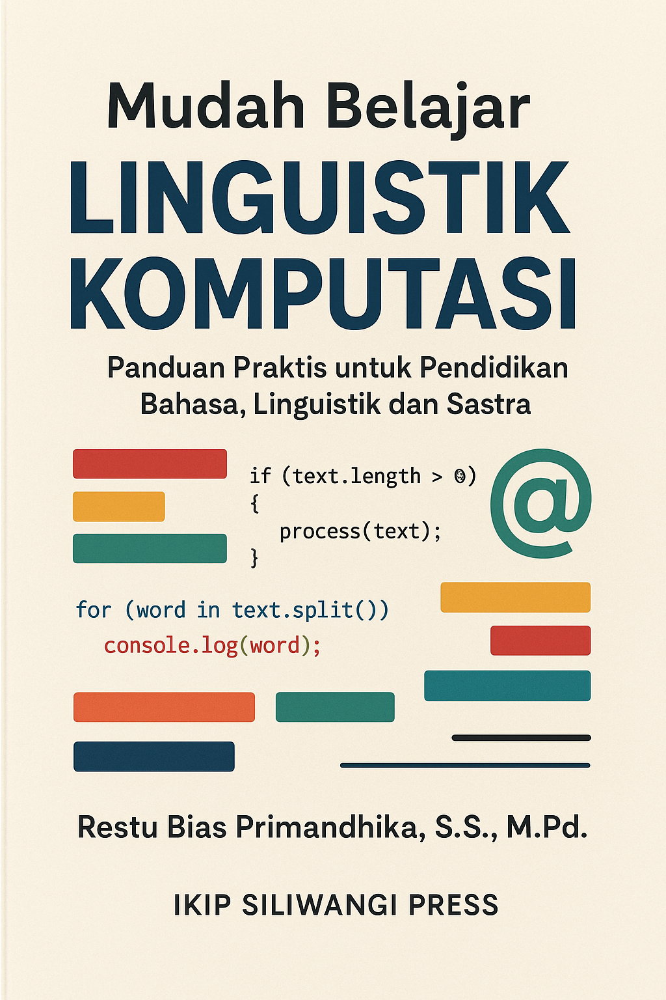

# LINGUISTIK KOMPUTASI DALAM PEMBELAJARAN BAHASA

## Pengantar Praktis dengan Python dan Google Colab

Restu Bias Primandhika, S.S., M.Pd.

RBP Media

# HALAMAN JUDUL

**LINGUISTIK KOMPUTASI DALAM PEMBELAJARAN BAHASA**

**Pengantar Praktis dengan Python dan Google Colab**

Restu Bias Primandhika, S.S., M.Pd.

RBP Media

# HALAMAN HAK CIPTA

**Linguistik Komputasi dalam Pembelajaran Bahasa: Pengantar Praktis dengan Python dan Google Colab**

Penulis: Restu Bias Primandhika, S.S., M.Pd.

Editor: [diisi kemudian]

Artistik: [diisi kemudian]

Penata Letak: [diisi kemudian]

Ukuran buku: 14,8 cm × 21 cm (A5)

Tebal: disesuaikan setelah tata letak final

Penerbit: RBP Media  
*Ruang Belajar Pintar Publishing*

Jl. (Gg.) Sukaraja, Kec. Baros, Cimahi Tengah 40521, Kota Cimahi

Email: publishing@rbpmedia.id

https://rbpmedia.id/

ISBN: [diisi kemudian]

Edisi Pertama

2026

HAK CIPTA PADA PENULIS DILINDUNGI UNDANG-UNDANG

# KATA PENGANTAR

Puji syukur ke hadirat Tuhan Yang Maha Esa atas tersusunnya buku *Linguistik Komputasi dalam Pembelajaran Bahasa: Pengantar Praktis dengan Python dan Google Colab* ini.

Kita hidup di masa ketika kecerdasan artifisial generatif sudah menjadi bagian dari keseharian. Chatbot yang bisa menjawab pertanyaan rumit, mesin penerjemah yang semakin halus, alat koreksi tulisan yang bekerja lintas bahasa. Banyak orang terkagum-kagum dengan kemampuan teknologi ini. Namun, tidak banyak yang menyadari satu hal mendasar: di balik semua itu, bahasa lah yang menjadi fondasi utamanya. Tanpa pemahaman tentang bagaimana bahasa bekerja sebagai data, bagaimana teks diproses, dan bagaimana pola kebahasaan dikenali oleh mesin, teknologi semacam itu tidak akan pernah ada.

Buku ini ditulis karena penulis melihat semakin banyak pembelajar bahasa, terutama di tingkat perguruan tinggi, yang tertarik dengan AI tetapi belum mengenal cikal bakal dan fondasi fundamentalnya. Mereka tahu bahwa AI bisa menulis puisi, meringkas artikel, atau menerjemahkan teks. Namun, mereka belum tahu bahwa linguistik komputasi adalah jembatan yang menghubungkan dunia bahasa dengan dunia mesin. Mereka belum tahu bahwa teknik-teknik yang mereka pelajari di kelas bahasa, mulai dari mengamati kosakata, memahami morfologi, menganalisis kalimat, hingga menafsirkan makna, sesungguhnya menjadi dasar bagi pemrosesan bahasa alami (*natural language processing*) yang menggerakkan AI saat ini.

Buku ini hadir untuk mengisi kekosongan itu. Bukan dengan cara yang rumit, melainkan dengan pendekatan yang bertahap, praktis, dan dekat dengan pengalaman nyata para pembelajar bahasa. Pembahasan dimulai dari hal yang paling dasar: apa itu linguistik komputasi, mengapa bahasa dapat diperlakukan sebagai data, bagaimana Python dan Google Colab bisa menjadi alat kerja yang terjangkau, lalu bagaimana teknik-teknik sederhana seperti tokenisasi, analisis frekuensi, konkordansi, analisis morfologi, dan pengukuran keterbacaan dapat diterapkan untuk kebutuhan pembelajaran bahasa di kelas. Pada bagian akhir, buku ini juga memperkenalkan perkembangan mutakhir seperti NLP modern, model bahasa besar (*large language model*), serta pertanyaan etis yang menyertainya.

Yang perlu ditegaskan: buku ini tidak bertujuan menjadikan pembaca sebagai pemrogram profesional. Buku ini dirancang agar pembaca memahami cara kerja dasar linguistik komputasi, memiliki keterampilan awal untuk mengolah data bahasa, dan melihat dengan lebih jernih bagaimana bahasa berperan dalam membangun teknologi yang sehari-hari kita pakai. Dengan bekal itu, pembaca diharapkan bisa lebih kritis, lebih percaya diri, dan lebih siap berpartisipasi di persimpangan bahasa dan teknologi.

Buku ini ditujukan terutama bagi mahasiswa bahasa, linguistik, pendidikan bahasa, dan sastra di tingkat perkuliahan. Namun, buku ini juga terbuka bagi siapa saja yang ingin memiliki keterampilan dasar dalam pembuatan AI berbasis bahasa, atau yang ingin memahami bagaimana komputer dapat diintegrasikan ke dalam proses pembelajaran bahasa secara bermakna. Tidak diperlukan latar belakang pemrograman sebelumnya. Yang dibutuhkan hanyalah rasa ingin tahu dan kesediaan untuk mencoba.

Penulis menyadari bahwa buku ini masih dapat terus disempurnakan. Kritik dan saran dari para dosen, mahasiswa, guru, peneliti, praktisi, dan pembaca umum sangat diharapkan demi perbaikan pada edisi berikutnya. Semoga buku ini dapat menjadi pintu masuk yang ramah dan bermakna bagi siapa saja yang ingin mengenal linguistik komputasi serta memanfaatkannya dalam pembelajaran bahasa di Indonesia.

Cimahi, 2026

Restu Bias Primandhika

# PETUNJUK PENGGUNAAN BUKU

Agar buku ini dapat digunakan secara optimal, pembaca disarankan mengikuti urutan bab secara bertahap. Bab-bab awal memberikan landasan konseptual dan keterampilan dasar yang diperlukan untuk memahami bab-bab berikutnya. Jika pembaca belum pernah menggunakan Python atau Google Colab, disarankan untuk tidak melewati bagian dasar tersebut.

Setiap bab dalam buku ini dirancang dengan pola yang relatif konsisten. Di dalamnya terdapat tujuan pembelajaran, pengantar konsep, contoh penerapan, praktik langkah demi langkah, serta latihan akhir bab. Pada beberapa bagian, pembaca juga akan menemukan proyek mini atau tugas reflektif yang dapat dipakai untuk memperdalam pemahaman.

Untuk bagian praktik, pembaca dianjurkan menyiapkan perangkat yang terhubung ke internet agar dapat menggunakan Google Colab dengan lancar. Jika memungkinkan, dosen atau pengampu mata kuliah juga dapat menjadikan contoh-contoh dalam buku ini sebagai bahan demonstrasi, tugas individu, atau tugas kelompok.

Buku ini akan lebih bermanfaat bila dibaca secara aktif. Artinya, pembaca tidak hanya membaca penjelasan, tetapi juga mencoba kode, mengamati hasil keluaran, mendiskusikan temuan, dan menghubungkannya dengan masalah pembelajaran bahasa yang nyata.

# DAFTAR GAMBAR

Daftar gambar akan disusun setelah seluruh naskah dan penomoran visual final selesai.

# DAFTAR TABEL

Daftar tabel akan disusun setelah seluruh naskah dan penomoran tabel final selesai.
