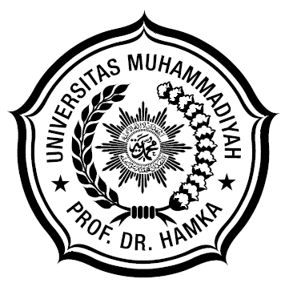

# PENGEMBANGAN WEB MICROLEARNING BERBASIS TEKNIK FEYNMAN UNTUK MENINGKATKAN KEMAMPUAN METAKOGNITIF DALAM KETERAMPILAN BERBICARA MAHASISWA

&nbsp;

&nbsp;

**DISERTASI**

&nbsp;

&nbsp;

&nbsp;

&nbsp;

**RESTU BIAS PRIMANDHIKA**

**NIM 2409108009**

&nbsp;

&nbsp;

&nbsp;

**PROGRAM STUDI DOKTOR PENDIDIKAN BAHASA INDONESIA**

**SEKOLAH PASCASARJANA**

**UNIVERSITAS MUHAMMADIYAH PROF. DR. HAMKA**

**2026**
