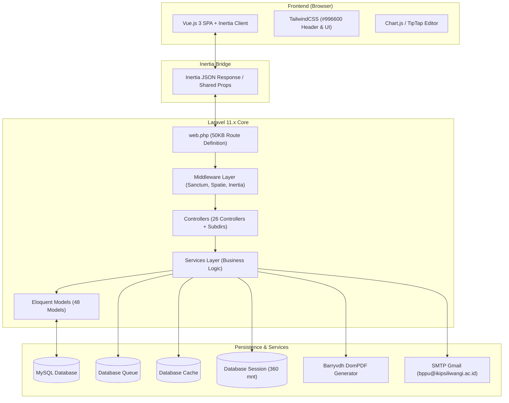
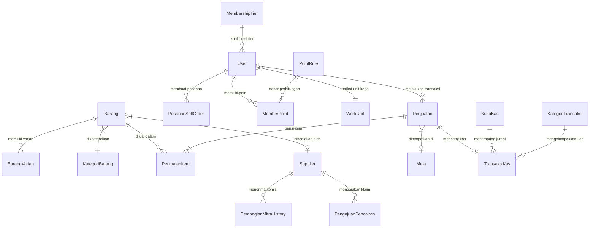

# Arsitektur dan Teknis Sistem BPPU

**Versi:** 2.0  
**Terakhir diperbarui:** 28 Juli 2026  
**Platform:** https://bppu.ikipsiliwangi.ac.id  
**Warna Branding Utama:** `#996600` (Emas IKIP Siliwangi)

---

## Ikhtisar Sistem

Sistem BPPU (Badan Pengelola dan Pengembangan Usaha) IKIP Siliwangi dirancang menggunakan arsitektur **Monolith Modern** yang menggabungkan keunggulan kerangka kerja Laravel 11.x di sisi *backend* dengan keandalan Vue.js 3 di sisi *frontend* melalui perantara **Inertia.js**. 

Pendekatan ini memungkinkan aplikasi beroperasi sebagai *Single Page Application* (SPA) yang responsif tanpa perlu membangun arsitektur API RESTful/GraphQL terpisah secara penuh. Seluruh pengolahan data, otorisasi, dan aturan bisnis dipusatkan pada Laravel *backend*, sementara Vue.js bertindak sebagai pembangun antarmuka pengguna yang dinamis.



---

## Tech Stack

Teknologi pendukung sistem BPPU dipilih untuk menjamin stabilitas, efisiensi operasional, serta kemudahan pemeliharaan dalam jangka panjang.

| Kategori | Teknologi / Pustaka | Versi / Spesifikasi | Fungsi / Kegunaan |
|---|---|---|---|
| **Backend Framework** | Laravel | 11.x | Kerangka kerja utama aplikasi, ORM, routing, middleware, dan antrean |
| **Frontend Framework** | Vue.js | 3.x | Komponen antarmuka interaktif SPA di sisi klien |
| **Adapter SPA** | Inertia.js | Latest | Penghubung seamless antara Laravel Controller dan Vue components |
| **Styling Engine** | TailwindCSS | 3.x | Utility-first CSS framework dengan kustomisasi warna `#996600` |
| **Database Engine** | MySQL | 8.0+ / MariaDB | Penyimpanan data utama relasional dengan dukungan *migration* |
| **Autentikasi** | Laravel Sanctum | Native | Autentikasi berbasis *stateful session* SPA |
| **Manajemen Akses** | Spatie Permission | Latest | Pengaturan *Role* dan *Permission* berjenjang |
| **PDF Generator** | Barryvdh/Laravel-DomPDF | Latest | Pencetakan invoice, nota POS, laporan keuangan, dan rekapitulasi |
| **Visualisasi Grafik** | Chart.js | Latest | Grafik analitik transaksi, penjualan, dan laporan eksekutif |
| **Rich Text Editor** | TipTap | Latest | Editor teks interaktif pada modul kelola berita/halaman CMS |

---

## Struktur Direktori Proyek

Aplikasi mengikuti struktur standar Laravel 11 dengan pemisahan lapisan layanan (*services layer*) secara eksplisit untuk menjaga keterbacaan kode.

```text
app/
├── Console/                      # Command kustom dan skedul tugas otomatis
├── Exports/                      # Class eksportir data transaksi & rekap ke Excel/CSV
├── Http/
│   ├── Controllers/             # 26 Controller utama aplikasi
│   │   ├── Admin/               # Sub-controller khusus administrasi sistem
│   │   ├── Member/              # Sub-controller portal member dan buyer
│   │   └── Sysadmin/            # Sub-controller konfigurasi tingkat lanjut
│   └── Middleware/              # Middleware kustom proteksi & penanganan Inertia
├── Mail/                         # Class pengiriman email berbasis Mailable
├── Models/                       # 48 Eloquent Model entitas bisnis
├── Providers/                    # Provider registrasi pustaka dan layanan
└── Services/                     # Lapisan logika bisnis modular
    ├── ActivityLogger.php       # Layanan pencatatan jejak audit
    ├── BarangImportService.php   # Layanan import data produk dari file spreadsheet
    ├── ImageCompressionService.php # Layanan optimasi dan kompresi gambar
    ├── LaporanKeuanganService.php# Layanan kalkulasi jurnal & pembukuan kas
    ├── PointService.php          # Layanan perhitungan & akumulasi poin member
    ├── RedeemService.php         # Layanan penukaran poin & klaim voucher
    ├── Dashboard/                # Sub-service kalkulasi widget dashboard
    ├── Member/                   # Sub-service manajemen keanggotaan
    └── PoS/                      # Sub-service pemrosesan kasir & transaksi cepat
```

---

## Models dan Relasi Database

Sistem memiliki **48 Eloquent Models** yang dikelompokkan ke dalam 9 domain fungsional:

### Pengelompokan Model Utamanya

| Domain | Model Terkait | Deskripsi Fungsional |
|---|---|---|
| **User & Organisasi** | `User`, `WorkUnit`, `EmailVerificationToken`, `MemberSurvey` | Identitas pengguna, unit kerja institusi, token verifikasi, dan hasil survei |
| **Katalog & Inventaris** | `Barang`, `BarangVarian`, `KategoriBarang`, `PengajuanBarang`, `PengajuanTambahBarang`, `StockOpname` | Master barang, varian ukuran/rasa, kategori, pengajuan stok baru, dan opname harian |
| **Transaksi & POS** | `Penjualan`, `PenjualanItem`, `CanteenMenu`, `ShopItem`, `Meja`, `LokasiMeja` | Transaksi kasir POS, menu kantin harian, produk toko, dan manajemen meja |
| **Self-Order & Cart** | `PesananSelfOrder`, `Cart`, `CartItem` | Keranjang belanja digital dan pemesanan mandiri oleh pembeli |
| **Keuangan & Kas** | `BukuKas`, `TransaksiKas`, `KategoriTransaksi` | Pencatatan arus kas masuk/keluar, akun buku kas, dan pengelompokan transaksi |
| **Kemitraan Usaha** | `Supplier`, `SkemaBisnis`, `PembagianMitraHistory`, `PengajuanPencairan` | Pendor/mitra bisnis, bagi hasil konsinyasi, dan pencairan saldo komisi |
| **Loyalitas & Poin** | `MemberPoint`, `MembershipTier`, `PointRule`, `Voucher`, `Potongan` | Aturan perolehan poin, tier keanggotaan (Bronze, Silver, Gold), dan diskon |
| **CMS & Portal Web** | `Page`, `Post`, `PostReaction`, `Tag`, `Category`, `MenuItem`, `MenuDisplay` | Pengelolaan konten website publik, berita BPPU, menu navigasi, dan halaman statis |
| **Audit & Konfigurasi**| `Arsip`, `ArsipUsage`, `ActivityLog`, `Setting` | Manajemen dokumen arsip institusi, log aktivitas user, dan preferensi aplikasi |

### Relasi Kunci Antar Model



---

## Controllers dan Routing

### Arsitektur Controller

Aplikasi memiliki **26 controller utama** yang mengelola interaksi antara *request* HTTP dan lapisan *service*:

1. **`AdminController` (37KB):** Controller pusat manajemen pengelola (dashboard utama, manajemen transaksi, rekapitulasi sistem).
2. **`SelfOrderController` (45KB):** Controller alur pemesanan mandiri kantin (katalog menu, pilih meja, *checkout*, dan pemantauan status pesanan real-time).
3. **`BelanjaSelfOrderController` (31KB):** Controller pemesanan mandiri toko/minimarket BPPU (keranjang, verifikasi stok, nota digital).
4. **`BukuKasController` (21KB):** Controller transaksi keuangan, pencatatan masuk/keluar kas, pencetakan rekap harian dan bulanan.
5. **`UserManagementController` (20KB):** Controller verifikasi akun, manajemen *role*, penonaktifan pengguna, dan data *member*.
6. **`MitraReportController` (21KB):** Controller laporan kinerja mitra, persentase bagi hasil, dan akumulasi komisi.
7. **`PenjualanManagementController` (15KB):** Controller manajemen riwayat transaksi penjualan, pembatalan pesanan, dan penyesuaian status.
8. **`PoSController` (14KB):** Antarmuka kasir cepat untuk transaksi langsung di kantin maupun toko BPPU.
9. **`SupplierController` (15KB):** Controller kelola data pendor, perjanjian skema bisnis, dan kontrak konsinyasi.

### Struktur Route (`routes/web.php`)

File `routes/web.php` berukuran sekitar **50KB** dan terstruktur ke dalam kelompok middleware berikut:

- **Public Routes:** Halaman portal depan, daftar produk, login/register (`/pengelola/login`, `/mitra/login`).
- **Group `/pengelola`:** Dilindungi `auth:sanctum` dan `AdminMiddleware`. Berisi *sub-routes* admin, officer, kantin, dan toko.
- **Group `/mitra`:** Dilindungi `auth:sanctum` dan `MitraMiddleware`. Khusus panel mitra usaha.
- **Group `/kantin/self-order` & `/belanja/self-order`:** Akses pemesanan mandiri tanpa/dengan login member.
- **Group `/member-area`:** Dilindungi `auth:sanctum` untuk pemantauan poin, tier, dan voucher pribadi.

---

## Middleware dan Autentikasi

Autentikasi menggunakan **Laravel Sanctum** dengan *cookie-based stateful session* untuk menjaga sesi login SPA Inertia.js. Pengaturan hak akses memanfaatkan **Spatie Permission** dengan hierarki role:

| Nama Role | Deskripsi Hak Akses | Akses Portal Login |
|---|---|---|
| `sysadmin` | Akses penuh tanpa batasan ke seluruh menu dan konfigurasi | `/pengelola/login` |
| `officer` | Akses operasional penuh (tanpa Log Aktivitas, Point Rules, Survey, Recycle Bin) | `/pengelola/login` |
| `head` | Mode *read-only* untuk pimpinan (Dashboard eksekutif, Buku Kas, Rekap, Laporan) | `/pengelola/login` |
| `canteen` | Operasional POS Kantin, pesanan kantin, stok menu harian, rekap harian | `/pengelola/login` |
| `shop` | Operasional POS Toko, barang minimarket, pesanan toko, rekap harian | `/pengelola/login` |
| `data_clerk` | Pengelolaan entitas dasar: katalog barang, menu kantin, stok opname, data buyer | `/pengelola/login` |
| `mitra` | Akses terbatas ke dashboard mitra, laporan penjualan barang milik mitra, penarikan saldo | `/mitra/login` |
| `member` | Akses buyer untuk self-order, riwayat transaksi, penukaran poin, dan voucher | Modal Self-Order / Sesi |

### Spesifikasi Middleware Utama

- **`HandleInertiaRequests`:** Menginjeksi data global (*shared props*) ke setiap komponen Vue, termasuk data pengguna aktif (`auth.user`), daftar role/permissions, *flash message*, dan pengaturan warna tema (`#996600`).
- **`AdminMiddleware`:** Menolak akses selain pengguna berkategori pengelola internal.
- **`MitraMiddleware`:** Memastikan pengguna yang mengakses memiliki peran `mitra`.
- **`RoleMiddleware`:** Memeriksa otorisasi peran spesifik pada *route* tertentu.
- **`RedirectIfAuthenticated`:** Mengarahkan pengguna yang sudah memiliki sesi aktif ke dashboard yang sesuai.

---

## Services Layer

Pengolahan logika bisnis dipisahkan dari controller dan ditampung dalam folder `app/Services/`:

- **`ActivityLogger`:** Mencatat setiap tindakan perubahan data (create, update, delete) oleh pengelola ke dalam tabel `activity_logs`.
- **`BarangImportService`:** Memproses pembacaan dan validasi berkas spreadsheet untuk menambahkan data barang secara masal.
- **`ImageCompressionService`:** Melakukan kompresi otomatis pada berkas gambar produk dan arsip sebelum disimpan ke direktori *storage*.
- **`LaporanKeuanganService`:** Menghitung neraca kas, laba rugi konsinyasi, serta rekapitulasi bagi hasil secara otomatis.
- **`PointService`:** Mengkalkulasi poin belanja berdasarkan nilai transaksi, aturan `PointRule`, dan bobot `MembershipTier`.
- **`RedeemService`:** Memvalidasi kecukupan poin member dan memproses pemotongan poin untuk penukaran voucher atau potongan tunai.

---

## Frontend (Vue.js + Inertia)

Antarmuka frontend dibangun dengan **Vue.js 3** yang dihubungkan secara erat melalui **Inertia.js**.

- **Rendering Alur:** Controller mengirimkan respon via `Inertia::render('NamaKomponen', $data)`, yang diterima oleh komponen Vue di folder `resources/js/Pages/`.
- **Pengelolaan State:** Menggunakan Inertia Shared Props untuk data global (pengguna login, flash alerts) dan Vue local state untuk form interaktif.
- **Rich Text Editor:** Menggunakan TipTap pada modul CMS untuk pembuatan pengumuman dan artikel berita BPPU.
- **Grafik Analitik:** Menggunakan Chart.js untuk menyajikan grafik tren penjualan harian, perbandingan omzet kantin vs toko, dan statistik member.
- **Styling:** Menggunakan TailwindCSS dengan skema warna utama emas IKIP Siliwangi (`#996600`).

---

## Konfigurasi Environment

Konfigurasi lingkungan server produksi diatur melalui berkas `.env` dengan parameter standar berikut:

| Parameter | Nilai Production | Keterangan |
|---|---|---|
| `APP_URL` | `https://bppu.ikipsiliwangi.ac.id` | URL domain resmi aplikasi |
| `APP_ENV` | `production` | Lingkungan aplikasi berjalan |
| `APP_DEBUG` | `false` | Menonaktifkan mode debug demi keamanan |
| `TIMEZONE` | `Asia/Jakarta` | Zona waktu standar WIB |
| `SESSION_DRIVER` | `database` | Penyimpanan sesi pengguna di tabel `sessions` |
| `SESSION_LIFETIME` | `360` | Masa berlaku sesi login (6 jam) |
| `QUEUE_CONNECTION` | `database` | Pemrosesan pekerjaan latar belakang via tabel `jobs` |
| `CACHE_STORE` | `database` | Penyimpanan data *cache* pada database |
| `MAIL_MAILER` | `smtp` | Pengirim email berbasis SMTP |
| `MAIL_HOST` | `smtp.gmail.com` | Server pengirim email |
| `MAIL_USERNAME` | `bppu@ikipsiliwangi.ac.id` | Alamat email resmi BPPU |

---

## Deployment dan Build

Prosedur pembaruan dan rilis kode pada lingkungan server produksi wajib mengikuti alur baku berikut:

### 1. Ambil Perubahan Kode (Git Pull)
```bash
git pull origin main
```

### 2. Pasang/Pembaruan Dependensi Backend
```bash
composer install --no-dev --optimize-autoloader
```

### 3. Kompilasi Aset Frontend
```bash
npm install
npm run build
```

### 4. Eksekusi Migration Tambahan
```bash
php artisan migrate --force
```

> [!CAUTION]
> **DILARANG KERAS** menjalankan `php artisan migrate:fresh` pada server produksi karena akan menghapus seluruh isi database MySQL!

### 5. Optimasi Cache Laravel
```bash
php artisan config:cache
php artisan route:cache
php artisan view:cache
```

### 6. Restart Queue Worker
```bash
php artisan queue:restart
```

---

## Pedoman Pengembangan (Development Guidelines)

Setiap pengembang yang berkontribusi pada codebase BPPU wajib mematuhi aturan teknis berikut:

1. **Batasan Ukuran File:** Maksimal **1000 baris kode per file**. Jika mendekati batasan, pecah kode ke dalam modul atau service terpisah.
2. **Arsitektur Modular:** Jangan menumpuk seluruh logika bisnis di Controller. Manfaatkan `app/Services/` untuk logika berat dan re-usable.
3. **Larangan Emoji:** **DILARANG** menggunakan emoji dalam kode sumber, komentar kode, pesan commit, maupun file dokumentasi teknis.
4. **Warna Identitas:** Gunakan kode warna `#996600` untuk elemen aksen utama, tombol primer, dan identitas visual visualisasi data.
5. **Migrasi Database:** Selalu buat file migrasi baru untuk setiap perubahan skema tabel. Jangan pernah mengedit file migrasi yang sudah dieksekusi di produksi.
6. **Penanganan Error:** Gunakan blok `try-catch` dan catat exception ke log tanpa menampilkan detail *stack trace* sensitif kepada pengguna akhir.

---

## Keamanan

Sistem menerapkan prinsip *Defense in Depth* untuk melindungi data transaksi dan identitas pengguna:

- **CSRF Protection:** Seluruh permintaan manipulasi data (POST, PUT, DELETE) dilindungi token CSRF bawaan Laravel dan Inertia.
- **SQL Injection Prevention:** Menggunakan Eloquent ORM dan *Query Builder* yang memanfaatkan *PDO parameter binding* secara eksplisit.
- **Otorisasi Berjenjang:** Pengecekan otorisasi menggunakan Spatie Permission pada tingkat *Route Middleware* dan *Controller Policy*.
- **Verifikasi Email:** Pengguna baru wajib melakukan verifikasi email melalui token yang dikirimkan via `EmailVerificationToken`.
- **Optimasi Upload Gambar:** Berkas gambar yang diunggah diproses melalui `ImageCompressionService` untuk menghapus metadata berbahaya serta membatasi ukuran berkas.
- **Pencatatan Jejak Audit:** Perubahan data sensitif dicatat oleh `ActivityLogger` mencakup informasi alamat IP, data lama, dan data baru.

---

## Pemeliharaan (Maintenance)

Prosedur perawatan berkala untuk menjamin stabilitas dan kinerja server produksi:

### 1. Pembackupan Database Rutin
Jadwalkan *backup* MySQL harian menggunakan `mysqldump` atau pustaka backup otomatis:
```bash
mysqldump -u [user] -p[password] [db_bppu] > /path/to/backup/bppu_$(date +%Y%m%d).sql
```

### 2. Pembersihan Sesi dan Cache Kadaluwarsa
Jalankan pembersihan berkala untuk tabel `sessions` dan `cache`:
```bash
php artisan session:gc
php artisan cache:clear
```

### 3. Pemantauan Log Aplikasi
Periksa berkas log sistem secara berkala untuk mendeteksi ancaman atau error yang terjadi:
```bash
tail -f storage/logs/laravel.log
```

### 4. Konfigurasi Cron Job Server
Pastikan *scheduler* Laravel terdaftar pada `crontab` server:
```cron
* * * * * cd /home/primandhika/artikel/panduan_bppu/bppu && php artisan schedule:run >> /dev/null 2>&1
```
